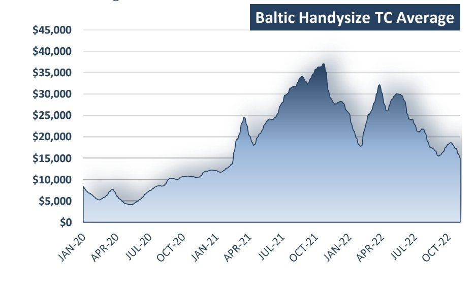
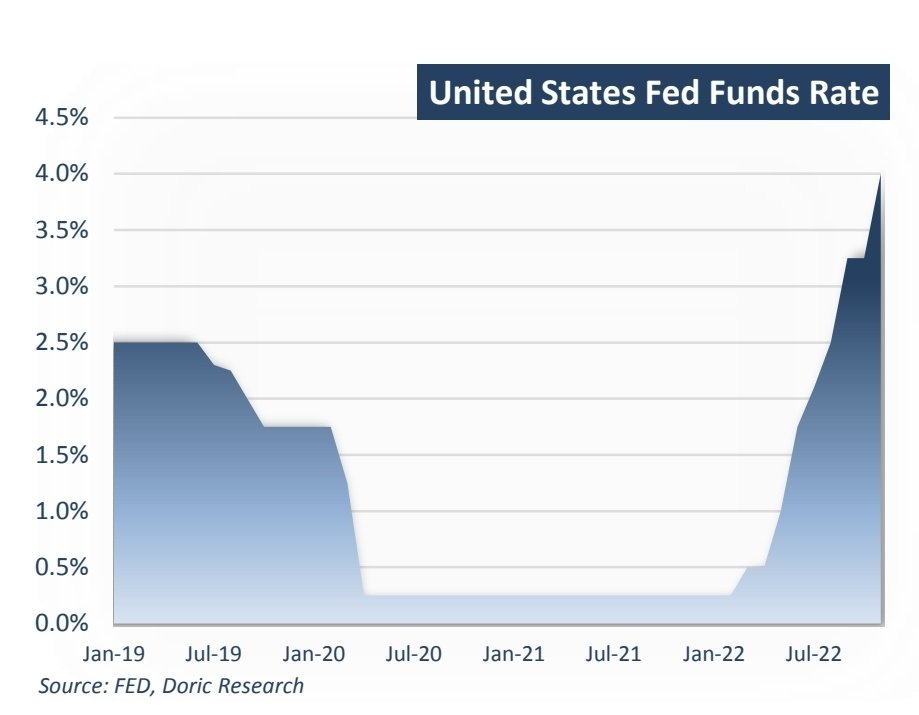
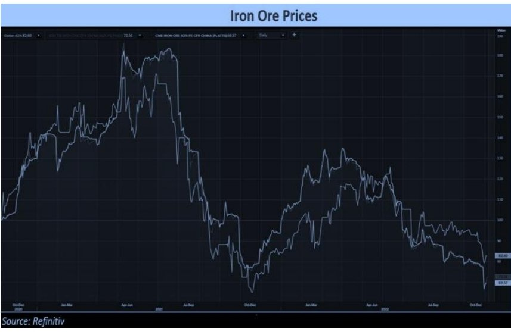

# Doric Dry Bulk Weekly Report

**Date:** November 07, 2022  
**Publisher:** Breakwave Advisors | **Category:** Market Insights  
**Original URL:** [https://www.breakwaveadvisors.com/insights/2022/11/7/doric-weekly-report](https://www.breakwaveadvisors.com/insights/2022/11/7/doric-weekly-report)  

---

*By*[*Michalis Voutsinas*](https://www.linkedin.com/in/michalis-voutsinas-587544163/)

In spite of the impressive Capesize reaction in the last trading day of the week, the forty-fourth week was one of those uninspiring periods taking place in the conventionally seasonal weakest first quarter of every trading year. In fact, with all sub-indices being in the red, Baltic Dry Index concluded today at 1323 points. Reporting circa 20 percent weekly losses, the leading Baltic Capesize index was flirting with the four-digits, before bouncing back at $11,139 daily on this week's closing. In a similar vein, Baltic Panamax 82K index moved further south, yet still managing to close with a positive tone.

Conversely, this was not the case in the Supramax spectrum, with the respective Baltic Supramax Index losing some 14.5 percent week-on-week and ending at multi-month lows of $13,945 daily. Being trapped in a downward spiral, the Baltic Handysize Index finished today at twentymonth minima of $15,043 daily, last seen in February 2021. Better reflecting the cloudy macroeconomic environment, Handies have this unique “privilege” to mirror the course of the global economy on their balancing levels.

> **Figure 1: Screenshot 20221107 123303 Samsung Notes**  
> **Interactive Data & Source:** [Doric](https://www.doric.gr/) | [Local Asset](file:///C:/Users/Dell/Github/Shipping/corpus/03-breakwave/insights/2022/assets/2022-11-07_doric-weekly-report_img_screenshot-20221107-123303-samsungno_6cf13a3909c0.jpg)

Further challenging an already sputtering global economy, the Federal Reserve raised the target range for the federal funds rate by another 75bps this week to 3.75-4 percent. Being in line with market forecasts, the aforementioned rise marks a sixth consecutive rate hike and the fourth straight three-quarter point supersized increase, pushing borrowing costs to a fresh high since 2008. Policymakers anticipate that ongoing increases in the target range will be appropriate in order to attain a stance of monetary policy that is sufficiently restrictive to return inflation to 2 percent over time. In determining the pace of future increases in the target range, the Committee will take into account the cumulative tightening of monetary policy, the lags with which monetary policy affects economic activity and inflation, and economic and financial developments.

Additionally, Federal Reserve chair Jay Powell warned interest rates would peak at a higher level than initially expected even as he held out the possibility of the Federal Reserve slowing the pace of its campaign to tighten monetary policy. The comments of Jerome Powell that it was "very premature" to be thinking about pausing its rate hikes sent stocks lower as US bond yields and the US dollar rose. The Dow Jones Industrial Average slid 505.44 points, or 1.55 percent, to settle at 32,147.76.

The S&P 500 dropped by 2.5 percent to close at 3,759.69, whilst the Nasdaq Composite took a 3.36 percent dive to finish at 10,524.80. In 2022, the main S&P 500 index dropped by -23.9 percent through the end of September. While inflation remained high, stocks began to rally in October in the hope that the Federal Reserve would start to pivot away from aggressive interest-rate hiking in December. However, the latest developments on the monetary policy front had a negative bearing on November’s opening.

> **Figure 2: Screenshot 20221107 123317 Samsung Notes**  
> **Interactive Data & Source:** [Doric](https://www.doric.gr/) | [Local Asset](file:///C:/Users/Dell/Github/Shipping/corpus/03-breakwave/insights/2022/assets/2022-11-07_doric-weekly-report_img_screenshot-20221107-123317-samsungno_10484135094a.jpg)

On the other side of the moon, iron ore futures climbed more than 4 percent on Friday, solidifying their weekly gains initially driven by earlier speculations that top steel producer China would ease its draconian Covid-19 rules, and further fuelled by Beijing's fresh progrowth rhetoric. The most-traded January iron ore on China's Dalian Commodity Exchange ended morning trade 4.2 percent higher at 658 yuan ($90.62) a tonne, on track for the first weekly rise in four weeks.

After suffering its steepest monthly fall in almost two years in October, the market reversal this week comes despite China's National Health Commission denying knowledge of a rumoured committee being formed to assess border reopening in March. The market of the steelmaking ingredient decided to focus on People’s Bank of China Governor Yi Gang reassurance that China would be able to maintain normal monetary policy as he steered for a resilient domestic economy, and expressed hopes for a soft landing in the suffering property sector.

> **Figure 3: Screenshot 20221107 123335 Samsung Notes**  
> **Interactive Data & Source:** [Doric](https://www.doric.gr/) | [Local Asset](file:///C:/Users/Dell/Github/Shipping/corpus/03-breakwave/insights/2022/assets/2022-11-07_doric-weekly-report_img_screenshot-20221107-123335-samsungno_cedd2a25e2a2.jpg)

Whilst concerns have been expressed by various financial institutions and associations that the Chinese steel sector along with global steel demand remain in a quite uncertain and fragile phase, Capesizes turned a Nelson's eye to these warnings and pledged allegiance to the iron ore futures trend – at least for the day.

Data source:[Doric](https://www.doric.gr/)
