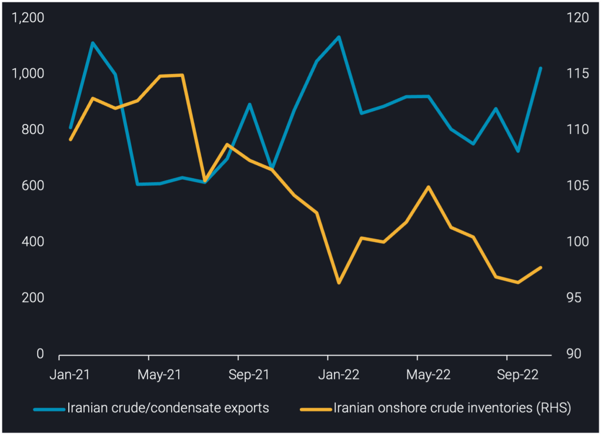
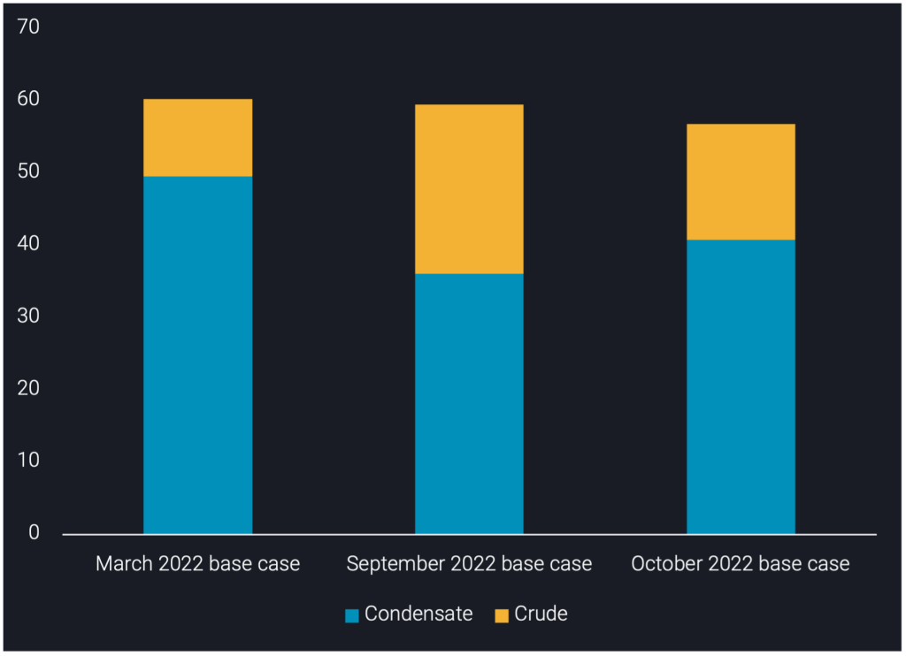
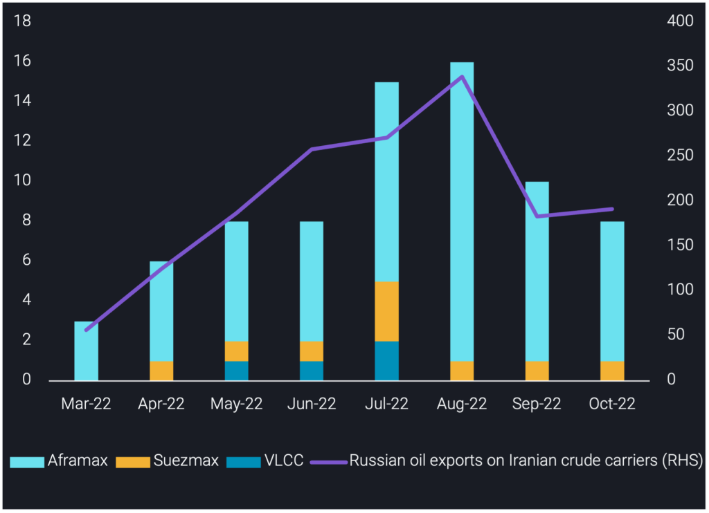
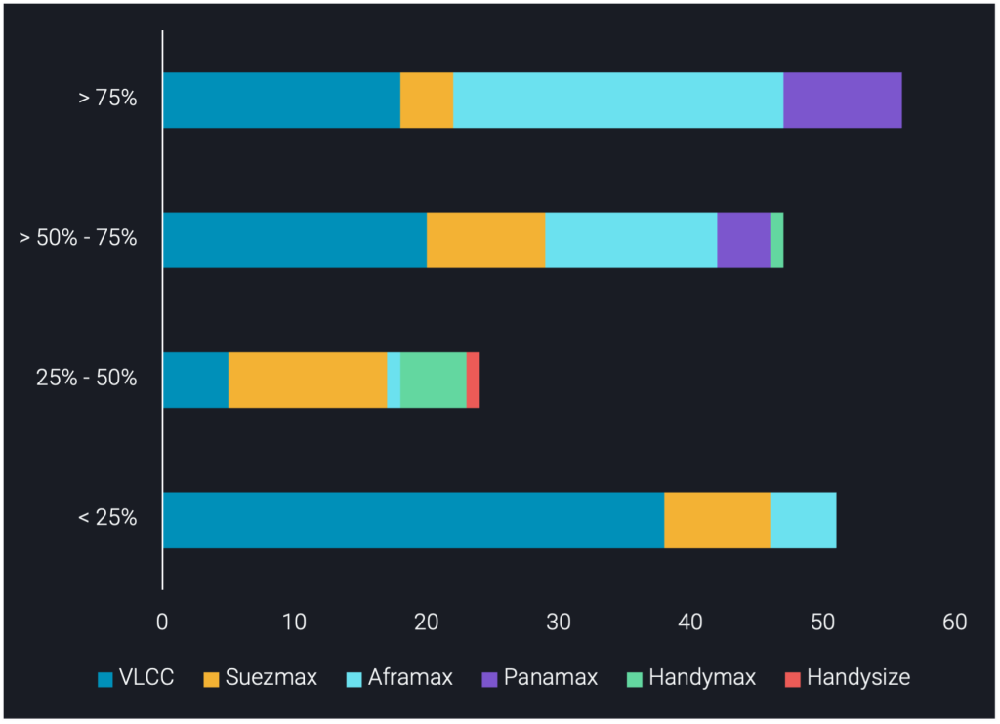

# Iran’s crude/condensate exports reached 9 month highs in October 2022

**Date:** November 10, 2022  
**Publisher:** Breakwave Advisors | **Category:** Market Insights  
**Original URL:** [https://www.breakwaveadvisors.com/insights/2022/11/10/irans-crudecondensate-exports-reached-9-month-highs-in-october-2022](https://www.breakwaveadvisors.com/insights/2022/11/10/irans-crudecondensate-exports-reached-9-month-highs-in-october-2022)  

---

This insight explores the sharp climb in Iran’s crude/condensate exports observed in October, changes to floating storage and Russia’s impact on Iranian fleet activity.

*By*[*Armen Azizian*](https://www.linkedin.com/in/armenazizian/)

Ιran exported 1mbd of crude/condensate in October 2022, a 300kbd increase m-o-m and 100kbd above the 12 month average. This marks October as Iran’s highest crude/condensate exports since January 2022, where exports surpassed 1.1mbd. Exports moved flat-to-lower since January, averaging 850kbd over February to September 2022, as Chinese buyers benefited from increased competition between Iranian and discounted Russian crude.

This sharp rebound in Iranian crude/condensate exports observed in October is driven by three factors. Firstly, Iranian crude has been heavily discounted in comparison to African and Middle Eastern grades, making them attractive for their largest buyer, China. Furthermore, Iranian Heavy has more attractive middle distillate yields compared to Venezuelan grades, making them additionally attractive for independent refiners admidst the higher refinery runs in China.

Secondly, strikes at Iran’s Abadan refinery (400kbd refining capacity) coupled with the planned partial maintenance of the Isfahan refinery (375kbd refining capacity) has meant more Iranian crude is available for export as opposed to domestic consumption. Thirdly, two non-NITC VLCCs newly joined the Iranian trade in October and a NITC VLCC departed from floating storage and partially loaded again, helping facilitate higher total crude/condensate exports.

Meanwhile, Iran’s onshore crude inventories have broadly increased, sitting at 97.8mb in October, a 1mb stock build m-o-m driven by the refinery outages observed above. This is the first m-o-m stock build since May 2022, as Iranian crude stocks drew 8.5mb from May to September 2022 amidst flat crude production and an attempt to facilitate higher exports given heightened competition with Russia.

> **Figure 1: Iran Insight Chart 1 1024x742**  
> **Interactive Data & Source:** [Analytics Vortexa](https://analytics.vortexa.com/?dateRange=2021-01-01T00%3A00%3A00.000Z__2022-10-31T23%3A59%3A59.999Z&filtersEnabled=%5B%22p%22%2C%22o%22%2C%22d%22%2C%22d_r%22%2C%22v%22%2C%22intra%22%2C%22sts_o%22%2C%22c_o%22%2C%22v_f%22%5D&from=%5B%22d308ddc557e774187ad6c7da81b39db990def9a39e6c88e79cb163b6bdd6e8e5%22%5D&geoBreakdownOriginGlobal=port&metric=bpd&page=Flows&products=%5B%2254af755a090118dcf9b0724c9a4e9f14745c26165385ffa7f1445bc768f06f11%22%5D&tabId=468b37b5-e1bf-4de9-a2e4-3c4ce3dacbb4) | [Local Asset](file:///C:/Users/Dell/Github/Shipping/corpus/03-breakwave/insights/2022/assets/2022-11-10_irans-crudecondensate-exports-reached-9-month-highs-in-october-2022_img_iran-insight-chart-1-1024x742_0bfd00e53867.png)

[**Iranian crude/condensate exports (kbd, LHS)**](https://analytics.vortexa.com/?dateRange=2021-01-01T00%3A00%3A00.000Z__2022-10-31T23%3A59%3A59.999Z&filtersEnabled=%5B%22p%22%2C%22o%22%2C%22d%22%2C%22d_r%22%2C%22v%22%2C%22intra%22%2C%22sts_o%22%2C%22c_o%22%2C%22v_f%22%5D&from=%5B%22d308ddc557e774187ad6c7da81b39db990def9a39e6c88e79cb163b6bdd6e8e5%22%5D&geoBreakdownOriginGlobal=port&metric=bpd&page=Flows&products=%5B%2254af755a090118dcf9b0724c9a4e9f14745c26165385ffa7f1445bc768f06f11%22%5D&tabId=468b37b5-e1bf-4de9-a2e4-3c4ce3dacbb4)**vs**[**Iranian onshore crude inventories (mb, RHS)**](https://analytics.vortexa.com/?dateRange=2020-01-03T00%3A00%3A00.000Z__2022-11-03T23%3A59%3A59.999Z&frequency=month&hiddenSeries=%5B%222cfd6f285665585c60351b6d59508896a8d5672da60eba9c8e3191591c5ec400%22%2C%22dd80e5e493cdd218a037721239189244c84d318d3df877544e9cc717efd89b21%22%2C%22b36c45f9370868b3030ac6567a4e344d69932d843b2125a41901a295e48a2d32%22%2C%22d1357097959bb46ccb3d9adc96640cb8d86782639e7f5b13e745db9fc08ed475%22%2C%2239f1baa602b24621eaa84786e298661bdf966e04ab05646cd1942d798712cedf%22%2C%22other%22%5D&multiSelect=1&onshoreInventoriesLocations=%5B%22d308ddc557e774187ad6c7da81b39db990def9a39e6c88e79cb163b6bdd6e8e5%22%5D&page=OnShoreCrudeInventories&selectedRegion=%5B%22d308ddc557e774187ad6c7da81b39db990def9a39e6c88e79cb163b6bdd6e8e5%22%5D&tabId=5bba9d4b-b30a-4ff3-89ba-f13d871acba1&tankCrude=%5B%22confirmed%22%5D)

## Iranian Crude/condensate in Floating Storage Totals 57mb

As of 1 November, Iranian crude/condensate in floating storage is assessed at 57mb, a mix of 70% condensate and 30% crude. The 70% condensate is accounted for by 26 NITC tankers storing condensate floating offshore Assaluyeh or Malaysia. The 30% crude is stored on non-NITC tankers floating offshore Malaysia awaiting buyers.

In total, Iranian floating storage is 3mb lower m-o-m, but the mix of crude and condensate in floating storage has changed.

As of 1 November, South Pars Condensate in floating storage is assessed at 41mb, a 4mb increase m-o-m. There are two primary reasons behind this increase. Firstly, there is a decline in NITC tankers sailing for Venezuela. Venezuelan crude production was assessed at 12 month lows in September (OPEC), and has hence resulted in lower demand for Iranian condensate for blending purposes. Secondly, two non-NITC VLCCs newly joined the Iranian trade in October (port loadings), reducing the need to utilise NITC tankers. This has resulted in a larger number of NITC tankers on floating storage duty.

Iranian crude in floating storage is assessed at 16mb in October, a 7mb decline m-o-m. This decline is driven by China’s increased demand for Iranian crude.

> **Figure 2: Iran Insight Chart 2 1024x742**  
> **Interactive Data & Source:** [Vortexa](https://www.vortexa.com//oil-gas-data-traders-analysts-data-scientists?gclid=Cj0KCQjw8_qRBhCXARIsAE2AtRZKOvMnbilZ_6_91d7huSFFy71pWLrnPwGwOHVzXsmsG-1a1mZnQw8aAt89EALw_wcB&hsa_acc=1782073842&hsa_ad=548425387665&hsa_cam=14746637662&hsa_grp=125038601902&hsa_kw=&hsa_mt=&hsa_net=adwords&hsa_src=g&hsa_tgt=dsa-1431852288425&hsa_ver=3&utm_campaign=%5BCD%5D%20-%20DSA%20-%20EMEA&utm_medium=cpc&utm_medium=ppc&utm_source=google&utm_source=adwords&utm_term=) | [Local Asset](file:///C:/Users/Dell/Github/Shipping/corpus/03-breakwave/insights/2022/assets/2022-11-10_irans-crudecondensate-exports-reached-9-month-highs-in-october-2022_img_iran-insight-chart-2-1024x742_5457de21adb0.png)

## Tankers Previously Carrying Iranian Oil Switch to Russian Trade

As of 1 November, we track 40 unique tankers which have loaded Russian crude/products since March 2022, having previously carried Iranian crude/products. The 40 tankers account for 99 Russian oil liftings since March.

Russian oil exports on carriers previously involved in Iranian trade were 190kbd in October, only a marginal increase m-o-m, largely a result of the pause in STS activity of Russian Urals in the North Atlantic since August. As more companies scale back from carrying Russian crude/products, those familiar with the sanctioned crude trade will continue using their tankers to assist Russia in exporting oil East of Suez.

As of 1 November, we track two VLCCs (both previously carried Iranian crude) which have returned to the North Atlantic from China, after discharging the Russian Urals they loaded via dark STS in the North Atlantic in June/July 2022. This is indicative of a looming second round of North Atlantic STS activity, which supports subterfuge techniques of transporting Russian Urals.

> **Figure 3: Iran Insight Chart 3 1024x742**  
> **Interactive Data & Source:** [Vortexa](https://www.vortexa.com//oil-gas-data-traders-analysts-data-scientists?gclid=Cj0KCQjw8_qRBhCXARIsAE2AtRZKOvMnbilZ_6_91d7huSFFy71pWLrnPwGwOHVzXsmsG-1a1mZnQw8aAt89EALw_wcB&hsa_acc=1782073842&hsa_ad=548425387665&hsa_cam=14746637662&hsa_grp=125038601902&hsa_kw=&hsa_mt=&hsa_net=adwords&hsa_src=g&hsa_tgt=dsa-1431852288425&hsa_ver=3&utm_campaign=%5BCD%5D%20-%20DSA%20-%20EMEA&utm_medium=cpc&utm_medium=ppc&utm_source=google&utm_source=adwords&utm_term=) | [Local Asset](file:///C:/Users/Dell/Github/Shipping/corpus/03-breakwave/insights/2022/assets/2022-11-10_irans-crudecondensate-exports-reached-9-month-highs-in-october-2022_img_iran-insight-chart-3-1024x742_d208a2977c20.png)

## An Additional 56 Tankers Identified As Highly Likely to Switch to Russian Trade

As of 1 November, we have grouped an additional 178 tankers based on their likelihood (%) of switching from Iranian trade to Russian trade into four groups:

> 75% (highly likely): 56 tankers with an average age of 20 years. This includes tankers 17 years and older, have China/India/Russia/UAE ownership interest, tankers belonging to the North Atlantic China network, no IR or EU flags and sanctioned under OFAC.

> 50% – 75% (likely): 47 tankers with an average age of 20 years. This includes tankers 17 years and older and ownership interest other than those listed above.

25% – 50% (unlikely): 24 tankers with an average of 19 years. This includes tankers under 17 years old and tankers with an IR flag (non-NITC).

< 25% (highly unlikely): 51 tankers with an average age of 16 years. This is exclusive to the NITC fleet, which is highly unlikely to switch due to government ownership.

As the EU ban implementation fast approaches, any of these tankers could join the 40 tankers which have already made the switch, especially VLCCs which could perform STS operations via the Baltic. However, these STS operations during the winter will require the utilisation of ice-class vessels, though there is a shortage.

> **Figure 4: Iran Insight Chart 4 1024x742**  
> **Interactive Data & Source:** [Vortexa](https://www.vortexa.com//oil-gas-data-traders-analysts-data-scientists?gclid=Cj0KCQjw8_qRBhCXARIsAE2AtRZKOvMnbilZ_6_91d7huSFFy71pWLrnPwGwOHVzXsmsG-1a1mZnQw8aAt89EALw_wcB&hsa_acc=1782073842&hsa_ad=548425387665&hsa_cam=14746637662&hsa_grp=125038601902&hsa_kw=&hsa_mt=&hsa_net=adwords&hsa_src=g&hsa_tgt=dsa-1431852288425&hsa_ver=3&utm_campaign=%5BCD%5D%20-%20DSA%20-%20EMEA&utm_medium=cpc&utm_medium=ppc&utm_source=google&utm_source=adwords&utm_term=) | [Local Asset](file:///C:/Users/Dell/Github/Shipping/corpus/03-breakwave/insights/2022/assets/2022-11-10_irans-crudecondensate-exports-reached-9-month-highs-in-october-2022_img_iran-insight-chart-4-1024x742_f2d92669c08c.png)

Data Source:[Vortexa](https://www.vortexa.com//oil-gas-data-traders-analysts-data-scientists?gclid=Cj0KCQjw8_qRBhCXARIsAE2AtRZKOvMnbilZ_6_91d7huSFFy71pWLrnPwGwOHVzXsmsG-1a1mZnQw8aAt89EALw_wcB&hsa_acc=1782073842&hsa_ad=548425387665&hsa_cam=14746637662&hsa_grp=125038601902&hsa_kw=&hsa_mt=&hsa_net=adwords&hsa_src=g&hsa_tgt=dsa-1431852288425&hsa_ver=3&utm_campaign=%5BCD%5D%20-%20DSA%20-%20EMEA&utm_medium=cpc&utm_medium=ppc&utm_source=google&utm_source=adwords&utm_term=)
