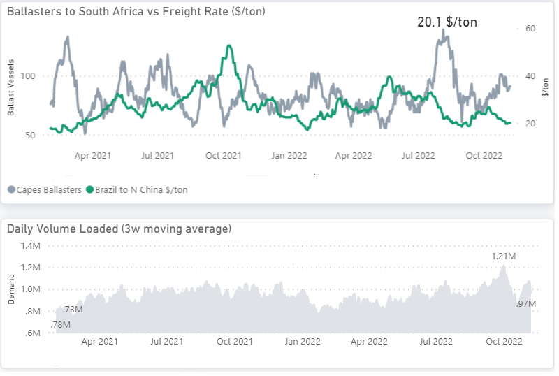
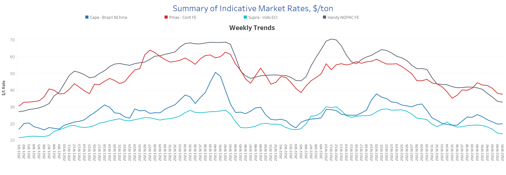
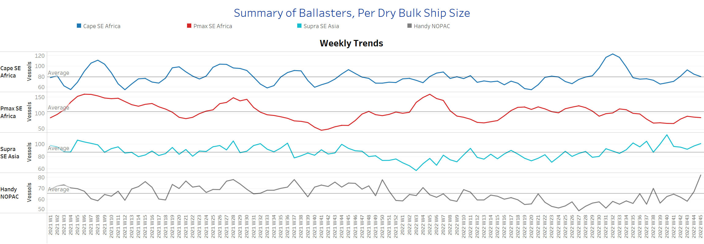
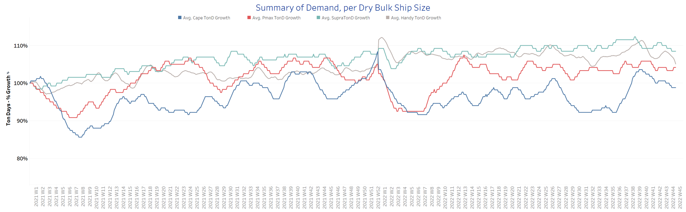
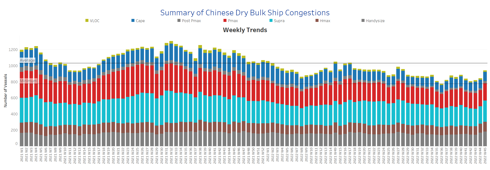

# Signal Dry Bulk Weekly Report

**Date:** November 10, 2022  
**Publisher:** Breakwave Advisors | **Category:** Market Insights  
**Original URL:** [https://www.breakwaveadvisors.com/insights/2022/11/10/signal-dry-bulk-weekly-report](https://www.breakwaveadvisors.com/insights/2022/11/10/signal-dry-bulk-weekly-report)  

---

In the second week of November, the downward trend in freight rates has not yet reversed, with the number of ships sailing ballast gradually increasing, while demand (ton days) is growing even more slowly. There are fears of a weaker last quarter this year with a negative trend in freight rates for all ship size classes. The chart below shows that growth in daily loadings for Capesize vessels is slowing while ballast vessel numbers are increasing, driving freight rates near $20/tonne.

Meanwhile, Reuters news agency reported that iron ore futures in Singapore retreated on Monday after a four-session rise, while contracts for the steelmaking material on the Dalian Commodity Exchange extended gains despite China maintaining a tight COVID restriction. Iron ore fundamentals are yet to show a positive trend amid domestic restrictions and expected curbs on steel production during the winter. However, some market participants are betting that China will eventually move away from its zero COVID policy.

*An increasing number of ballasters with weaker growth dynamics in the daily loaded*

> **Figure 1: Chart of the Week Capesize: Supply - Demand**  
> **Interactive Data & Source:** [Signal Ocean Platform](https://go.signalocean.com/e/983831/dry-reports-c3/2ktgym/284263092?h=YH4CC3tPt1D5dkuz7gb4I3GK8H7cwlGXQ8XuSEd99ss) | [Local Asset](file:///C:/Users/Dell/Github/Shipping/corpus/03-breakwave/insights/2022/assets/2022-11-10_signal-dry-bulk-weekly-report_img_unnamed-2022-11-10t121121923_d2d4d14c222f.png)

Data Source: The Signal Ocean Platform, Capesize Brazil to China (C3) Dashboard
[Signal Ocean Platform](https://go.signalocean.com/e/983831/dry-reports-c3/2ktgym/284263092?h=YH4CC3tPt1D5dkuz7gb4I3GK8H7cwlGXQ8XuSEd99ss)

## Section 1/ Freight -Market Rates ($/T) Weaker

‘The Big Picture’ - Capesize and Panamax Bulkers and Smaller Ship Sizes

> **Figure 2: Market Chart 2**  
> **Interactive Data & Source:** [Signal Ocean Platform](https://www.thesignalgroup.com/signal-ocean-platform) | [Local Asset](file:///C:/Users/Dell/Github/Shipping/corpus/03-breakwave/insights/2022/assets/2022-11-10_signal-dry-bulk-weekly-report_img_unnamed-2022-11-10t123840633_c51181eeba59.png)

The weaker outlook for freight rates continued in the second week of November, with signs of a gradual upward trend in the Capesize segment.

- **Capesize**freight rates from Brazil to North China are now around $20/tonne, which shows a slight upward trend but is still nearly $6/tonne lower than in week 40.
- **Panamax**freight rates fromtheContinent to the Far East continued their downward trend, falling to $37.6/tonne, down nearly $7/tonne from the week 40 high.
- **Supramax**freight rates for the Indo-ECI route are now at their lowest level this year at $14/tonne, down nearly $7/tonne from the week 34 peak.
- **Handysize**freight rates from NOPAC to the Far East fell to $33/tonne, down 48% from the week 21 peak.

## Section 2/ Supply -Ballasters (# Vessels) Increasing

> **Figure 3: Supply Trend Lines for Key Load Areas**  
> **Interactive Data & Source:** [Signal Ocean Platform](https://www.thesignalgroup.com/signal-ocean-platform) | [Local Asset](file:///C:/Users/Dell/Github/Shipping/corpus/03-breakwave/insights/2022/assets/2022-11-10_signal-dry-bulk-weekly-report_img_unnamed-2022-11-10t130944869_b55697feaba3.png)

The number of ships in ballast has remained above the annual average for the smaller vessel categories since the first week of November, while the Capesize and Panamax segments have shown a downward correction.

- **Capesize**SE Africa: The number of vessels is now close to the annual average of 79 after peaking in week 43.
- **Panamax**SE Africa: The number of ships was 88, with a continued downward trend, while the numbers are below the annual average since the end of week 36.
- **Supramax**SE Asia: The number of ships has increased to 102, 10 more than in week 43 and 15 more than the annual average.
- **Handysize**NOPAC: The number of vessels has maintained an accelerated increase in recent days, rising to more than 80, almost 30% above the annual average, with a continuous upward trend in the coming days.

## Section 3/ Demand -TonDays Decreasing

> **Figure 4: TonDays Decreasing**  
> **Interactive Data & Source:** [Signal Ocean Platform](https://www.thesignalgroup.com/signal-ocean-platform) | [Local Asset](file:///C:/Users/Dell/Github/Shipping/corpus/03-breakwave/insights/2022/assets/2022-11-10_signal-dry-bulk-weekly-report_img_unnamed-2022-11-10t131118367_750f58f4828b.png)

Percent demand growth in the Panamax and Surpamax size classes remained very volatile, and there were no immediate signs of a sustained upturn.

- **Capesize**demand ton-days: The last peak in week 40 has not yet been followed by an upswing, but there have been consecutive weeks of slower growth movement.
- **Panamax**demand ton-days: Strong volatility with a downward trend in November.
- **Supramax**demand ton-days: Overall trend is downward growth in November with limited potential for a strong recovery.
- **Handysize**demand ton-days: The decline has continued since week 43, with a significant downward correction expected in the coming days.

## Section 4/ Port Congestion -No of Vesselsincreasing

> **Figure 5: Dry Bulk Ships Congested at Chinese Ports**  
> **Interactive Data & Source:** [Signal Ocean Platform](https://www.thesignalgroup.com/signal-ocean-platform) | [Local Asset](file:///C:/Users/Dell/Github/Shipping/corpus/03-breakwave/insights/2022/assets/2022-11-10_signal-dry-bulk-weekly-report_img_unnamed-2022-11-10t131214825_439db56621c6.png)

There is more congestion in the Panamax, Supramax, and Handysize segments, with overall bulk congestion reaching new highs.

- **Capesize:**The number of vessels increased to 111, up 7 from the previous week.
- **Panamax:**The number of vessels increased to 223, with a firm upward trend.
- **Supramax:**The number of congested vessels increased to 257, 36 more than the previous week.
- **Handysize**: The number of congested vessels was 184, up 8% from the previous week and up 32% from week 43.

Data Source:[Signal Ocean Platform](https://www.thesignalgroup.com/signal-ocean-platform)
