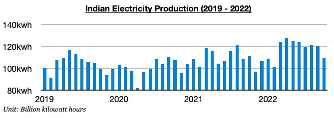
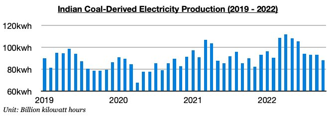
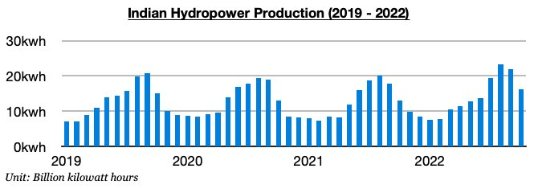

# Decline in India's Electricity Production

**Date:** November 11, 2022  
**Publisher:** Breakwave Advisors | **Category:** Market Insights  
**Original URL:** [https://www.breakwaveadvisors.com/insights/2022/11/11/decline-in-indias-electricity-production](https://www.breakwaveadvisors.com/insights/2022/11/11/decline-in-indias-electricity-production)  

---

*By*[*Jeffrey Landsberg*](https://www.linkedin.com/in/jeffrey-landsberg-70ab957/)

As we discussed in our most recent Weekly Dry Bulk Report, India produced only 109.6 billion kilowatt hours of electricity last month which is down month-on-month by 10.4 billion kilowatt hours (-9%) and down year-on-year by 1.2 billion kilowatt hours (-1%). The weakness has come as a surprise. Electricity production had previously grown on a year-on-year basis for seven straight months.

> **Figure 1: Chart 1 (61)**  
> [Local Asset](file:///C:/Users/Dell/Github/Shipping/corpus/03-breakwave/insights/2022/assets/2022-11-11_decline-in-indias-electricity-production_img_chart1286129_5b03443f0f2d.jpg)

India’s coal-derived electricity generation totaled 88.1 billion kilowatt hours last month. This has marked a month-on-month decline of 5.2 billion kilowatt hours (-6%) and is down year-on-year by 1.7 billion kilowatt hours (-2%). Coal derived-electricity generation had previously increased on a year-on-year basis during six of the prior seven months.

> **Figure 2: Chart 2 (52)**  
> [Local Asset](file:///C:/Users/Dell/Github/Shipping/corpus/03-breakwave/insights/2022/assets/2022-11-11_decline-in-indias-electricity-production_img_chart2285229_a52bfbe2618a.jpg)

India’s hydropower output totaled approximately 16.3 billion kilowatt hours last month. This has marked a month-on-month decline of 5.7 billion kilowatt hours (-26%) but is up year-on-year by 3.2 billion kilowatt hours (24%). It is very normal for hydropower output to decline by a large amount on a month-on-month basis in October. India's hydropower output has now grown on a year-on-year basis during ten of the last twelve months.

> **Figure 3: Chart 3 (39)**  
> [Local Asset](file:///C:/Users/Dell/Github/Shipping/corpus/03-breakwave/insights/2022/assets/2022-11-11_decline-in-indias-electricity-production_img_chart3283929_1c334b37480f.jpg)
