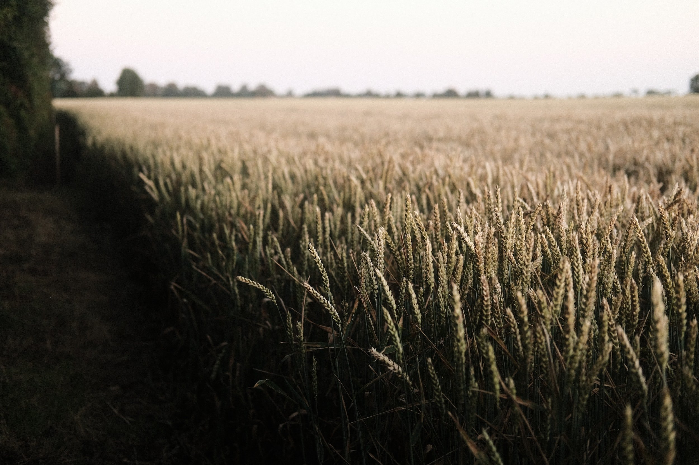
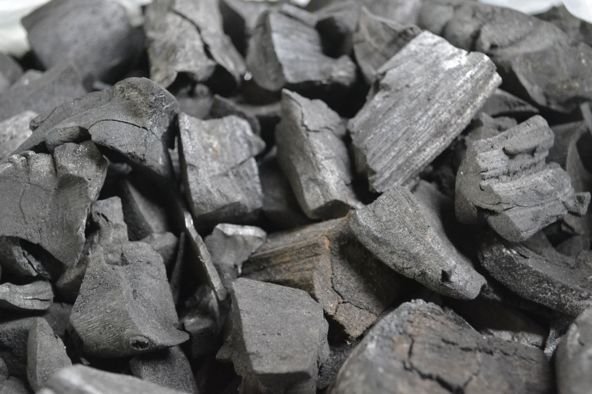
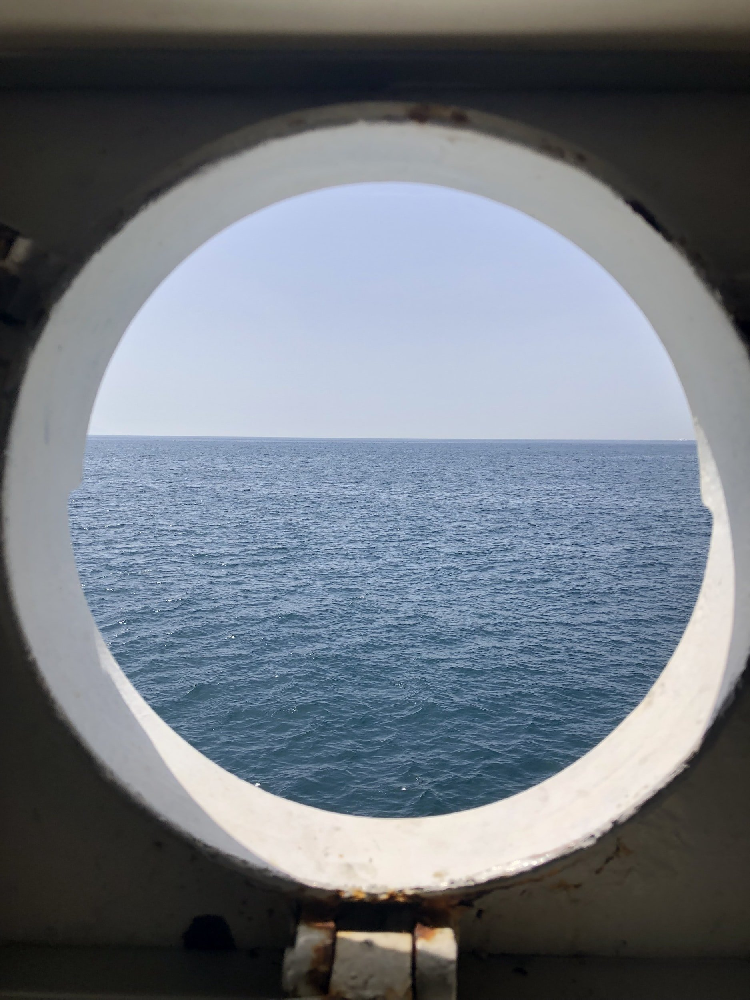
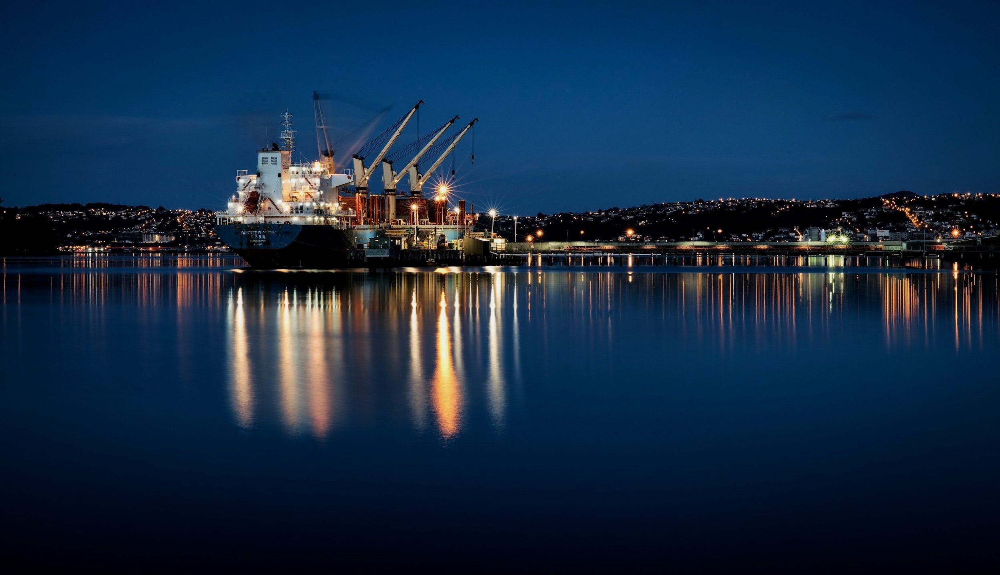
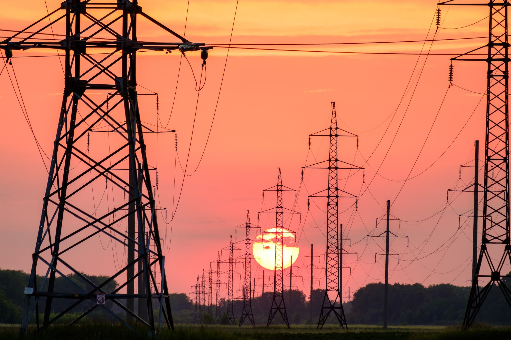

# Weekly Insights Review

**Date:** November 13, 2022  
**Publisher:** Breakwave Advisors | **Category:** Market Insights  
**Original URL:** [https://www.breakwaveadvisors.com/insights/2022/11/13/weekly-insights-review](https://www.breakwaveadvisors.com/insights/2022/11/13/weekly-insights-review)  

---

## Welcome to Our Weekly Insights Review

## Read Here Everything You Need to Know

> **Figure 1: Unsplash Image Gg1cwf4qdlg**  
> **Interactive Data & Source:** [Breakwave Advisors Market Insights](https://www.breakwaveadvisors.com/insights/2022/11/7/pl0blv4mfipsin9fewu1w8uam5yt7i) | [Local Asset](file:///C:/Users/Dell/Github/Shipping/corpus/03-breakwave/insights/2022/assets/2022-11-13_weekly-insights-review_img_unsplash-image-gg1cwf4qdlg_bae496ab7c12.jpg)

## Shipping Decarbonization Weekly Insights

## Latest Trends

Energy and shipping organizations have met to outline plans to accelerate the development of a green corridor to transport iron ore between Australia and East Asia.
[Read More](https://www.breakwaveadvisors.com/insights/2022/11/7/pl0blv4mfipsin9fewu1w8uam5yt7i)

## The Shipfix Blog: Ukrainian Grain Exports Facing Renewed Uncertainty

## A Week Is an Eternity in Geopolitics

The drone attacks on Russian naval assets in Crimea last weekend led to the suspension of the country's participation in the deal that has allowed Ukraine to recommence seaborne exports of grains.
[Read More](https://www.breakwaveadvisors.com/insights/2022/11/8/the-shipfix-blog-ukrainian-grain-exports-facing-renewed-uncertainty)

> **Figure 2: Unsplash Image 5d1ilpv4c6w**  
> **Interactive Data & Source:** [Breakwave Advisors Market Insights](https://www.breakwaveadvisors.com/insights/2022/11/9/indonesia-and-russia-remain-chinas-primary-sources-for-coal-imports) | [Local Asset](file:///C:/Users/Dell/Github/Shipping/corpus/03-breakwave/insights/2022/assets/2022-11-13_weekly-insights-review_img_unsplash-image-5d1ilpv4c6w_c5d359255bda.jpg)

## Indonesia and Russia Remain China's Primary Sources for Coal Imports

## No Coal Was Imported From the Philippines, South Africa or Colombia

Coal import data for September by origin has been released and shows that imports from Indonesia have remained China’s primary source and Russia the second largest source.
[Read More](https://www.breakwaveadvisors.com/insights/2022/11/9/indonesia-and-russia-remain-chinas-primary-sources-for-coal-imports)

> **Figure 3: Unsplash Image 6d71rfz7j1e**  
> **Interactive Data & Source:** [Breakwave Advisors Market Insights](https://www.breakwaveadvisors.com/insights/2022/11/10/signal-dry-bulk-weekly-report) | [Local Asset](file:///C:/Users/Dell/Github/Shipping/corpus/03-breakwave/insights/2022/assets/2022-11-13_weekly-insights-review_img_unsplash-image-6d71rfz7j1e_526cae017a9f.jpg)

## Signal Dry Bulk Weekly Report

## Snapshot of Spot Freight Rates, Supply-Demand Trends, Port Congestions

In the second week of November, the downward trend in freight rates has not yet reversed, with the number of ships sailing ballast gradually increasing, while demand (ton days) is growing even more slowly.
[Read More](https://www.breakwaveadvisors.com/insights/2022/11/10/signal-dry-bulk-weekly-report)

> **Figure 4: Unsplash Image Th Tagnriy**  
> **Interactive Data & Source:** [Breakwave Advisors Market Insights](https://www.breakwaveadvisors.com/insights/2022/11/9/metals-gain-as-low-inventories-spark-concerns-of-supply-shortages) | [Local Asset](file:///C:/Users/Dell/Github/Shipping/corpus/03-breakwave/insights/2022/assets/2022-11-13_weekly-insights-review_img_unsplash-image-th-tagnriy_784041607495.jpg)

> **Figure 5: Unsplash Image Mrhdg5x3ofa**  
> **Interactive Data & Source:** [Breakwave Advisors Market Insights](https://www.breakwaveadvisors.com/insights/2022/11/9/metals-gain-as-low-inventories-spark-concerns-of-supply-shortages) | [Local Asset](file:///C:/Users/Dell/Github/Shipping/corpus/03-breakwave/insights/2022/assets/2022-11-13_weekly-insights-review_img_unsplash-image-mrhdg5x3ofa_98e15107b26e.jpg)

## Metals Gain As Low Inventories Spark Concerns of Supply Shortages

## A Weaker Usd Also Helped Support Investor Appetite

Rising COVID-19 cases in China weighed on sentiment across commodity markets.
[Read More](https://www.breakwaveadvisors.com/insights/2022/11/9/metals-gain-as-low-inventories-spark-concerns-of-supply-shortages)

> **Figure 6: Unsplash Image Auu3z6lajma**  
> **Interactive Data & Source:** [Breakwave Advisors Market Insights](https://www.breakwaveadvisors.com/insights/2022/11/10/irans-crudecondensate-exports-reached-9-month-highs-in-october-2022) | [Local Asset](file:///C:/Users/Dell/Github/Shipping/corpus/03-breakwave/insights/2022/assets/2022-11-13_weekly-insights-review_img_unsplash-image-auu3z6lajma_f43ac4f29bb0.jpg)

## Iran’s Crude/condensate Exports Reached 9 Month Highs in October 2022

## The Factors Driving the Sharp Rebound in Iranian Crude Exports

This insight explores the sharp climb in Iran’s crude/condensate exports observed in October, changes to floating storage and Russia’s impact on Iranian fleet activity.
[Read More](https://www.breakwaveadvisors.com/insights/2022/11/10/irans-crudecondensate-exports-reached-9-month-highs-in-october-2022)

## Braemar Weekly Dry Bulk Report

## The Big Picture: Supply Forecast

Ordering this year has naturally slowed down as the freight market softened throughout the year.
[Read More](https://www.breakwaveadvisors.com/insights/2022/11/11/braemar-weekly-dry-bulk-report)

> **Figure 7: Unsplash Image U9f2mwh73m (1)**  
> **Interactive Data & Source:** [Breakwave Advisors Market Insights](https://www.breakwaveadvisors.com/insights/2022/11/11/decline-in-indias-electricity-production) | [Local Asset](file:///C:/Users/Dell/Github/Shipping/corpus/03-breakwave/insights/2022/assets/2022-11-13_weekly-insights-review_img_unsplash-image-u9f2mwh73m28129_2ef68e9eef5d.jpg)

## Decline in India's Electricity Production

## The Weakness Has Come As a Surprise

As we discussed in our most recent Weekly Dry Bulk Report, India produced only 109.6 billion kilowatt hours of electricity last month which is down month-on-month by 10.4 billion kilowatt hours (-9%) and down year-on-year by 1.2 billion kilowatt hours (-1%).
[Read More](https://www.breakwaveadvisors.com/insights/2022/11/11/decline-in-indias-electricity-production)

> **Figure 8: Unsplash Image Qpaoxji4dao (1)**  
> [Local Asset](file:///C:/Users/Dell/Github/Shipping/corpus/03-breakwave/insights/2022/assets/2022-11-13_weekly-insights-review_img_unsplash-image-qpaoxji4dao28129_9453b7359296.jpg)
