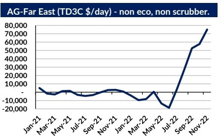

# Gibson's Weekly Tanker Market Report

**Date:** November 15, 2022  
**Publisher:** Breakwave Advisors | **Category:** Market Insights  
**Original URL:** [https://www.breakwaveadvisors.com/insights/2022/11/15/gibsons-weekly-tanker-market-report](https://www.breakwaveadvisors.com/insights/2022/11/15/gibsons-weekly-tanker-market-report)  

---

VLCC earnings have been remarkably strong over the past few months despite the prospect of OPEC+ production cuts which are largely focused on the Middle East. With cuts planned, next year will also coincide with increases in regional refining runs, the fundamentals suggest earnings will ease into 2023. However, shifting trade flows and fleet developments make this outcome far from certain.

First, it is important to take stock of the supply side. Gibson counts 876 VLCCs on the water, however, the actual number of vessels available in the mainstream, non-sanctioned market is in fact lower, with 15% of the fleet engaged in sanctioned or unconventional activity. Furthermore, an additional 15% of the fleet (excluding those engaged in questionable activity) are over 15 years of age, putting almost 1/3rd of the VLCC fleet out of reach for many charterers. Coincidently, the number of VLCCs over 15 years of age sold to relatively unknown owners almost matches the number of newbuild VLCCs delivered from shipyards to date, suggesting that available fleet supply is largely unchanged year on year.

Secondly, global VLCC export volumes grew steadily from April to August as Middle East exports rose to a 6 year high (excluding April 2020), the West African VLCC market share also increased, Latam exports remained close to a 12-month high and total Gulf Coast exports hit record levels. However, due to the lag effect between loading and discharging, tonne miles peaked in October, whilst the time taken to ballast back to the next load port is likely to be keeping the market firm for now. It is also important to note that OPEC cuts for November onwards are from October’s target, which despite a marginal trim of 100kbd from September, is up by nearly 2.2mbd since January. In effect, OPEC is cutting from a high baseline, which provides a hedge against VLCC earnings returning to the lows seen earlier in the year.

> **Figure 1: Screenshot 20221115 101928 Samsung Notes**  
> **Interactive Data & Source:** [Gibsons Co](https://www.gibsons.co.uk/market-reports) | [Local Asset](file:///C:/Users/Dell/Github/Shipping/corpus/03-breakwave/insights/2022/assets/2022-11-15_gibsons-weekly-tanker-market-report_img_screenshot-20221115-101928-samsungno_949ff4018f27.jpg)

Looking forward, the demand side fundamentals for VLCCs are mixed. Assuming OPEC+ cuts are adhered to, export volumes from the Middle East could decline by nearly 1mbd. Additionally, with 3 new refineries in the region planning to increase run rates in 2023, increased domestic crude intake also threatens export volumes. US crude exports may also be challenged over the coming months. As the SPR release program looks to conclude, coinciding with the end of US Gulf refinery maintenance season, it would be logical to assume that some downwards pressure in regional exports could materialise. However, it is not all negative. VLCCs could continue to benefit from volatile Aframax and Suezmax markets. Indeed, VLCCs have increased their market share on the US Gulf, Latin America and West Africa to Europe runs from almost nothing to 20% this year.

Whilst this route is not as long haul as heading to Asia, it keeps VLCC supply locked into the Atlantic market, meaning these vessels never appear on a Middle East position list. As long as VLCCs continue to offer a superior $/tonne to the Aframax and Suezmax sector, they can expect to continue enjoying increased market share.

> **Figure 2: Unsplash Image Ut1ygrqxy8**  
> **Interactive Data & Source:** [Gibsons Co](https://www.gibsons.co.uk/market-reports) | [Local Asset](file:///C:/Users/Dell/Github/Shipping/corpus/03-breakwave/insights/2022/assets/2022-11-15_gibsons-weekly-tanker-market-report_img_unsplash-image-ut1ygrqxy8_ff2053728dc1.jpg)

Finally, it’s impossible to look at the VLCC market without understanding the dynamics in India and China. Both markets have increased their intake of Russian barrels, however, VLCC import volumes in China have grown steadily since the summer, notably in tandem with crude import quotas for 2023 being granted; whereas in India, VLCC volumes have remained flat year on year, with the most growth seen in Aframax volumes. Looking ahead, imports from Russia into these countries may have peaked, suggesting incremental barrels will have to come from elsewhere, possibly supporting larger crude carriers.

Putting these factors together, the VLCC market has reason to remain optimistic, even if current freight levels are likely to be overvalued. Generally speaking, the market should expect earnings to ease into 2023, but remain firmly above average 2022 levels, until the next black swan event comes to light.

Data source:[Gibson Shipbrokers](https://www.gibsons.co.uk/market-reports)
