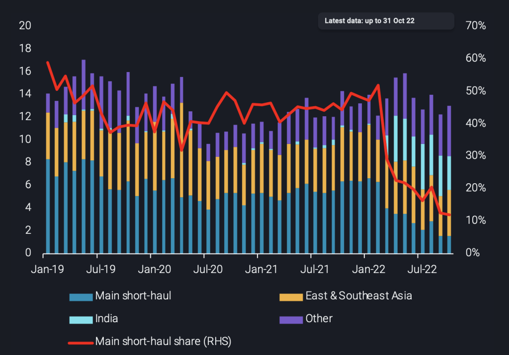
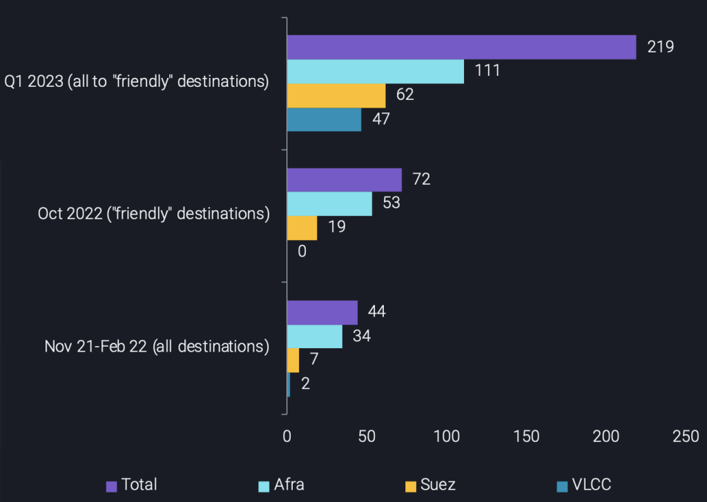
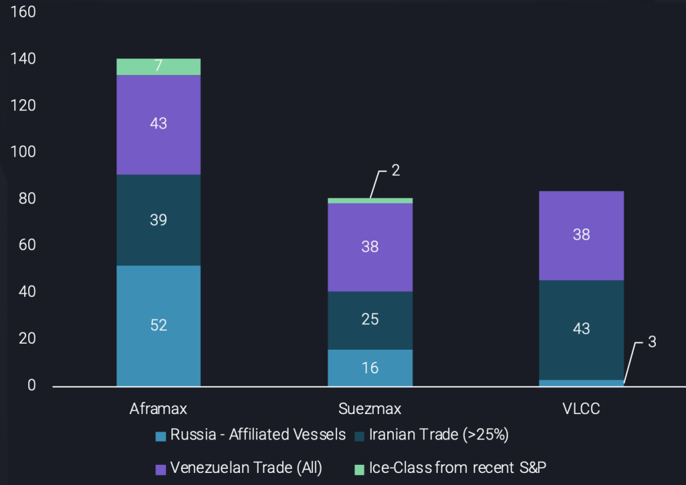

# The shipping logistics behind reshuffling Russian crude

**Date:** November 16, 2022  
**Publisher:** Breakwave Advisors | **Category:** Market Insights  
**Original URL:** [https://www.breakwaveadvisors.com/insights/2022/11/16/the-shipping-logistics-behind-reshuffling-russian-crude](https://www.breakwaveadvisors.com/insights/2022/11/16/the-shipping-logistics-behind-reshuffling-russian-crude)  

---

Russian crude exports are having to travel farther as the country redirects flows to “friendly” nations. In this insight, we assess the implications for Russia’s shipping logistics, and hence the feasibility of this reshuffle.

*By*[*Dylan Simpson*](https://www.linkedin.com/search/results/all/?heroEntityKey=urn%3Ali%3Afsd_profile%3AACoAACDtdn0BzHNR8syu_G8WxL-JXL-9PRT5AP4&keywords=dylan%20simpson&origin=RICH_QUERY_SUGGESTION&position=0&searchId=9f4e911f-2dd1-4040-aa4a-1c65b4ae44da&sid=1M1)

Ιn the past, Russian crude exports have largely been sent to relatively short-haul destinations. Specifically, Vortexa’s historical[flows](https://analytics.vortexa.com/?dateRange=2019-01-01T00%3A00%3A00.000Z__2022-11-10T23%3A59%3A59.999Z&filtersEnabled=%5B%22p%22%2C%22o%22%2C%22d%22%2C%22d_r%22%2C%22v%22%2C%22intra%22%2C%22sts_o%22%2C%22c_o%22%2C%22w%22%2C%22sts%22%2C%22v_o%22%5D&from=%5B%22b996521be9c996db3560ca234a56286ac38f798d34be229437555fab4f12a6a5%22%5D&metric=t&page=Flows&products=%5B%2254af755a090118dcf9b0724c9a4e9f14745c26165385ffa7f1445bc768f06f11%22%5D&productsExcluded=%5B%22578b0722570521d64e6a1527e1fb88ddb1a064cc15afe1d6023d2a0b6d66be6b%22%2C%22bb70cf56200f5b72ba69a90bda2c6b47ba29da23945c6f1994cfd4c2ef2fe0ff%22%5D&tabId=9bd621ca-e761-485b-b308-18da5cc93ef0&timeSeriesProperty=destination_shipping_region)data shows that the main short-haul destinations for Russian crude (UK Cont, Baltic and Black Sea) represented – on average – a combined 45% of monthly Russian crude exports from January 2019 to February 2022. During Russia’s conflict with Ukraine, reshuffling due to sanctions has already seen this figure decline to just 20% on average. This highlights that Russia is already having to travel further to export its crude.

> **Figure 1: Russian Crude Exports (Excl**  
> *Russian crude exports (excl. Kebco & CPC blend) per destination (mt, LHS) vs short-haul share (%, RHS)*  
> **Interactive Data & Source:** [Vortexa](https://www.vortexa.com/insights/crude/irans-crude-condensate-exports-reached-9-month-highs-in-october-2022/) | [Local Asset](file:///C:/Users/Dell/Github/Shipping/corpus/03-breakwave/insights/2022/assets/2022-11-16_the-shipping-logistics-behind-reshuffling-russian-crude_img_chart-1-5-1024x715_7bb04140cf21.png)

While shorter-haul exports of Russian crude have decreased, longer-haul exports are increasing and are expected to increase further in the months following the EU ban on Russian oil and products. The obvious consequence of increasing voyage mileage is that turnaround times for voyages increase, which means that each tanker can be reused fewer times in a month. Essentially, this translates to a higher number of vessels being required. To highlight the implications this could have on the tanker fleet required to accommodate these new markets, we have explored the potential tanker requirements for three main scenarios.

Our first scenario is a base case, and shows the vessel requirements to accommodate Russian crude exports during the most recent winter (November 2021 to February 2022), before the conflict in Ukraine. A larger share of short-haul destinations meant the total fleet requirement sat at 44 vessels per month, consisting mostly of Aframax tankers, with a few Suezmaxes as well as 2 VLCCs, for ship-to-ship (STS) transfers.

Secondly, a similar exercise revealed what would have been required to direct all of October 2022’s Russian crude flows to “friendly” nations only, namely China (from the Baltic and from Kozmino) as well as India & Turkey (from the Baltic and Black Sea). Already, the longer voyages alone would have required 60% more tankers overall compared to last winter’s requirements. This may have been feasible in October given the current alternative “shadow” fleet that could accommodate this trade, but what about this winter?

In our final scenario, we take into account what could have been sent to Europe in Q1 of 2023, and assume it gets redirected to “friendly” nations, including the 500kbd from the Druzhba pipeline. Now, particularly in China’s case, the use of ice-class vessels also needs to be considered. The expected behaviour assumed here is that ice-class Aframaxes would take crude from the Baltic to STS with VLCC tankers off the Azores, which would then head to China. This adds a new layer to Russia’s tanker requirements evident in the increased VLCC requirement seen in the chart below.

> **Figure 2: Requirements by Vessel Class to Export Europe-Facing Russian**  
> *Requirements by vessel class to export Europe-facing Russian crude in three different periods/scenarios (no. of vessels)*  
> **Interactive Data & Source:** [Vortexa](https://www.vortexa.com/insights/crude/irans-crude-condensate-exports-reached-9-month-highs-in-october-2022/) | [Local Asset](file:///C:/Users/Dell/Github/Shipping/corpus/03-breakwave/insights/2022/assets/2022-11-16_the-shipping-logistics-behind-reshuffling-russian-crude_img_chart-2-4-1024x728_29b531b66809.png)

The fleet in our final scenario includes a requirement of 91 ice-class Aframaxes, about 2.5 times the 36 currently available to Russia. Not only that, but the total fleet requirement is almost 5 times more than what was required last winter if Russia’s aim is to maintain 100% of their current exports to China, India and Turkey. This also begs the question: are these requirements sufficient to be absorbed by Russia’s shadow candidates?

> **Figure 3: Number of Viable Candidates for Carrying Russian Crude Post-Eu**  
> *Number of viable candidates for carrying Russian crude post-EU ban (no. of vessels)*  
> **Interactive Data & Source:** [Vortexa](https://www.vortexa.com/insights/crude/irans-crude-condensate-exports-reached-9-month-highs-in-october-2022/) | [Local Asset](file:///C:/Users/Dell/Github/Shipping/corpus/03-breakwave/insights/2022/assets/2022-11-16_the-shipping-logistics-behind-reshuffling-russian-crude_img_chart-3-1-1024x724_3f279cf5a04d.png)

Examining the shadow fleet above – made up of Russia-affiliated vessels, vessels involved in Iranian and Venezuelan sanctioned trade and ice-class vessels from recent S&P activities – we can see that this fleet could virtually absorb Russia’s current fleet (for more details see[here](https://www.vortexa.com/insights/crude/irans-crude-condensate-exports-reached-9-month-highs-in-october-2022/)). However, practically, this would require all of the aforementioned Iranian and Venezuelan vessels to be involved, which is not necessarily going to be the case. Additionally, and more importantly, even if this were to materialise, the ice-class requirements are far too high for Russia to maintain 100% of their crude exports out of the Baltic. This means that a reduction in Russian exports in Q1 is highly likely and adds further aspects for Russia to consider when deciding whether or not to accept an oil price cap.

Data Source:[Vortexa](https://www.vortexa.com//oil-gas-data-traders-analysts-data-scientists?gclid=Cj0KCQjw8_qRBhCXARIsAE2AtRZKOvMnbilZ_6_91d7huSFFy71pWLrnPwGwOHVzXsmsG-1a1mZnQw8aAt89EALw_wcB&hsa_acc=1782073842&hsa_ad=548425387665&hsa_cam=14746637662&hsa_grp=125038601902&hsa_kw=&hsa_mt=&hsa_net=adwords&hsa_src=g&hsa_tgt=dsa-1431852288425&hsa_ver=3&utm_campaign=%5BCD%5D%20-%20DSA%20-%20EMEA&utm_medium=cpc&utm_medium=ppc&utm_source=google&utm_source=adwords&utm_term=)
