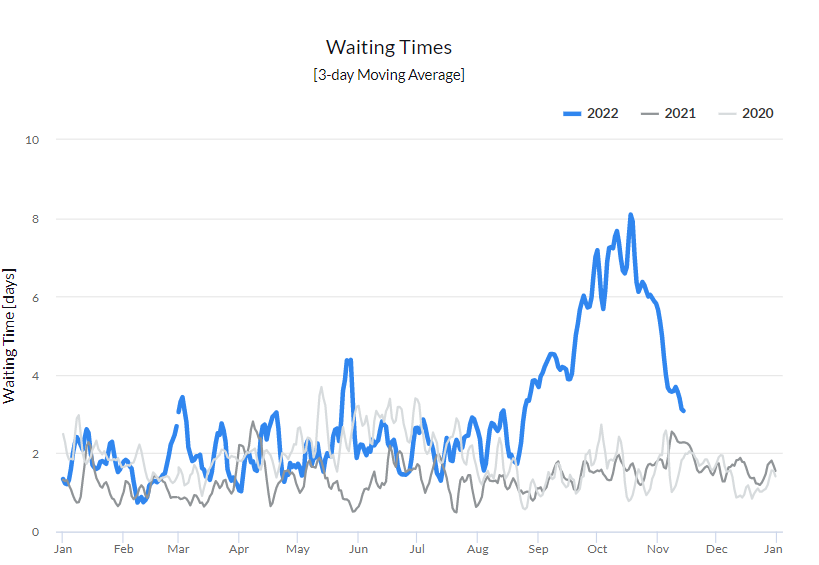
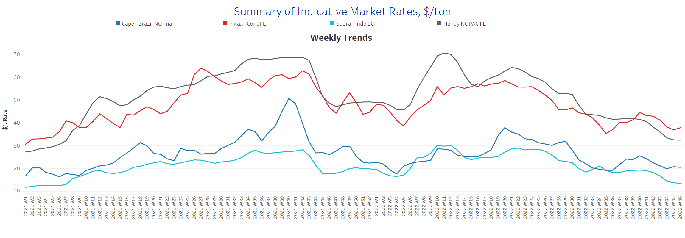
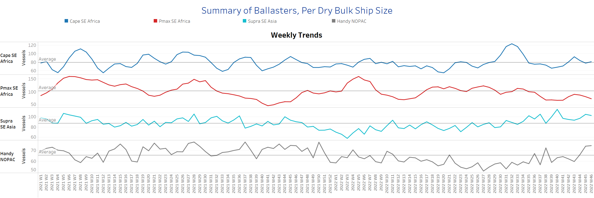
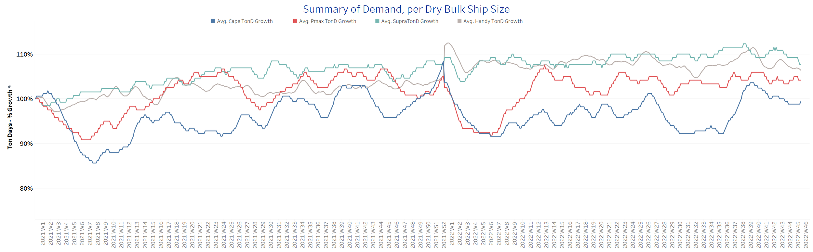
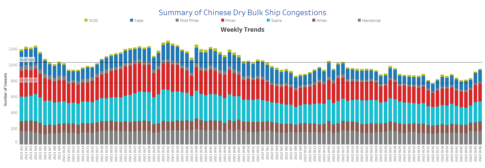

# Signal Dry Bulk Weekly Report

**Date:** November 17, 2022  
**Publisher:** Breakwave Advisors | **Category:** Market Insights  
**Original URL:** [https://www.breakwaveadvisors.com/insights/2022/11/17/signal-dry-bulk-weekly-report](https://www.breakwaveadvisors.com/insights/2022/11/17/signal-dry-bulk-weekly-report)  

---

The third week of November is characterized by a continued weaker trend in freight rates and demand for smaller vessel categories, while there are signs of stronger momentum in Capesize. The potential for strength in the coming days was reflected in iron ore prices. According to Reuters news agency, the spot price of iron ore for delivery to northern China has recovered from a two-year low and is up $92/tonne, but is still 43% below its 2022 peak of $160/tonne reached on March 8 in the wake of geopolitical tensions between Russia and Ukraine.

Meanwhile, there are reports that Russia will extend the Black Sea Grain Export Agreement, which could lead to a significant upward movement in freight rates for the Supramax and Handysize segments. In recent days, we have seen a slowdown in the 3-day moving average of the waiting time for congestion in the Bosphorus Strait canals following news that Russia will not agree to an extension of the export agreement.

*Significant slowdown after the peak in early November*

> **Figure 1: Chart of the Week Dry Bulk: Canals Congestion, Bosphorus Straits**  
> **Interactive Data & Source:** [Signal Ocean Platform](https://go.signalocean.com/e/983831/dry-reports-canals-congestion/2kwxjt/285397797?h=AX4TG7bNSzHdHZ1N7CRZ20n0Ry1F3W1CN1opMKcgT5o) | [Local Asset](file:///C:/Users/Dell/Github/Shipping/corpus/03-breakwave/insights/2022/assets/2022-11-17_signal-dry-bulk-weekly-report_img_unnamed-2022-11-17t123041984_d36ca7122ed1.png)

Data Source: The Signal Ocean Platform, Dry Bulk Canals Congestion
[Signal Ocean Platform](https://go.signalocean.com/e/983831/dry-reports-canals-congestion/2kwxjt/285397797?h=AX4TG7bNSzHdHZ1N7CRZ20n0Ry1F3W1CN1opMKcgT5o)

## Section 1/ Freight -Market Rates ($/T) Weaker

‘The Big Picture’ - Capesize and Panamax Bulkers and Smaller Ship Sizes

> **Figure 2: Market Chart 2**  
> **Interactive Data & Source:** [Signal Ocean Platform](https://www.thesignalgroup.com/signal-ocean-platform) | [Local Asset](file:///C:/Users/Dell/Github/Shipping/corpus/03-breakwave/insights/2022/assets/2022-11-17_signal-dry-bulk-weekly-report_img_unnamed-2022-11-17t123139315_948fd23bc404.png)

The Capesize segment continues to show an upward trend, while the weaker outlook for freight rates in the other size classes emerged in the last days of November.

- **Capesize**freight rates are now approaching $21/tonne, up nearly $2/tonne from two weeks ago, but still $6/tonne lower than week 40.
- **Panamax**freight rates fromtheContinent to the Far East fell below $37/tonne, down nearly $7/tonne from the week 40 peak.
- **Supramax**freight rates for the Indo-ECI route reached their lowest level of the year at less than $14/tonne, down nearly $7/tonne from the week 34 peak.
- **Handysize**freight rates from NOPAC to the Far East fell to $32.5/tonne, down 50% from the week 21 peak.

## Section 2/ Supply -Ballasters (# Vessels) Increasing

> **Figure 3: Supply Trend Lines for Key Load Areas**  
> **Interactive Data & Source:** [Signal Ocean Platform](https://www.thesignalgroup.com/signal-ocean-platform) | [Local Asset](file:///C:/Users/Dell/Github/Shipping/corpus/03-breakwave/insights/2022/assets/2022-11-17_signal-dry-bulk-weekly-report_img_unnamed-2022-11-17t123308100_b1c2e0405607.png)

The number of ships in ballast remains above the annual average in November for the smaller ship categories, while a downward trend is observed in the Capesize and Panamax segments.

- **Capesize**SE Africa: The number of vessels is now close to the annual average of 81, 3 more than the previous week, after peaking in week 43.
- **Panamax**SE Africa: The number of ships has dropped to 74, continuing the downward trend since the beginning of the previous week, while the numbers are below the annual average since the end of week 36.
- **Supramax**SE Asia: The number of vessels has risen to more than 100, almost 15 above the annual average.
- **Handysize**NOPAC: The number of vessels continues to increase at an accelerated pace, reaching around 75 vessels, almost 30% above the annual average, with a steady upward trend.

## Section 3/ Demand -TonDays Decreasing

> **Figure 4: TonDays Decreasing**  
> **Interactive Data & Source:** [Signal Ocean Platform](https://www.thesignalgroup.com/signal-ocean-platform) | [Local Asset](file:///C:/Users/Dell/Github/Shipping/corpus/03-breakwave/insights/2022/assets/2022-11-17_signal-dry-bulk-weekly-report_img_unnamed-2022-11-17t123431592_c671a0a6afdd.png)

Demand growth continues to decline with the exception of the Capesize segment, while the small ship categories are facing further weakness.

- **Capesize**demand ton-days: The percentage increase remained at the highest level since the last peak in week 27.
- **Panamax**demand ton-days: The upward trend began at the end of last week and continued in the third week of September with a slower pace of growth.
- **Supramax**demand ton-days: After peaking in the first days of September, there seems to have been a steady percentage increase over the last three weeks.
- **Handysize**demand ton-days: There is a downward trend, while it seemed that the previous week was the last firmness after the low of week 32.

## Section 4/ Port Congestion -No of Vesselsincreasing

> **Figure 5: Dry Bulk Ships Congested at Chinese Ports**  
> **Interactive Data & Source:** [Signal Ocean Platform](https://www.thesignalgroup.com/signal-ocean-platform) | [Local Asset](file:///C:/Users/Dell/Github/Shipping/corpus/03-breakwave/insights/2022/assets/2022-11-17_signal-dry-bulk-weekly-report_img_unnamed-2022-11-17t125414948_68086aeedbf9.png)

The new highs in total bulk carrier congestion this week are led by the larger vessel categories, Capesize and Panamax.

- **Capesize:**The number of vessels increased to 145, up 24 from the previous week.
- **Panamax:**The number of vessels remained at an accelerated level of 223, with a firm upward trend for the second consecutive week.
- **Supramax:**The number of congested vessels increased to 251, down 4 from the previous week, but still significantly higher than week 44 (~212).
- **Handysize**: The number of congested vessels was 169, 6 more than the previous week and 25% above the week 36 low.

Data Source:[Signal Ocean Platform](https://www.thesignalgroup.com/signal-ocean-platform)
