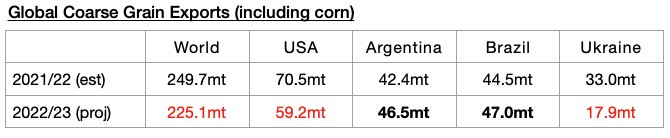
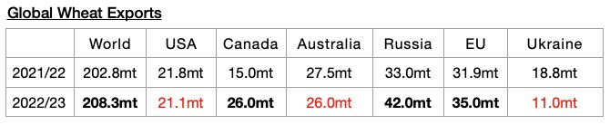
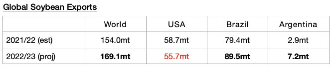
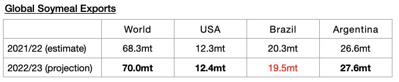

# Global Grain Trade Forecast Lowered Again

**Date:** November 18, 2022  
**Publisher:** Breakwave Advisors | **Category:** Market Insights  
**Original URL:** [https://www.breakwaveadvisors.com/insights/2022/11/18/global-grain-trade-forecast-lowered-again](https://www.breakwaveadvisors.com/insights/2022/11/18/global-grain-trade-forecast-lowered-again)  

---

*By*[*Jeffrey Landsberg*](https://www.linkedin.com/in/jeffrey-landsberg-70ab957/)

The United States Department of Agriculture (USDA) recently released their latest global grain export forecast for the 2022/23 season and has again reduced its expectations. The trade forecast is still very preliminary, but of note is that 486.6 million tons of exports are now expected. This is 800,000 tons less than was forecast a month ago and would mark a year-on-year decline of 22 million tons (-4%). Global soybean exports (soybeans are not technically classified as a grain) are now expected to rise year-on-year by 15.1 million tons.

The USDA is now forecasting that global coarse grain exports in 2022/23 will total 225.1 million tons, which is 800,000 tons less than was forecast a month ago and would mark a year-on-year decline of 24.6 million tons (-10%)

.

> **Figure 1: Chart 1 (62)**  
> [Local Asset](file:///C:/Users/Dell/Github/Shipping/corpus/03-breakwave/insights/2022/assets/2022-11-18_global-grain-trade-forecast-lowered-again_img_chart1286229_0924516c1505.jpg)

Global wheat exports are expected to total 208.7 million tons. This is 400,000 tons more than was forecast a month ago but would mark a year-on-year increase of 5.9 million tons (3%).

> **Figure 2: Chart 2 (53)**  
> [Local Asset](file:///C:/Users/Dell/Github/Shipping/corpus/03-breakwave/insights/2022/assets/2022-11-18_global-grain-trade-forecast-lowered-again_img_chart2285329_328364a73393.jpg)

Global soybean exports are expected to total 169.1 million tons. This is 900,000 tons (1%) more than was forecast a month ago and would mark a year-on-year increase of 15.1 million tons (10%).

> **Figure 3: Chart 3 (41)**  
> [Local Asset](file:///C:/Users/Dell/Github/Shipping/corpus/03-breakwave/insights/2022/assets/2022-11-18_global-grain-trade-forecast-lowered-again_img_chart3284129_3073648f2a2f.jpg)

Global soymeal exports are expected to total 70 million tons. This is 100,000 tons more than was forecast a month ago but would mark a year-on-year increase of 1.7 million tons (2%).

> **Figure 4: Chart 4 (19)**  
> [Local Asset](file:///C:/Users/Dell/Github/Shipping/corpus/03-breakwave/insights/2022/assets/2022-11-18_global-grain-trade-forecast-lowered-again_img_chart4281929_163d1bbd3f94.jpg)
