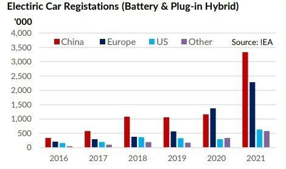

# Gibson's Weekly Tanker Market Report

**Date:** November 19, 2022  
**Publisher:** Breakwave Advisors | **Category:** Market Insights  
**Original URL:** [https://www.breakwaveadvisors.com/insights/2022/11/19/gibsons-weekly-tanker-market-report](https://www.breakwaveadvisors.com/insights/2022/11/19/gibsons-weekly-tanker-market-report)  

---

Electric vehicles (EVs) can rightfully claim to be a leading technology to reduce emissions. The uptake of EVs accelerated exponentially in recent years on the back of increases in driving range, improving infrastructure, subsidies, greater vehicle availability and rising demand. According to the latest IEA update, EV sales reached record levels in 2021, accounting for 9% of global new vehicles sales. The most impressive growth was seen in China, where electric car registrations (both battery and plug-in hybrid) jumped to 3.3 million last year, accounting for 16% of all sales. EV sales in Europe also grew strongly, with 2.3 million being sold and EV’s market share climbing to 17%. In the US, EV uptake is lower in comparison, although growth rates are accelerating as well.

Last year, 630,000 EVs were sold in the world’s biggest oil consumer, seeing their market share double to 4.5%. Elsewhere, EV sales are showing the same trend, with uptake increasing. Globally, strong sales data during the 1st half of this year indicate that EVs could account for 13% of all sales in 2022.

It is worth mentioning, however, that despite this rapid growth, absolute numbers remain very small. The global light duty EV fleet (battery and plug-in hybrid) reached 16.2 mln in 2021, compared to a total fleet of over 1.4 billion.

As such, for now, the impact on oil demand remains limited, with the IEA assessing that in 2021, EVs displaced just 0.3 mbd. Yet, future targets are very ambitious: the electric car fleet needs to displace 7 mbd by 2030 to be in line with Net Zero emission goals. It is questionable whether these ambitious targets (which would require electric car fleet growing to over 300 million by 2030) are achievable, considering the need to expand the infrastructure network of charging points, the limited availability of critical metals and EV price levels.

> **Figure 1: Screenshot 20221117 130644 Drive**  
> **Interactive Data & Source:** [Gibsons Co](https://www.gibsons.co.uk/market-reports) | [Local Asset](file:///C:/Users/Dell/Github/Shipping/corpus/03-breakwave/insights/2022/assets/2022-11-19_gibsons-weekly-tanker-market-report_img_screenshot-20221117-130644-drive_a63cba239ebc.jpg)

Nonetheless, it is apparent that EV growth rates will continue to accelerate, gradually eating deeper into road fuel consumption. Investment in electrification, driven by EV sales, is already accounting for more than 65% of end use investment in the transport sector and expected to reach 74% this year, meanwhile capital expenditure by listed battery manufacturers tripled in 2021 relative to 2020 levels.

Internationally, there is a growing trend of governments increasing their ambitions in terms of zeroemission vehicle targets. For example, the US set a target last year for EVs to represent 50% of all light duty vehicles sales in 2030, whilst the EU’s Fit-for-55 package includes recently passed regulation on car fleet emission reductions, which effectively means that all new cars and vans sold from 2035 will need to be emissions free. Government subsidies also play an important role here, with the expenditure nearly doubling in 2021, with key consuming countries announcing new or extending existing support. The EU spent $12.5 billion on subsidies last year and China was narrowly behind at $12 billion.

In terms of existing limitations, recent technological advancements could lead to a declining need for critical metals for battery production. A notable growth has been observed in lithium-ion phosphate cathodes, which do not require nickel or cobalt. Similarly, sodium-ion batteries, that completely avoid critical metals, also show strong potential.

Of course, inflationary pressures are inevitably translating into higher EV retail prices, negatively affecting affordability. Yet, with crude benchmarks well above $100/bbl earlier this year and the OPEC+ decision to cut production by 2 mbd earlier this week to support oil prices, one cannot help but wonder that upward pressure on oil prices will only speed up the transition to electric vehicles.

Data source:[Gibson Shipbrokers](https://www.gibsons.co.uk/market-reports)
