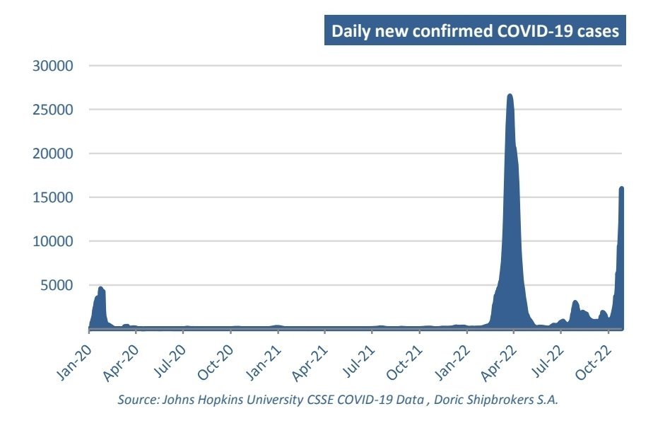

# Doric Weekly Market Insight

**Date:** November 21, 2022  
**Publisher:** Breakwave Advisors | **Category:** Market Insights  
**Original URL:** [https://www.breakwaveadvisors.com/insights/2022/11/21/doric-weekly-market-insight](https://www.breakwaveadvisors.com/insights/2022/11/21/doric-weekly-market-insight)  

---

[

> **Figure 1: Bymichalis Voutsinas**  
> *ByMichalis Voutsinas*  
> **Interactive Data & Source:** [Linkedin](https://www.linkedin.com/in/michalis-voutsinas-587544163/) | [Local Asset](file:///C:/Users/Dell/Github/Shipping/corpus/03-breakwave/insights/2022/assets/2022-11-21_doric-weekly-market-insight_img_page2b211_c497586f981c.png)](https://www.breakwaveadvisors.com/agenda22)

Breakwave Advisors 2nd annual shipping market event

The forty-sixth week started with the IMF stressing that global economic growth prospects are confronting a unique mix of headwinds, including Russia’s invasion of Ukraine, interest rate increases to contain inflation, and lingering pandemic effects such as China’s lockdowns and disruptions in supply chains. With such a demoralizing start, few assets could find the courage to defy the law of gravity. Baltic indices were not among them, with the whole pack being dragged down to multi-month minima. In particular, the leading Baltic Capesize index landed in the four-digits, concluding today at a mere $9,305 daily. Trending sideways, Baltic Panamax 82K index closed the trading week in the red, lingering today at $14,343 daily. Echoing concerns for the course of global economy on their balancing levels, geared segments seem to be trapped in a downward spiral lately, concluding this Friday at $12,870 and $13,727 daily for the Baltic Supramax and Handysize Indices respectively.

Similar concerns were raised again this week from the IMF. In the Fund's latest World Economic Outlook, global growth was forecasted for next year to balance at 2.7 percent, a sizeable downward revision from few months earlier. In sync, the IMF's chart of this week below indicated that there has been a steady worsening in recent months for purchasing manager indices that are tracking a range of G20 economies. As the chart illustrates, readings for a growing share of G20 countries have fallen from expansionary territory earlier this year to levels that signal contraction.

That is the case for both advanced and emerging market economies, underscoring the slowdown’s global nature. While gross domestic product releases for the third quarter surprised on the upside in some major economies, October PMI releases point to weakness in the fourth quarter – particularly in Europe. In China, intermittent pandemic lockdowns and the struggling real estate sector are contributing to a slowdown that can be seen not only in PMI data but also in investment, industrial production, and retail sales. This will inevitably have a significant impact on other economies due to China’s leading role in trade.

Setting aside the stressed real estate sector, the world’s second largest economy is facing another challenge this November. Covid-19 cases rose again this week, climbing to near their highest of the pandemic. As the country eases some of its draconian Zero Covid rules, authorities signalled that they are preparing to face even more infections. In fact, China reported 24,028 infections on Thursday – the highest since April when Shanghai’s outbreak spurred a surge in the national tally. In particular, the manufacturing hub of Guangzhou remains a hotspot, with more than 9,000 new cases.

The southern city is setting up hospitals and quarantine sites with capacity for circa 250,000 beds for Covid-19 infections, officials said on Thursday. While state media have repeatedly reiterate Beijing’s commitment to eradicate Covid, health officials on Thursday laid out plans to strengthen the national hospital framework in a potential sign they are bracing for an increased caseload.

> **Figure 2: Screenshot 20221121 103123 Samsung Notes**  
> **Interactive Data & Source:** [Doric](https://www.doric.gr/) | [Local Asset](file:///C:/Users/Dell/Github/Shipping/corpus/03-breakwave/insights/2022/assets/2022-11-21_doric-weekly-market-insight_img_screenshot-20221121-103123-samsungno_ef32d70fc5e5.jpg)

Against this backdrop, Asian markets were in cautious mood on Friday, with investors preoccupied by the gloomy global economic picture and Covid’s persistence in China. The Nikkei ended the forty-sixth week marginally lower, reversing small gains from earlier. Hong Kong stocks dropped off amid more losses for Chinese property developers. China stocks trended mostly sideways, tracking the cautious mood in regional markets amid concerns of aggressive US tightening and domestic Covid19 outbreaks. In commodity markets, oil futures regained some ground but still nursed steep losses for the week on worries about Chinese demand and tighter monetary policy in the US.

In sharp contrast, iron ore futures advanced on Friday and were set for their third straight weekly rise. Expectations that Beijing will present enhanced policy actions to support the economy – after easing some of its strict Covid-19 containment rules and unveiling fresh measures to aid an ailing property sector – added to the buoyant mood. The latter was largely absent though from the spot market for yet another week.

Data source:[Doric](https://www.doric.gr/)
