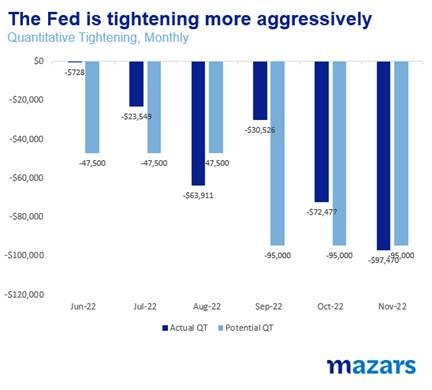
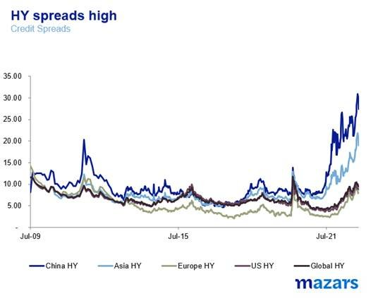
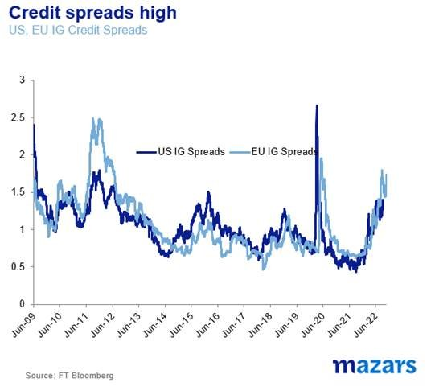
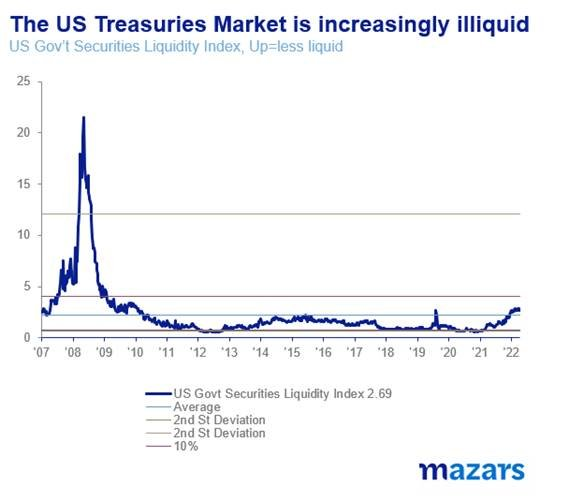
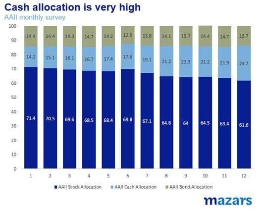

# Mazars Comment : Difficult decisions and difficult truths

**Date:** November 21, 2022  
**Publisher:** Breakwave Advisors | **Category:** Market Insights  
**Original URL:** [https://www.breakwaveadvisors.com/insights/2022/11/21/mazars-comment-difficult-decisions-and-difficult-truths](https://www.breakwaveadvisors.com/insights/2022/11/21/mazars-comment-difficult-decisions-and-difficult-truths)  

---

[

> **Figure 1: Bygeorge Lagarias**  
> *ByGeorge Lagarias*  
> **Interactive Data & Source:** [Linkedin](https://www.linkedin.com/in/george-lagarias-mba-3baa769/) | [Local Asset](file:///C:/Users/Dell/Github/Shipping/corpus/03-breakwave/insights/2022/assets/2022-11-21_mazars-comment-difficult-decisions-and-difficult-truths_img_page2b211_c497586f981c.png)](https://www.breakwaveadvisors.com/agenda22)

Breakwave Advisors 2nd annual shipping market event

This isn’t a weekly I was particularly eager to write. It requires telling truths, and truths are always uneasy.

## The Pivot

For one, it’s bad news for our ‘pivoting’ camp, a word that in the past few months has been grossly and infuriatingly overused. Not only is the Fed speeding up the rate of Quantitative Tightening, but it is also showing no signs that it is ready to change its aggressive tightening policy.

The most dovish remarks in two weeks concern mostly the possible reduction of the pace of rate hikes from three to two for the next session. A double rate hike a year ago would have been considered anathema. Today, it is seen as manna.

Meanwhile, everyone on the FOMC is focused on inflation numbers

This is bad news for investors, but also bad for the Fed. The US economy is slipping into a seemingly mild recession. However, the pace of slowdown could accelerate, as external economic conditions deteriorate, the housing market is clearly suffering, manufacturing is contracting, and consumers spend their savings and rack up expensive credit card debt to which a divided Congress will be of little help.

> **Figure 2: Market Chart 2**  
> [Local Asset](file:///C:/Users/Dell/Github/Shipping/corpus/03-breakwave/insights/2022/assets/2022-11-21_mazars-comment-difficult-decisions-and-difficult-truths_img_image01128329_4ca4bc40bd70.jpg)

Meanwhile, credit conditions continue to deteriorate, and this is becoming felt everywhere, from high-yield markets.

> **Figure 3: Market Chart 3**  
> [Local Asset](file:///C:/Users/Dell/Github/Shipping/corpus/03-breakwave/insights/2022/assets/2022-11-21_mazars-comment-difficult-decisions-and-difficult-truths_img_image01228329_a092348a59d5.jpg)

> **Figure 4: To Investment Grade Credit Spreads…**  
> [Local Asset](file:///C:/Users/Dell/Github/Shipping/corpus/03-breakwave/insights/2022/assets/2022-11-21_mazars-comment-difficult-decisions-and-difficult-truths_img_image01328229_3cc34660fe2e.jpg)

> **Figure 5: … and the Ever Deep Us Treasury Markets**  
> [Local Asset](file:///C:/Users/Dell/Github/Shipping/corpus/03-breakwave/insights/2022/assets/2022-11-21_mazars-comment-difficult-decisions-and-difficult-truths_img_image01428129_df4c1c59e982.jpg)

Adhering strictly to its inflation mandate, the Fed often behaves as if the rate for the world’s global reserve currency exists in a bubble. Failure to acknowledge the external risk build-up, increases the probability of a financial accident. The real risk is not the accident itself. It is that fourteen years when all manner of accidents were prevented with the use of money printing may have turned markets and policymakers complacent.

We believe that the pivot, orderly (which is our base case) or disorderly (in case of an accident) will come. The question is at what cost to the global economy?

## The Budget

Unfortunately, the Fed is not the only one viewing things parochially. Last week, pundits cheered Jeremy Hunt’s new budget. The deferment of some key tax obligations for the period closer to (or after) the general election was seen as a masterstroke to calm markets and at the same time avoid putting too much extra stress on consumption. “We must be very careful not to assign to this deliverance the attributes of a victory”, Sir Winston Churchill might have warned us.

Avoiding a market panic is a very low hurdle to defining a ‘good’ budget. For one, it does little to alleviate current consumer pains. Economists see more than 90% probability of a recession for the next year. More importantly, the Government failed to convince international investors to return to British risk assets, which they have, by and large, shunned after the referendum.

Meanwhile, the EU sent a warning letter last week that Brexit issues, especially pertaining to the NI protocol, remain open, despite the goodwill exhibited by Mr Sunak’s government. This comes after the government’s statement that it is not looking for a Swiss-type deal, and will steam ahead towards the deletion of 4000 EU laws from UK statute books.

The narrative suggests that bond vigilantes attacked Mr Kwarteng’s expansive budget. However, as long as external bond market conditions remain precarious, the UK bond market is still in peril. The very notion of Brexit could find itself at the centre of fresh market turbulence, leaving Mr Sunak’s government with very few options. It has already capitulated to market demands, tightening fiscal policy. If markets attack Brexit, how could the government for which the notion is a ‘raison d'etre’, possibly react?

## What Investors and Managers Need to Do

Our job number one is to acknowledge risks. We have unwaveringly done so and have been keen to share our concerns with clients.

The question is what can portfolio managers and investors do in this environment, especially when diversification hasn’t worked this year?

Seasoned asset managers are planning ahead, keeping market ‘bets’ to a minimum, either by holding cash or by being ‘neutral’ in their asset allocation, which we have been doing since our last September meeting.

> **Figure 6: It Is Exactlybecauseof the Higher Probability of Further**  
> *It is exactlybecauseof the higher probability of further financial distress that we believe the pivot could come sooner rather than later. Thus we are making plans to make sure we don’t lose out when and if the pivot comes. The very high level of cash suggests that institutional investors are also waiting on the sidelines for precisely an abrupt US policy reversal.*  
> [Local Asset](file:///C:/Users/Dell/Github/Shipping/corpus/03-breakwave/insights/2022/assets/2022-11-21_mazars-comment-difficult-decisions-and-difficult-truths_img_image01528229_b90d0983b0c2.jpg)

Also, we have managed to steer clear of areas where the downside has been significant. From any exposure to new-age assets such as cryptocurrencies (which seemed to be getting a lot of attention eighteen months ago), to illiquid securities and funds, such as real estate, we have made sure our investment offering is liquid, transparent and of high quality.

Meanwhile, we need to acknowledge upside risks as well as downside risks. Over-protecting a portfolio, or reverting to cash, could risk missing the market rebound, causing lacklustre returns for years to come.

Investment managers should not fail to acknowledge the lack of visibility in a very bad environment. Instead, they should be open about it, and protect what can be protected. Hence, our ‘Neutral Position’.
