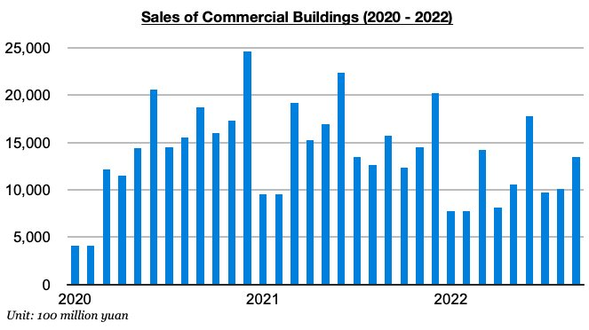
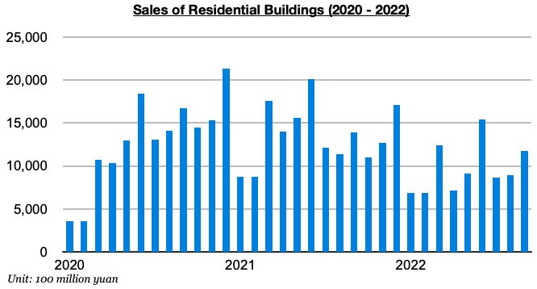

# Smaller Contraction in Chinese Home Sales

**Date:** November 22, 2022  
**Publisher:** Breakwave Advisors | **Category:** Market Insights  
**Original URL:** [https://www.breakwaveadvisors.com/insights/2022/11/22/smaller-contraction-in-chinese-home-sales](https://www.breakwaveadvisors.com/insights/2022/11/22/smaller-contraction-in-chinese-home-sales)  

---

[

> **Figure 1: Byjeffrey Landsberg**  
> *ByJeffrey Landsberg*  
> **Interactive Data & Source:** [Linkedin](https://www.linkedin.com/in/jeffrey-landsberg-70ab957/) | [Local Asset](file:///C:/Users/Dell/Github/Shipping/corpus/03-breakwave/insights/2022/assets/2022-11-22_smaller-contraction-in-chinese-home-sales_img_buttonwdate_d45d644f7990.png)](https://www.breakwaveadvisors.com/agenda22)

As we have been highlighting in our Weekly China Reports, sales of commercial buildings in China (the vast majority of which are residential homes) have remained in contraction, but the contraction has at least continued to slow in recent months. The most recent data shows commercial building sales totaled 1.35 trillion yuan in September. This is up month-on-month by 34% and is down year-on-year by only 14%. This year-on-year contraction has marked the smallest contraction seen since July 2021. Still, though, sales have now contracted on a year-on-year basis for fifteen straight months.

> **Figure 2: Chart 1 (63)**  
> [Local Asset](file:///C:/Users/Dell/Github/Shipping/corpus/03-breakwave/insights/2022/assets/2022-11-22_smaller-contraction-in-chinese-home-sales_img_chart1286329_9e0a423d721f.jpg)

Also of note is that sales of residential buildings (which last year contributed to 89% of all commercial building sales) continue to experience a near identical trajectory. Sales totaled 1.12 trillion yuan, which is up month-on-month by 31% and is down year-on-year by 15% This has also marked the smallest year- on-year contraction seen since July 2021. As with commercial building sales, though, residential building sales have now contracted on a year-on-year basis for fifteen straight months.

> **Figure 3: Chart 2 (54)**  
> [Local Asset](file:///C:/Users/Dell/Github/Shipping/corpus/03-breakwave/insights/2022/assets/2022-11-22_smaller-contraction-in-chinese-home-sales_img_chart2285429_b7b3b9676fcb.jpg)
