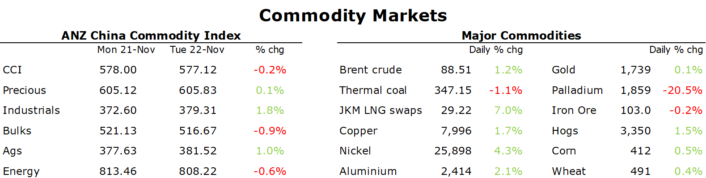

# European gas rallies after EC sets high price cap

**Date:** November 23, 2022  
**Publisher:** Breakwave Advisors | **Category:** Market Insights  
**Original URL:** [https://www.breakwaveadvisors.com/insights/2022/11/23/ekejsqcl0jjqj2qrwm57x5yfyhzykz](https://www.breakwaveadvisors.com/insights/2022/11/23/ekejsqcl0jjqj2qrwm57x5yfyhzykz)  

---

[

> **Figure 1: Buttonwdate**  
> **Interactive Data & Source:** [Linkedin](https://www.linkedin.com/in/dahynes/) | [Local Asset](file:///C:/Users/Dell/Github/Shipping/corpus/03-breakwave/insights/2022/assets/2022-11-23_ekejsqcl0jjqj2qrwm57x5yfyhzykz_img_buttonwdate_d45d644f7990.png)](https://www.breakwaveadvisors.com/agenda22)

*By*[*Daniel Hynes*](https://www.linkedin.com/in/dahynes/)

A risk on tone across markets boosted sentiment across the commodity complex. This was further supported by ongoing supply side issues.

> **Figure 2: 1669150707445**  
> **Interactive Data & Source:** [Publications Anz](https://publications.anz.com/SingletrackCMS__DownloadDocument?docRef=9da60b05-bf7c-4f82-aa5a-e5b354bbd29a&uid=bd219b92-f5cc-400e-9646-4178791864b7&jobRef=a78ca078-9889-47f0-be05-a6dd8c6f59b6) | [Local Asset](file:///C:/Users/Dell/Github/Shipping/corpus/03-breakwave/insights/2022/assets/2022-11-23_ekejsqcl0jjqj2qrwm57x5yfyhzykz_img_1669150707445_5349cde3d26f.png)

**Crude oil**struggled to keep its head above water in early trading amid an uncertain economic backdrop. Health officials in China advised sticking with COVID-zero amid the severe outbreak. Restrictions were tightened across several cities, including mandated tests within 48 hours to access public venues in Beijing. This weighed on the outlook for demand. Crude oil prices rallied after Saudi Arabia was joined by Kuwait in rejecting the idea that OPEC+ was considering an output hike. The largest OPEC producer said it stands ready to make further cuts if needed. This comes as the group implements its recent cut to quotas of 2mb/d. This policy is expected to stay in place until the end of 2023. The market is also cautious as G7 nation discuss a price-cap plan. Chinese buyers are said to have paused some purchases of Russian crude amid the uncertainty.

**European natural gas**pushed higher after the European Commission proposed a price cap above current levels. Dutch front month futures gained as much as 7% after the commission announced a price-cap level of EUR275/MWh. The measures will only be used if the price is exceeded for two weeks. The gap between the Dutch price and LNG prices must also be greater than EUR58 for 10 trading days. Sentiment was also boosted after Gazprom warned supplies via Ukraine may be reduced next week because some of the Russian fuel meant for Moldova remains in the transit nation. Even with full inventories, winter without any Russian gas would be a challenge for Europe. The threat of European buyers relaying even more on LNG saw**North Asia LNG**spot prices rally. The Japan Korea Marker gained more than 7% to finish the session at USD29.22/MMBtu.

**Coal**prices in Asia edged lower as China said it will raise the amount of coal sold under long term contracts. The NDRC asked miners to increase contracted volumes by 300mt to 2.9bn tonnes. Even so,[**China’s reliance on imported coal**](https://publications.anz.com/SingletrackCMS__DownloadDocument?docRef=9da60b05-bf7c-4f82-aa5a-e5b354bbd29a&uid=bd219b92-f5cc-400e-9646-4178791864b7&jobRef=a78ca078-9889-47f0-be05-a6dd8c6f59b6)is likely to increase this winter, after a drought over summer saw China’s reservoir levels hit critical lows. Despite record coal output, it will still fall short of what is required.

**Copper**rebounded as a weaker USD and measures to support China’s real estate sector boosted sentiment. Investors shrugged off the surging COVID-19 cases and widening restrictions to focus on Beijing’s efforts to steady the economy. The call from financial regulators for banks to stabilise lending to real estate developers should see downside risks to demand lessened. This was supported by further falls in inventories for aluminium and zinc.

**Iron ore**futures were steady as traders eye the potential boost to demand amid the measures to support China’s property sector. However, the prospect of rising supply snuffed out any hope of further gains. In Brazil, daily average exports of iron ore in the first third of November were tracking above year-ago levels. In Australia, bulk export terminal Port Hedland just set a record for flows in the month of October.

**Gold**snapped a four-day losing streak as a weaker USD boosted investor demand. The dollar dipped following Fed official comments that reinforced expectations the central bank will slow the pace of rate increases. A rally in bonds pushed the 10-year yield down 6bps to 3.77%, helping support investor appetite.

Data source:[Commodities Wrap](https://www.linkedin.com/newsletters/commodities-wrap-6692196755876012032/?fbclid=IwAR3kiXJqZdxmp9ZcRwBNI7FsBySI-XSC0pfPur1qzjt7OZp7PTE59Tsl1QI)
