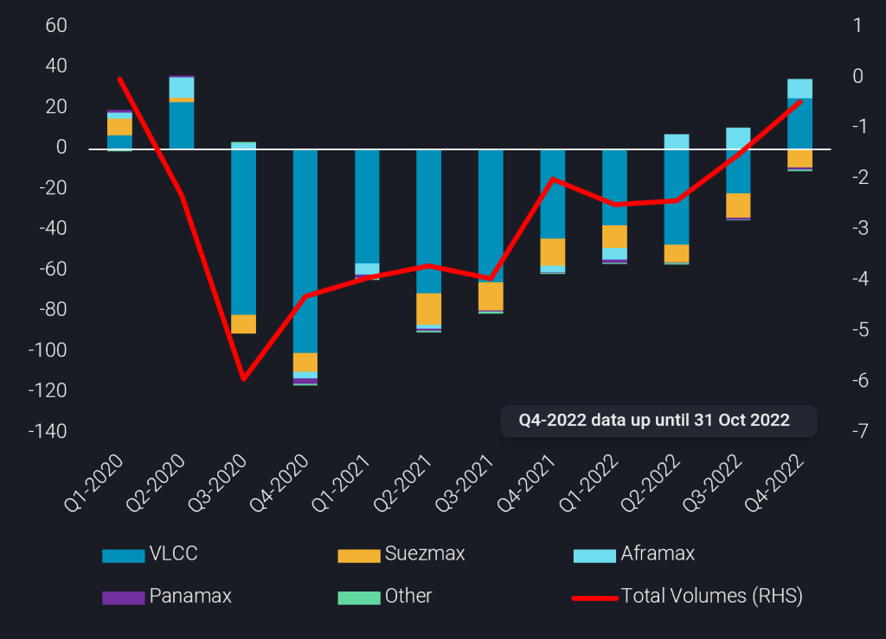
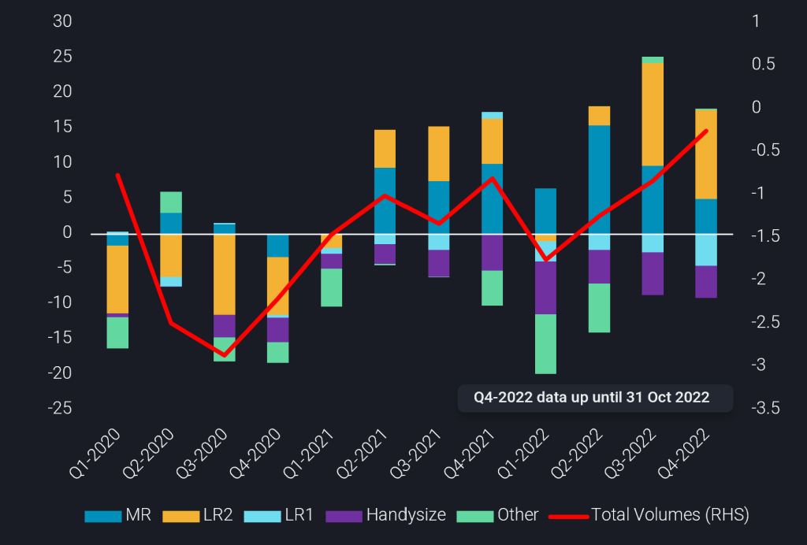

# Mid-Q4 2022 Tanker Freight Market Review

**Date:** November 23, 2022  
**Publisher:** Breakwave Advisors | **Category:** Market Insights  
**Original URL:** [https://www.breakwaveadvisors.com/insights/2022/11/23/mid-q4-2022-freight-market-review](https://www.breakwaveadvisors.com/insights/2022/11/23/mid-q4-2022-freight-market-review)  

---

[

> **Figure 1: Buttonwdate**  
> **Interactive Data & Source:** [Linkedin](https://www.linkedin.com/search/results/all/?heroEntityKey=urn%3Ali%3Afsd_profile%3AACoAABXVyecBtg-pRnIrZe0BoWk0ygPiUfbvhsw&keywords=mary%20evelyn%20melton&origin=RICH_QUERY_SUGGESTION&position=0&searchId=df50a435-022f-48a9-aea9-82252ae9cb04&sid=HjN) | [Local Asset](file:///C:/Users/Dell/Github/Shipping/corpus/03-breakwave/insights/2022/assets/2022-11-23_mid-q4-2022-freight-market-review_img_buttonwdate_d45d644f7990.png)](https://www.breakwaveadvisors.com/agenda22)

While the crude tanker market continues its rally and the clean market lags, Russia’s approach to the oil price cap will shape freight rates at a time when freight market dynamics are experiencing significant upheavals.

*By*[*Mary Melton*](https://www.linkedin.com/search/results/all/?heroEntityKey=urn%3Ali%3Afsd_profile%3AACoAABXVyecBtg-pRnIrZe0BoWk0ygPiUfbvhsw&keywords=mary%20evelyn%20melton&origin=RICH_QUERY_SUGGESTION&position=0&searchId=df50a435-022f-48a9-aea9-82252ae9cb04&sid=HjN)

As we reach the end of Q4 2022, we examine the key dynamics which have shaped crude and clean tanker markets and will continue to do so in the near term.

## Crude Tanker Market

Global demand reshuffling of the crude markets has led to declining outlets for Russian cargoes in ‘traditional’, mainly European, markets. Therefore, dirty crude tankers are indicating higher tonne-mileage on a q-o-q basis. VLCCs and Aframaxes have led this increase, the former having surpassed pre-pandemic tonne-miles in Q4 thus far for the first time since Q2 2020, as shown in the chart below.

> **Figure 2: Crude Tonne-Miles by Vessel Class (Lhs**  
> *Crude tonne-miles by vessel class (LHS, bn tm) vs 2019 avg. and global seaborne crude exports (RHS, mbd) vs 2019 avg.*  
> **Interactive Data & Source:** [Analytics Vortexa](https://analytics.vortexa.com/?dateRange=last-12-months&frequency3=week&page=FleetUtilisation&primarySplitProperty1=vessel_class&primarySplitProperty2=origin_shipping_region&products=%5B%2254af755a090118dcf9b0724c9a4e9f14745c26165385ffa7f1445bc768f06f11%22%5D&secondaryTimeSeries1=hide&tabId=74f4745a-8bfd-4773-92fe-2647449f4f60&to=%5B%22f39d455f5d38907394d6da3a91da4e391f9a34bd6a17e826d6042761067e88f4%22%5D&vesselClasses=%5B%22vlcc_plus%22%2C%22suezmax%22%2C%22aframax%22%5D) | [Local Asset](file:///C:/Users/Dell/Github/Shipping/corpus/03-breakwave/insights/2022/assets/2022-11-23_mid-q4-2022-freight-market-review_img_chart1-17nov-1-1024x740_5090b991055f.png)

The tonne-miles development has been backed from both increasing global crude volumes and greater mileage travelled. Looking specifically at the VLCC market, the return of higher levels of Chinese crude purchasing has significantly contributed to voyage mileage as USG-to-China daily tonne-miles more than doubled for the Sep-Oct period versus the first eight months of 2022 combined.

This development gave Suezmax and Aframax markets operating in the West of Suez some respite,[gaining back market share](https://analytics.vortexa.com/?dateRange=last-12-months&frequency3=week&page=FleetUtilisation&primarySplitProperty1=vessel_class&primarySplitProperty2=origin_shipping_region&products=%5B%2254af755a090118dcf9b0724c9a4e9f14745c26165385ffa7f1445bc768f06f11%22%5D&secondaryTimeSeries1=hide&tabId=74f4745a-8bfd-4773-92fe-2647449f4f60&to=%5B%22f39d455f5d38907394d6da3a91da4e391f9a34bd6a17e826d6042761067e88f4%22%5D&vesselClasses=%5B%22vlcc_plus%22%2C%22suezmax%22%2C%22aframax%22%5D)from their greater counterparts for Europe-bound crude cargoes. Aframax tankers toward Europe increased m-o-m nearly 25% in October, while VLCCs towards Europe showed the same proportion decrease.

Russian exports, on the other hand, are increasingly finding home further afield, supporting[Aframaxes and Suezmax utilisation](https://analytics.vortexa.com/?dateRange=2021-01-01T00%3A00%3A00.000Z__2022-10-31T23%3A59%3A59.999Z&page=FleetUtilisation&primarySplitProperty2=vessel_class&primaryTimeSeries1=utilisation&primaryTimeSeries3=avg-speed&products=%5B%22c8803c073c2980d9849784c16bcd41d7f7b7561d2c8c1799a16166527b120242%22%2C%2204c4ea46fc6fccfe8388717f399b40e5e348f9a98c451d99e7366caa998191a7%22%2C%22a6c0a31f361b480bddfb93b1b93f38f4989013ae54b2b147ab18116fdfbebdb7%22%2C%227cab5376bbb441feabdafc7b9f6272c2f9cbd10deb604bed8fa7f9986b2a39a9%22%2C%2220c87d7477f8cfe103904d9af911668c9a69bd03690e74e52e4386ad34e054ee%22%2C%22fef83ff1194c77d969693ee17c08e1112878e184e3449400e5904bc47b0119fe%22%2C%220fff12441aa3bf28aa568134ef527d09f741c543a49c0db8c03a195a0bbc481e%22%2C%224ff810b966104a658d22e7155596c11bedcd1e3e81594e6187ab88ec816d95d6%22%2C%224aebc156649b4c9691cdf3a9c81758426d10ffc944ba441f907f9fbe0964e879%22%2C%220c703e0e14d99572c62f15a26fdf2c9f0c00e111e625cd40b8b337154e81d46d%22%2C%221dfa78c965d56ab9d7b953e424d9160e9f79d0275e460c74994193a328f51537%22%2C%22054b79baa9a54171be2582c9b4f8fa82d0386d41c1914700a498dc5b95e8daba%22%2C%2274a8bc823d4742318d38072f81068fac1ac02ac66e0d491ea4366007bb95c602%22%5D&secondaryTimeSeries1=hide&tabId=b9c87d2e-6f9b-4443-aa33-ecd082fef7a6&vesselClasses=%5B%22vlcc_plus%22%2C%22aframax%22%2C%22suezmax%22%5D). More importantly, Aframaxes benefited the most from the increased tonne-miles, however Suezmaxes showed a very steep percentage increase. To put it in perspective, there were around five to six Suezmaxes carrying Russian crude before the invasion, compared to 20 to 25 after the invasion.

In the short-term, all crude tanker segments are poised to benefit from European diversification of its crude slates and higher refinery runs in China as the country attempts to stimulate its economy. China’s crude demand, Europe’s crude supply sourcing behaviour, along with the EU/UK shipping insurance ban will be the main drivers that will impact the crude tanker market in Q1.

In the medium term, a volatile profile of oil producing regions (West Africa, Yemen, Libya, Kazakhstan, Russia) could pose a downside risk for crude supply. On the demand side,[a sharp increase of oil on water and onshore crude inventory building thus far in Q4](https://www.linkedin.com/posts/activity-6995709018916687875-spjw?utm_source=share&utm_medium=member_desktop)is observed which points to a crude demand weakness. Both of these points raise questions on whether this level of trade flows can be sustained at similar levels, potentially heralding weaker freight markets around Q2 2023.

## Cpp Tanker Market

In the CPP tanker market, there are different dynamics moving into Q4. Despite higher CPP volumes globally, which continue to remain below pre-pandemic levels, overall tonne-miles have dropped, albeit remaining higher than pre-pandemic quantities. In the MR markets, tonne-miles continued to decline for the second consecutive quarter, while LR2 tonne-mileage remained strong.

> **Figure 3: Cpp Tonne-Miles by Vessel Class (Lhs**  
> *CPP tonne-miles by vessel class (LHS, bn tm) vs 2019 avg. and global seaborne CPP exports (RHS, mbd) vs 2019 avg.*  
> **Interactive Data & Source:** [Analytics Vortexa](https://analytics.vortexa.com/?dateRange=2020-01-01T00%3A00%3A00.000Z__2022-10-31T23%3A59%3A59.999Z&filtersEnabled=%5B%22p%22%2C%22o%22%2C%22d%22%2C%22d_r%22%2C%22v%22%2C%22intra%22%2C%22sts_o%22%2C%22c_o%22%2C%22v_o%22%2C%22c%22%2C%22w%22%5D&from=%5B%22b5fafce6e20de2dc307fb7e0b89978ee91a49a7b6ec6f5461daf2633f3c56674%22%5D&metric=t&page=Flows&products=%5B%22c76d43ed46524d628a16be1b63019719631a5c2dcbf54af5a94e90ebe2c37a4f%22%2C%22d72edbab2b5e2e249d8c216909945922a02eb017dd200f90876fee6fa180c743%22%2C%22deda35eb9ca56b54e74f0ff370423f9a8c61cf6a3796fcb18eaeeb32a8c290bb%22%5D&tabId=ac386282-5eaa-4021-851c-feec9348ebf5&timeSeriesHiddenSeries=%5B%22d7c97202bcb916580fb554245b1ed66965c0bb2ac71b55f34883d91bfdadcdda%22%5D&timeSeriesProperty=product_group_product) | [Local Asset](file:///C:/Users/Dell/Github/Shipping/corpus/03-breakwave/insights/2022/assets/2022-11-23_mid-q4-2022-freight-market-review_img_chart2-17nov-1024x692_8741c80db044.png)

The overall drop in tonne-miles indicates oil demand weakness against a global recessionary environment, while the shift in diesel yields has cut down light distillate trade in the West of Suez, which is dominated by MRs, reflecting their underperformance. In addition, the European – Russian diesel relationship has affected tanker dynamics to the benefit of MR and LR2 segments.

Since the Russian invasion, Europe has diversified its sources of clean products, by raising imports from the Middle East and Asia, but so far only very limited purchases from the United States. Europe’s efforts to source alternative volumes of diesel from further destinations have increased parcelling sizes, with MR tanker and LRs taking away market share from the Handysize tankers. Conversely, Russia has struggled to place its diesel in ‘friendly’ markets such as Latin America and West African markets. As a result, total utilisation has dropped with MRs retaining their share, demonstrating that Russia remains reliant on European short-haul routes, and has had to go far to find alternative outlets for CPP exports.

Another interesting trend which will depend on the geopolitical sphere and global economy is China’s export quotas. This will drive MRs and potentially LR2s to Asia to take increased diesel exports from China. There was a nearly[150% increase in diesel/gasoil exports m-o-m in October](https://analytics.vortexa.com/?dateRange=2020-01-01T00%3A00%3A00.000Z__2022-10-31T23%3A59%3A59.999Z&filtersEnabled=%5B%22p%22%2C%22o%22%2C%22d%22%2C%22d_r%22%2C%22v%22%2C%22intra%22%2C%22sts_o%22%2C%22c_o%22%2C%22v_o%22%2C%22c%22%2C%22w%22%5D&from=%5B%22b5fafce6e20de2dc307fb7e0b89978ee91a49a7b6ec6f5461daf2633f3c56674%22%5D&metric=t&page=Flows&products=%5B%22c76d43ed46524d628a16be1b63019719631a5c2dcbf54af5a94e90ebe2c37a4f%22%2C%22d72edbab2b5e2e249d8c216909945922a02eb017dd200f90876fee6fa180c743%22%2C%22deda35eb9ca56b54e74f0ff370423f9a8c61cf6a3796fcb18eaeeb32a8c290bb%22%5D&tabId=ac386282-5eaa-4021-851c-feec9348ebf5&timeSeriesHiddenSeries=%5B%22d7c97202bcb916580fb554245b1ed66965c0bb2ac71b55f34883d91bfdadcdda%22%5D&timeSeriesProperty=product_group_product), while refiners apparently plan to export up to 6mt of CPP in November, up significantly from 4.04mt exported in October. Currently, tonnage availability has capped rates in the region, which means a potential tonnage relief could manifest if Russia manages to maintain its CPP exports post-EU ban on the 5th of February.

## Uncertainty Around Price Cap

The upcoming EU-UK Shipping Insurance Ban and how Russia will interact is of crucial importance to the freight market. If Russia agrees to the price cap, then it is good news for shipowners in both sectors. Russia’s cargo reshuffling will increasingly join the European cargo sourcing behaviour consisting of longer voyages, ultimately boosting tonne-miles.

However, if Russia does not agree to the price cap then a ‘two-tier market’ could be formed for both clean and dirty vessels either carrying sanctioned Russian crude to certain regions or participating under the EU-UK insurance-approved trade lanes. Limited flows out of Russia due to vessel restrictions on both the[crude](https://www.vortexa.com/insights/freight/the-shipping-logistics-behind-reshuffling-russian-crude/)and[CPP](https://www.vortexa.com/insights/freight/the-shipping-logistics-behind-reshuffling-russian-crude/)markets could cause a decline in overall trade, forcing vessels currently employed in Russian trades to seek employment elsewhere, effectively raising competition in other routes and potentially driving tonnage oversupply.

As the end of Q4 quickly approaches we see three major factors which will significantly influence the crude and clean freight markets: the handling of European sanctions on Russian oil especially with regards to third-party shipping services, Chinese activity in crude imports and product exports, and the depth of recession the global economy faces.

Data Source:[Vortexa](https://www.vortexa.com//oil-gas-data-traders-analysts-data-scientists?gclid=Cj0KCQjw8_qRBhCXARIsAE2AtRZKOvMnbilZ_6_91d7huSFFy71pWLrnPwGwOHVzXsmsG-1a1mZnQw8aAt89EALw_wcB&hsa_acc=1782073842&hsa_ad=548425387665&hsa_cam=14746637662&hsa_grp=125038601902&hsa_kw=&hsa_mt=&hsa_net=adwords&hsa_src=g&hsa_tgt=dsa-1431852288425&hsa_ver=3&utm_campaign=%5BCD%5D%20-%20DSA%20-%20EMEA&utm_medium=cpc&utm_medium=ppc&utm_source=google&utm_source=adwords&utm_term=)
