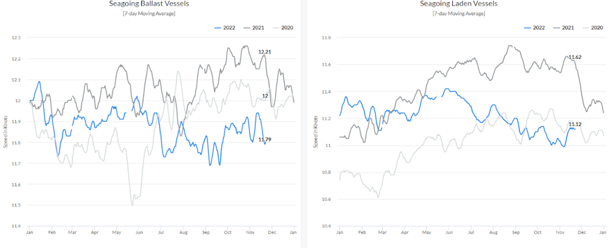
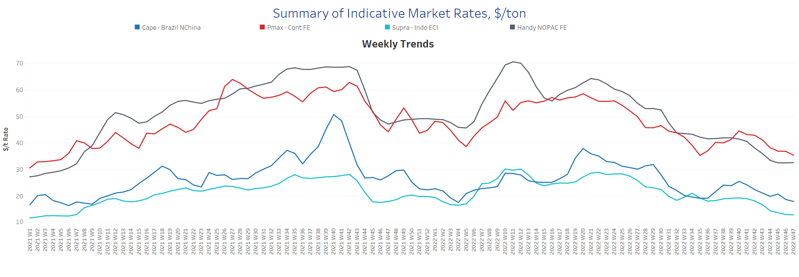
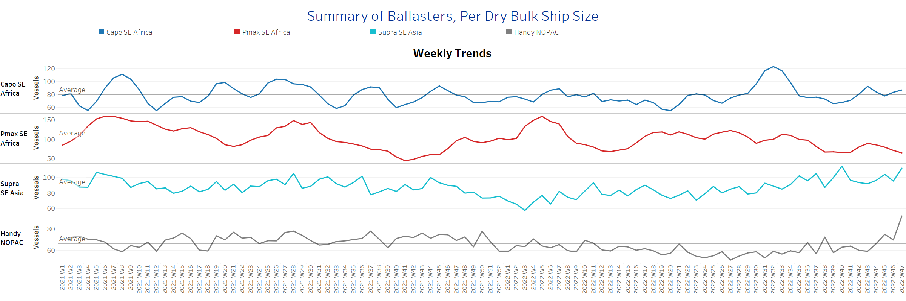
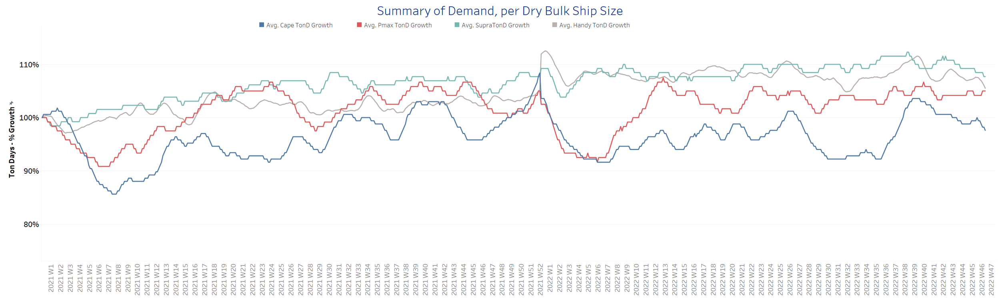
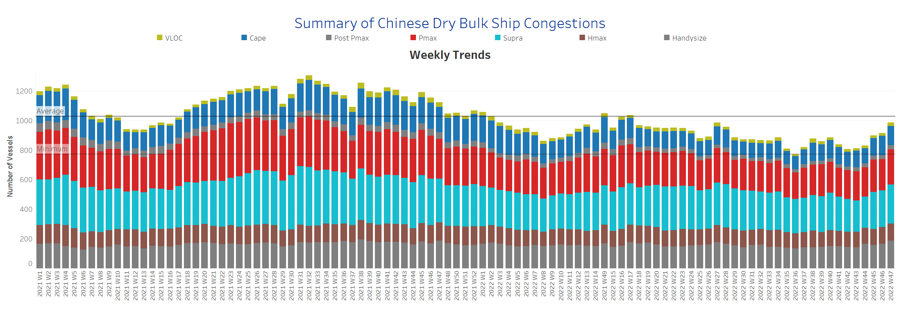

# Signal Dry Bulk Weekly Report

**Date:** November 24, 2022  
**Publisher:** Breakwave Advisors | **Category:** Market Insights  
**Original URL:** [https://www.breakwaveadvisors.com/insights/2022/11/23/signal-dry-bulk-weekly-report](https://www.breakwaveadvisors.com/insights/2022/11/23/signal-dry-bulk-weekly-report)  

---

[

> **Figure 1: Current Levels Are at the Lowest Compared to a Similar Period In**  
> *Current levels are at the lowest compared to a similar period in 2021-2020*  
> **Interactive Data & Source:** [Signal Ocean Platform](https://go.signalocean.com/e/983831/dry-reports-vesselSpeeds/2l66vj/287121756?h=3E2GAJ3d3YyNT46BsvLMBg5xZZrLppARiyEPCZQGeFU) | [Local Asset](file:///C:/Users/Dell/Github/Shipping/corpus/03-breakwave/insights/2022/assets/2022-11-24_signal-dry-bulk-weekly-report_img_buttonwdate_d45d644f7990.png)](https://www.breakwaveadvisors.com/agenda22)

In the fourth week of November, the weaker dynamics of freight market rates have yet to be reversed in all ship size classes, while demand continues to signal a downward trend. Economic uncertainties for the Chinese economy and the escalation of geopolitical tensions between Russia and Ukraine appear to be shaking the strength of freight rates, as the number of ships sailing in ballast for supramax and handysize vessels has declined significantly from the increase recorded in early November. As shown in the chart below based on Signal Ocean Data, the vessel speed for seagoing ballasted and loaded vessels has dropped to its lowest level compared to a similar period in the previous two years as freight rates continue to decline and demand has not yet turned to positive momentum.

In the iron ore market, prices for iron ore shipments have fallen due to the increase in covid cases in China. Mining.com reported 26,824 new local cases, approaching the April high, and two deaths in Beijing. According to Fastmarkets MB, 62% iron fine ore imported into northern China traded for $96/tonne Monday morning, down 2.4%. Meanwhile, iron ore prices are 37% below their March 2022 peak, and the market expects a continued decline amid fears of a global economic slowdown.

## Chart of the Week Dry Bulk: Vessel Speed

> **Figure 2: Market Chart 2**  
> **Interactive Data & Source:** [Signal Ocean Platform](https://go.signalocean.com/e/983831/dry-reports-vesselSpeeds/2l66vj/287121756?h=3E2GAJ3d3YyNT46BsvLMBg5xZZrLppARiyEPCZQGeFU) | [Local Asset](file:///C:/Users/Dell/Github/Shipping/corpus/03-breakwave/insights/2022/assets/2022-11-24_signal-dry-bulk-weekly-report_img_unnamed-2022-11-23t211959927_de1e106d1bba.png)

Data Source: The Signal Ocean Platform, Vessel Speed

## Section 1/ Freight -Market Rates ($/T) Weaker

‘The Big Picture’ - Capesize and Panamax Bulkers and Smaller Ship Sizes

> **Figure 3: Market Chart 3**  
> **Interactive Data & Source:** [Signal Ocean Platform](https://www.thesignalgroup.com/signal-ocean-platform) | [Local Asset](file:///C:/Users/Dell/Github/Shipping/corpus/03-breakwave/insights/2022/assets/2022-11-24_signal-dry-bulk-weekly-report_img_unnamed-2022-11-23t212105517_d4a48f262bbc.png)

In the last days of November, the weaker sentiment from the beginning of the month continues, while a sustained downward trend seems to emerge in the following days.

- **Capesize**vessel freight rates are approaching $18/tonne, down nearly $2/tonne from two weeks ago and down $7/tonne from week 40.
- **Panamax**vessel freight rates fromtheContinent to the Far East fell to $35/tonne, down nearly $7/tonne from the week 40 peak.
- **Supramax**freight rates for the Indo-ECI route continued the previous accelerated decline, falling to $13/tonne, down nearly $7/tonne from the week 34 peak.
- **Handysize**freight rates from NOPAC to the Far East appeared to represent a pause in the ongoing decline and remained at around $32.6/tonne, down 50% from the week 21 peak.

## Section 2/ Supply -Ballasters (# Vessels) Increasing

> **Figure 4: Supply Trend Lines for Key Load Areas**  
> **Interactive Data & Source:** [Signal Ocean Platform](https://www.thesignalgroup.com/signal-ocean-platform) | [Local Asset](file:///C:/Users/Dell/Github/Shipping/corpus/03-breakwave/insights/2022/assets/2022-11-24_signal-dry-bulk-weekly-report_img_unnamed-2022-11-23t212244084_c85efc46a098.png)

The number of ships in ballast was down only in the Panamax segment, while the other ship size classes showed an accelerated increase compared to the previous weeks of November.

- **Capesize**SE Africa: The number of vessels now stands at 87, 10 more than in Week 45 and 7 above the annual average.
- **Panamax**SE Africa: The number of ships has dropped to 67, continuing the downward trend since the beginning of November, while the numbers are still below the annual average since the end of week 36.
- **Supramax**SE Asia: The number of ships increased to 112, almost 17 more than the previous week. The last time the number exceeded 110 was in week 40.
- **Handysize**NOPAC: The number of vessels has continued to accelerate to 92, almost 40% above the average for the year, with a steady upward trend.

## Section 3/ Demand -TonDays Decreasing

> **Figure 5: TonDays Decreasing**  
> **Interactive Data & Source:** [Signal Ocean Platform](https://www.thesignalgroup.com/signal-ocean-platform) | [Local Asset](file:///C:/Users/Dell/Github/Shipping/corpus/03-breakwave/insights/2022/assets/2022-11-24_signal-dry-bulk-weekly-report_img_unnamed-2022-11-24t123725014_9933e3c762ec.png)

Demand growth continues to decline, with stronger signs in the Panamax segment, while the trend in the Capesize segment is clearly downward.

- **Capesize**demand ton-days: Compared to the highs of week 41, the trend has not yet recovered in the fourth week of November.
- **Panamax**demand ton-days: The current outlook continues the strong volatility of the last days with a slight upward trend until the end of November.
- **Supramax**demand ton-days: The overall trend continues to decline in November, and there are no signs of recovery in the coming month.
- **Handysize**demand ton-days: The decline is similar to the previous November days, with increasing signs of a further downward correction.

## Section 4/ Port Congestion -No of Vesselsincreasing

> **Figure 6: Dry Bulk Ships Congested at Chinese Ports**  
> **Interactive Data & Source:** [Signal Ocean Platform](https://www.thesignalgroup.com/signal-ocean-platform) | [Local Asset](file:///C:/Users/Dell/Github/Shipping/corpus/03-breakwave/insights/2022/assets/2022-11-24_signal-dry-bulk-weekly-report_img_unnamed-2022-11-24t123920556_ac50db9e9469.png)

This week, the new highs in total bulk carrier congestion are led by the Panamax, Supramax, and Handysize segments.

- **Capesize:**The number of vessels decreased to 128, 5 less than the previous week.
- **Panamax:**The number of vessels increased to 237, 29 more than the previous week, with a clear upward trend in the last days of November.
- **Supramax:**The number of congested vessels increased to 264, 14 more than the previous week and significantly more than week 44 (~212).
- **Handysize**: The number of congested vessels was 188, 23 more than the previous week and 40% above the week 36 low.

Data Source:[Signal Ocean Platform](https://www.thesignalgroup.com/signal-ocean-platform)
