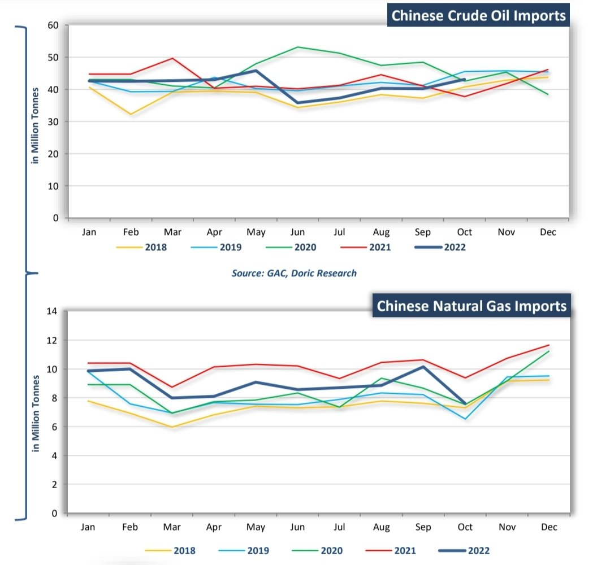
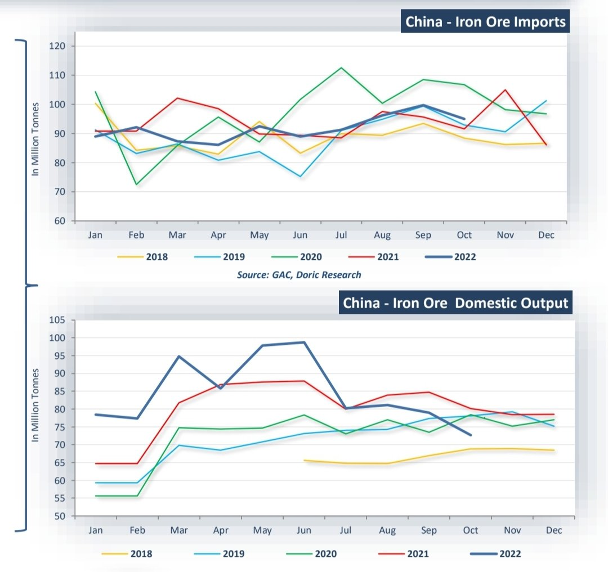
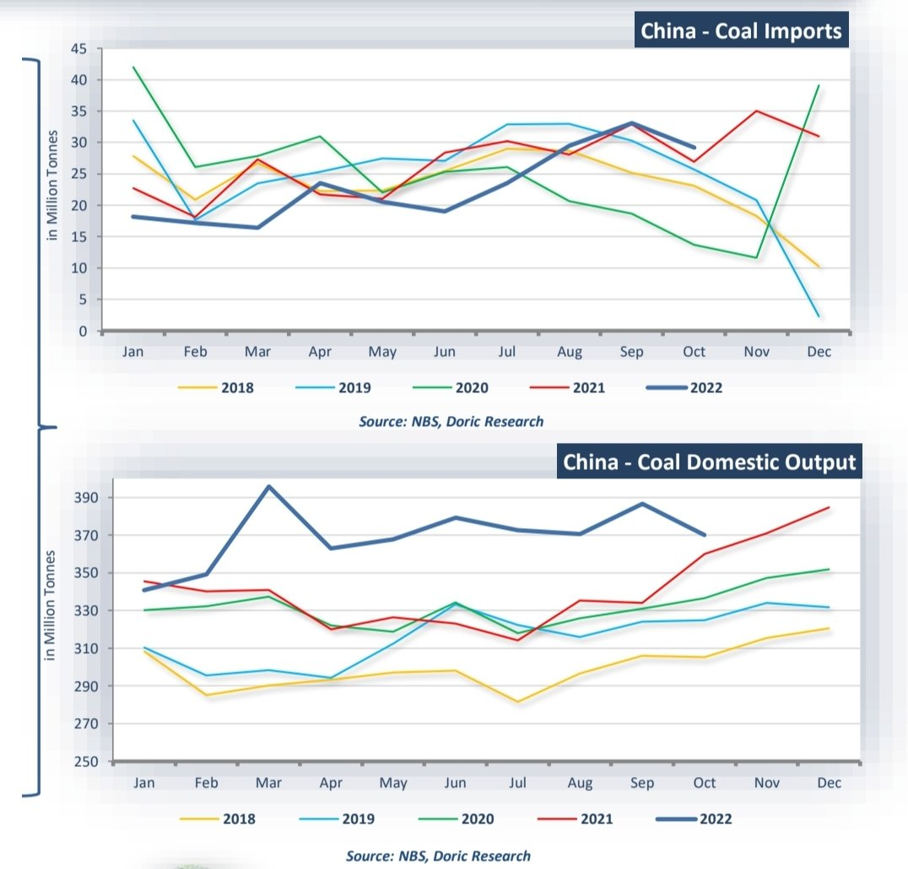
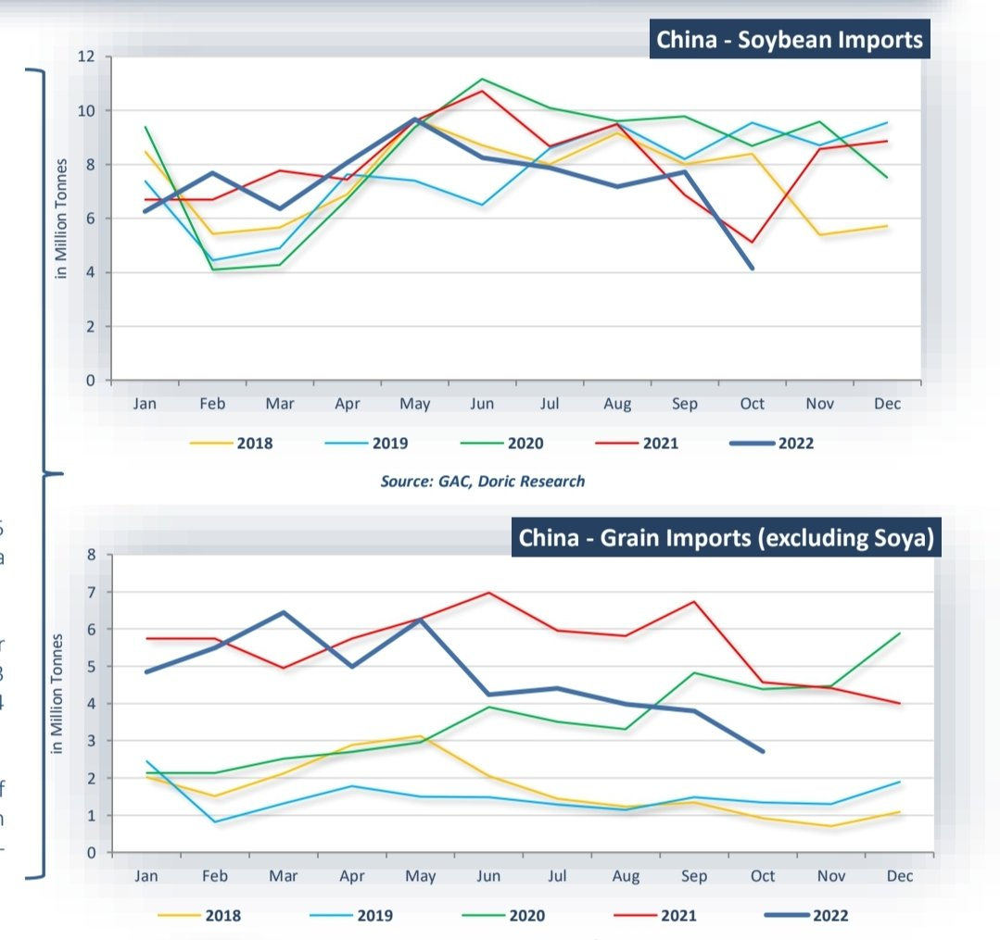
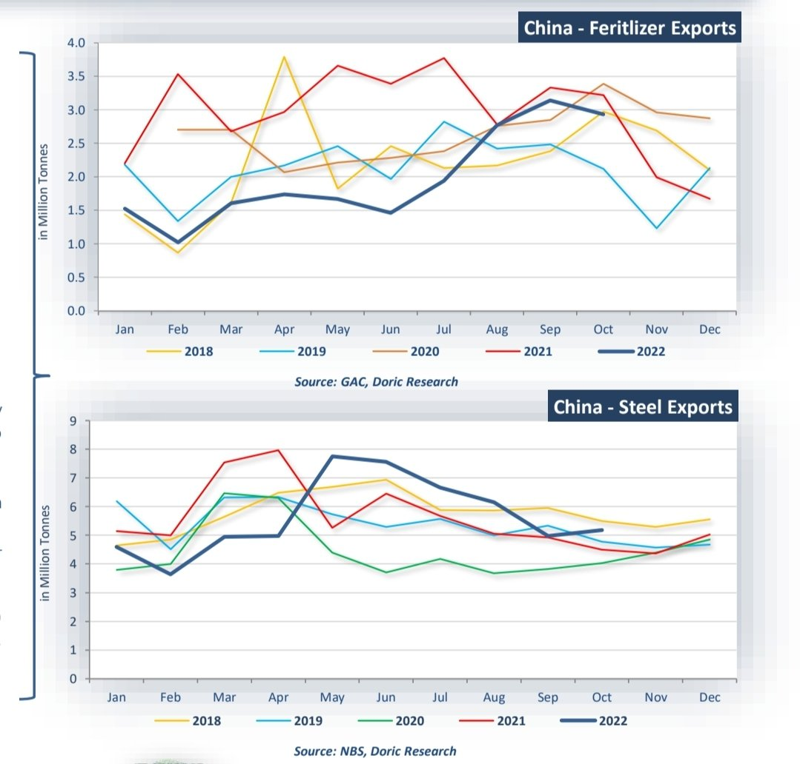
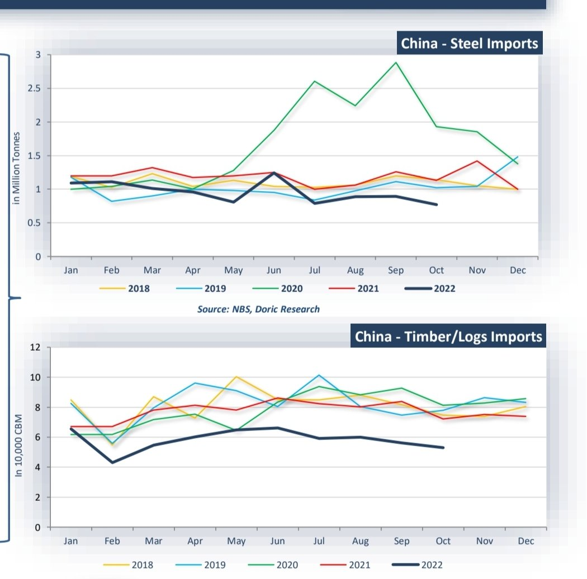

# Doric-China Barometer part 2/2

**Date:** November 25, 2022  
**Publisher:** Breakwave Advisors | **Category:** Market Insights  
**Original URL:** [https://www.breakwaveadvisors.com/insights/2022/11/25/doric-china-barometer-part-22](https://www.breakwaveadvisors.com/insights/2022/11/25/doric-china-barometer-part-22)  

---

[

> **Figure 1: Bymichalis Voutsinasand Helen Vlassi**  
> *ByMichalis Voutsinasand Helen Vlassi*  
> **Interactive Data & Source:** [Linkedin](https://www.linkedin.com/in/michalis-voutsinas-587544163/) | [Local Asset](file:///C:/Users/Dell/Github/Shipping/corpus/03-breakwave/insights/2022/assets/2022-11-25_doric-china-barometer-part-22_img_buttonwdate_d45d644f7990.png)](https://www.breakwaveadvisors.com/agenda22)

### Crude Oil/natural Gas

- China brought in 43.14 million tonnes of crude oil in October, equivalent to 10.16 million barrels per day, or circa 14.0 percent up from a year earlier.
- October’s reading rebounded to the highest level since May, marking its first annual growth in five months, as refiners embraced to replenish stocks amid soaring global crude prices.
- From January to October, crude imports totalled 413.53 million tonnes, down circa 2.7 percent from a year earlier.
- China’s imports of low-priced Russian crude oil marked its highest pace since January, rising by 3.9 percent month-onmonth.
- China’s imports of natural gas sank to a twoyear low of 7.61 metric tonnes in October, reversing from a brief spike of 10.15 million tonnes in previous month.
- From January to October, China’s total imports stood at 88.74 million tonnes, down circa 10.4 percent from a year earlier.

> **Figure 2: Screenshot 20221125 141457 Samsung Notes**  
> **Interactive Data & Source:** [Doric](https://www.doric.gr/) | [Local Asset](file:///C:/Users/Dell/Github/Shipping/corpus/03-breakwave/insights/2022/assets/2022-11-25_doric-china-barometer-part-22_img_screenshot-20221125-141457-samsungno_70f23796817b.jpg)

### Iron Ore October 2022

- China brought in 94.97 million tonnes of iron ore in October, down by circa 4.7 percent year-on-year.
- During the first ten months of 2022, China imported 917.0 million tonnes of iron ore, a dive of 1.7 percent from 935.0 million tonnes reported in the same period a year earlier.
- Chinese steel mills stepped up utilization rates during October expecting demand to pick up and government stimulus measuresto boost activity.
- During October, 72.68 million metric tonnes of crude iron ore have been extracted in China, or down circa 10.7 percent year-on-year.
- On a monthly basis, iron ore output decreased by circa 8.0 percent in October, down from 78.98 million tonnes reported in September.
- From January to October, 845.84 million metric tonnes of crude iron ore have been extracted in China, or up circa 5.5 percent year-on-year.

> **Figure 3: Screenshot 20221125 141512 Samsung Notes**  
> **Interactive Data & Source:** [Doric](https://www.doric.gr/) | [Local Asset](file:///C:/Users/Dell/Github/Shipping/corpus/03-breakwave/insights/2022/assets/2022-11-25_doric-china-barometer-part-22_img_screenshot-20221125-141512-samsungno_5dcdfe5a3666.jpg)

### Coal

- China imported 29.18 million tonnes of coal in October, up 8.3 percent year-onyear.
- On a monthly basis, China’s coal imports stood 7.7 percentage points higher.
- From January to October, Chinese customs cleared a total of 230.1 million metric tonnes or circa 10.5 percent down year-on-year.
- A stronger dollar led to higher coal prices in domestic terms , eating into profit margins at power plants.
- Reporting a rise of 1.2 percent year-onyear, China’s domestic coal output balanced at circa 370 million tonnes in October, or 11.94 million tonnes per day.
- China’s domestic coal output during first ten months of 2022 rose by circa 10.0 percent from a year earlier to 3.69 billion metric tonnes.
- Chinese government announced the extension of the price limit of USD 92.76 on thermal coal in 2023, in an effort to stabilise prices.

> **Figure 4: Screenshot 20221125 141531 Samsung Notes**  
> **Interactive Data & Source:** [Doric](https://www.doric.gr/) | [Local Asset](file:///C:/Users/Dell/Github/Shipping/corpus/03-breakwave/insights/2022/assets/2022-11-25_doric-china-barometer-part-22_img_screenshot-20221125-141531-samsungno_c15bca09c465.jpg)

### Grains

- China’s soybean imports in October decreased by 19.0 percent from a year earlier to 4.14 million tonnes.
- China’s October imports stood circa 46.4 percent lower than a reading of 7.72 million tonnes in the previous month, hitting the lowest level since 2014, amid high global prices and poor crush margins.
- During the first ten months of 2022, China’s total imports of soybean totalled 73.18 million tonnes, or circa 7.4 percent lower than a year ago.
- China’s corn imports balanced at 0.55 million tonnes in October, down by circa 64.1 percent year-on-year.
- China’s wheat imports in October increased significantly by circa 158.3 percent from a year earlier, to 1.24 million tonnes.
- China imported circa 2.7 million tonnes of grains on top of soybean imports in October, or circa 40.7 percent down yearon-year.

> **Figure 5: Screenshot 20221125 141554 Samsung Notes**  
> **Interactive Data & Source:** [Doric](https://www.doric.gr/) | [Local Asset](file:///C:/Users/Dell/Github/Shipping/corpus/03-breakwave/insights/2022/assets/2022-11-25_doric-china-barometer-part-22_img_screenshot-20221125-141554-samsungno_986ec8558410.jpg)

### Minors (Exports)

- China fertilizer exports in October shrank to 2.93 million tonnes, or down 8.9 percent year-on-year.
- During the first ten months of 2022, China exported circa 19.8 million tonnes of fertilizers, down by circa 37.2 percent year-on-year.
- Chinese authorities are imposing new hurdles for fertilizer exporters amid growing concerns over surging power prices and food production.
- China’s total finished steel exports rose by 15.1 percent year-on-year in October, to 5.18 million tonnes.
- Chinese steel exports during the first ten months of 2022, lay at 56.46 million tonnes or down by 1.9 percent year-onyear.
- October’s steel exports stood circa 4.0 percent higher than a reading of 4.98 million tonnes a month earlier.

> **Figure 6: Screenshot 20221125 141617 Samsung Notes**  
> **Interactive Data & Source:** [Doric](https://www.doric.gr/) | [Local Asset](file:///C:/Users/Dell/Github/Shipping/corpus/03-breakwave/insights/2022/assets/2022-11-25_doric-china-barometer-part-22_img_screenshot-20221125-141617-samsungno_c3bc58cd368d.jpg)

### Minors (Imports)

- China’s steel imports during October fell by 31.7 percent year-on-year to 0.8 million tonnes.
- From January to October, Chinese steel imports stood 18.9 percent lower than the respective period a year earlier, or at 9.57 million tonnes.
- On a monthly basis, China’s October imports stood 13.4 percent down. 2
- In October, Chinese timber imports balanced at 5.31 million CBM .
- On a year-on-year basis, October’s timber imports decreased by circa 26.5 percent.
- From January to October, China brought in 58.2 million CBM of timber and logs, or down circa 24.9 percent year-on-year.

> **Figure 7: Screenshot 20221125 141645 Samsung Notes**  
> **Interactive Data & Source:** [Doric](https://www.doric.gr/) | [Local Asset](file:///C:/Users/Dell/Github/Shipping/corpus/03-breakwave/insights/2022/assets/2022-11-25_doric-china-barometer-part-22_img_screenshot-20221125-141645-samsungno_b390c974d047.jpg)

Data source:[Doric](https://www.doric.gr/)
