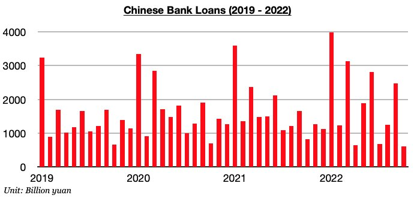
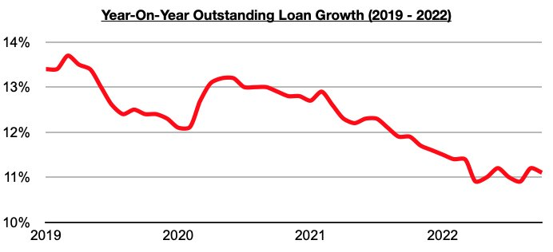

# New Loans in China Fall to Lowest Level in Five Years

**Date:** November 25, 2022  
**Publisher:** Breakwave Advisors | **Category:** Market Insights  
**Original URL:** [https://www.breakwaveadvisors.com/insights/2022/11/25/new-loans-in-china-fall-to-lowest-level-in-five-years](https://www.breakwaveadvisors.com/insights/2022/11/25/new-loans-in-china-fall-to-lowest-level-in-five-years)  

---

[

> **Figure 1: Byjeffrey Landsberg**  
> *ByJeffrey Landsberg*  
> **Interactive Data & Source:** [Linkedin](https://www.linkedin.com/in/jeffrey-landsberg-70ab957/) | [Local Asset](file:///C:/Users/Dell/Github/Shipping/corpus/03-breakwave/insights/2022/assets/2022-11-25_new-loans-in-china-fall-to-lowest-level-in-five-years_img_buttonwdate_d45d644f7990.png)](https://www.breakwaveadvisors.com/agenda22)

As we discussed back in Commodore's November 14th Weekly China Report, Chinese banks issued only 615 billion yuan in new loans in October. This marked a month-on-month decline of 1.86 trillion yuan (-75%) and a year-on-year decline of 211 billion yuan (-26%). New loans had previously increased on a year-on-year basis during four of the prior five months.

> **Figure 2: Chart 1 (64)**  
> [Local Asset](file:///C:/Users/Dell/Github/Shipping/corpus/03-breakwave/insights/2022/assets/2022-11-25_new-loans-in-china-fall-to-lowest-level-in-five-years_img_chart1286429_fe02baf244d3.jpg)

It is normal for new loans to fall by a large amount on a month-on-month basis in October. However, October’s 615 billion yuan in new loans has marked the lowest monthly total seen in any month since December 2017. As we have continued to stress in our Weekly Dry Bulk Reports and Weekly China Reports, the Chinese government remains focused on stimulating the economy, but home sales remaining in contraction continues to be a significant issue. Also of note is that outstanding loan growth has declined.

Outstanding loan growth in October came in at 11.1%. While down from the 11.2% outstanding growth seen in September, this 11.1% growth is at least higher than the 10.9% growth that was seen in both August and April. Prior to April, it had been over ten years since outstanding low growth came in at 10.9% or lower. During prior stimulating periods, China’s housing market and related sectors have accounted for over half of total loan generation. With the housing market in contraction, though, banks are still having difficulty in having lendees to actually lend to.

> **Figure 3: Chart 2 (55)**  
> [Local Asset](file:///C:/Users/Dell/Github/Shipping/corpus/03-breakwave/insights/2022/assets/2022-11-25_new-loans-in-china-fall-to-lowest-level-in-five-years_img_chart2285529_83389f2e5c3a.jpg)
