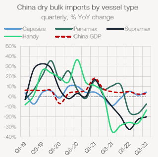
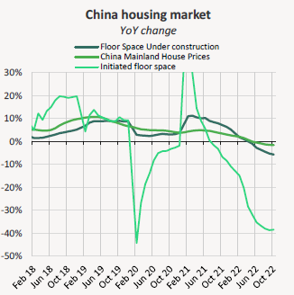
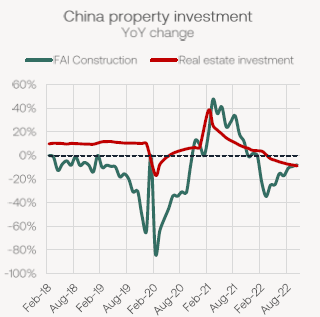
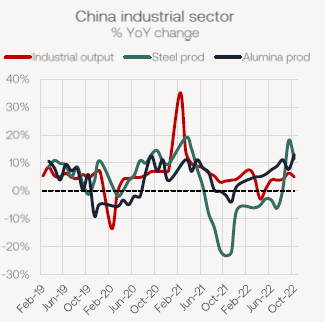

# Braemar Weekly Dry Market Report

**Date:** November 28, 2022  
**Publisher:** Breakwave Advisors | **Category:** Market Insights  
**Original URL:** [https://www.breakwaveadvisors.com/insights/2022/11/27/braemar-weekly-dry-market-report](https://www.breakwaveadvisors.com/insights/2022/11/27/braemar-weekly-dry-market-report)  

---

[

> **Figure 1: Past Several Weeks Has Seen a Range of Economic Support Measures**  
> *The past several weeks has seen a range of economic support measures announced by the Chinese government. With a particular focus on the property market, these measures could further support the country’s bulk commodity demand next year.*  
> **Interactive Data & Source:** [Linkedin](https://www.linkedin.com/in/mark-nugent-3724a3192/) | [Local Asset](file:///C:/Users/Dell/Github/Shipping/corpus/03-breakwave/insights/2022/assets/2022-11-28_braemar-weekly-dry-market-report_img_buttonwdate_d45d644f7990.png)](https://www.breakwaveadvisors.com/agenda22)

*By*[*Mark Nugent*](https://www.linkedin.com/in/mark-nugent-3724a3192/)

## The Big Picture: More China Stimulus

## Here We Go Again

The ongoing slowdown in the Chinese economy has triggered the introduction of a further range of supportive economic policies. Throughout the year there have been minor efforts to contain any further downside, but having made little impact, these efforts have seemingly accelerated in Q4. Naturally, the industrial slowdown is reflected in China’s dry bulk commodity import demand, which has declined by 4.7% YoY to 1.6bn tonnes across the first 10 months of the year.

> **Figure 2: Market Chart 2**  
> [Local Asset](file:///C:/Users/Dell/Github/Shipping/corpus/03-breakwave/insights/2022/assets/2022-11-28_braemar-weekly-dry-market-report_img_image028829_5360c91143fe.png)

China’s slowdown has made a larger impact on the smaller ships, with imports on Supramaxes and Handies lower by 23% and 21% respectively. On the Handies in particular, some of this downside, however, is the decline in container shipments it should be noted. In comparison, the Capesizes have proven the most robust in terms of volumes discharged, rising by 3.4% as these vessels are unsurprisingly more exposed to China’s steel sector as opposed to the country’s overall economy.

In recent weeks, the Chinese government has announced a range of stimulus policies for its ailing economy, including a 16-point plan targeting the property and construction sectors, which ultimately drive the country’s dry bulk demand. Measures taken so far this year have been rather underwhelming, such as trimming its 1-year loan prime rate by just 5 basis points in August to 3.65% thus economic data releases have continued to be discouraging.

## Chinese Credit Demand Showing Little Improvement

Chinese new loans amounted to just CNY 615bn in October, the lowest level for several years. Despite the range of policy measures announced in the past several months, this has driven little upside to the demand picture as of yet. Covid-19 lockdowns can partially be attributed to the root cause of continued weak credit demand, as their stop-start nature makes new projects less appealing. This can be reflected in the latest reading of initiated floor space, which declined by 38.5% YoY in October, a marginal improvement to that in September.

> **Figure 3: Market Chart 3**  
> [Local Asset](file:///C:/Users/Dell/Github/Shipping/corpus/03-breakwave/insights/2022/assets/2022-11-28_braemar-weekly-dry-market-report_img_image128829_63a2add0fbeb.png)

Included in the country’s recent 16-point plan released last week were special loans for project completion, easing caps on banks’ property lending and encouraging the acquisitions of property projects by strong developers from weaker ones. Further, the PBoC are supporting mortgage repayment extensions for homebuyers while reassuring credit scores will be unaffected. A major headwind for property developers next year, however, is a considerable amount of outstanding loans. This has been exacerbated by falling property sales. The total cumulative value of commercial and residential building sales have declined by 26.1% and 28.2% YoY across the first 10 months of the year. Chinese policymakers have since granted an extension of up to a year for any loans due for repayment in the next 6 months, which should ease some of the strains developers are facing.

> **Figure 4: Market Chart 4**  
> [Local Asset](file:///C:/Users/Dell/Github/Shipping/corpus/03-breakwave/insights/2022/assets/2022-11-28_braemar-weekly-dry-market-report_img_image228829_9d954969882c.png)

Growth in real estate investment in China has now been in negative territory all year, reflecting the poor liquidity position of several large developers and weak property demand. On the demand side, the lockdowns will continue to hinder any real recovery in property investment. While the Chinese government has shown the willingness to ease some Covid curbs, the lockdowns show the stringent Covid policy is still in tact for now. Ultimately, however, we do expect to see the country re-open on a very gradual basis throughout next year as the economy takes priority once again.

## Industrial Production Robust Despite Lockdowns

In spite of the weak demand from the property sector, the two most dry bulk-intensive industrial sectors in China have proven relatively robust so far this year. Steel production, while showing several months of negative growth this year, is flat YoY across the January-October period at 700.4m tonnes given the sharp drop in production in 2H 2021. Subsequently, iron ore imports have improved by 2% YoY over the same period to 931.2m tonnes. Alumina production, in which bauxite is used heavily in the production process, has increased by 8% YoY to 56.4m tonnes.

> **Figure 5: Market Chart 5**  
> [Local Asset](file:///C:/Users/Dell/Github/Shipping/corpus/03-breakwave/insights/2022/assets/2022-11-28_braemar-weekly-dry-market-report_img_image328729_21f59603d9a7.png)

Production of both steel and alumina in China this year is encouraging given the constant disruptions due to lockdowns and poor hydropower performance which is a primary energy source for many aluminum smelters specifically. Although steel demand domestically has been poor, China has been able to export some of the excess volumes, largely into the SE Asian markets.

Overall, in recent weeks the Chinese government has shown an even greater motivation to intervene and support its economy while putting a particular focus on its struggling property market. As is the nature of most fiscal and monetary policy, there is inherently a response lag to when these policies will show any true impact, which will not be until the first half of next year at the earliest. Given the worsening impact of the lockdowns and the strong rise in Covid cases this month in particular, we expect to see more stimulus measures put in place before the new year as sentiment in the country’s real estate market continues on a downward trajectory. Looking to next year, the effects these policies are expected to have provides some encouragement on the prospects for China’s property market and thus raw material demand.
