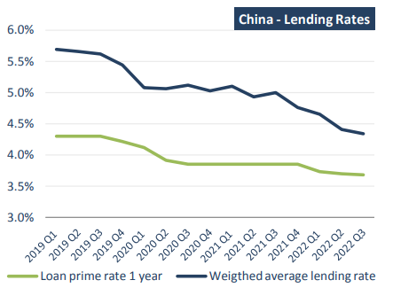
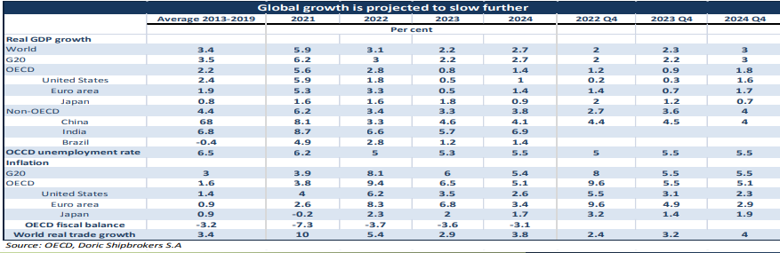

# Doric Weekly Market Insight

**Date:** November 28, 2022  
**Publisher:** Breakwave Advisors | **Category:** Market Insights  
**Original URL:** [https://www.breakwaveadvisors.com/insights/2022/11/28/doric-weekly-market-insight](https://www.breakwaveadvisors.com/insights/2022/11/28/doric-weekly-market-insight)  

---

[

> **Figure 1: Bymichalis Voutsinas**  
> *ByMichalis Voutsinas*  
> **Interactive Data & Source:** [Linkedin](https://www.linkedin.com/in/michalis-voutsinas-587544163/) | [Local Asset](file:///C:/Users/Dell/Github/Shipping/corpus/03-breakwave/insights/2022/assets/2022-11-28_doric-weekly-market-insight_img_buttonwdate_d45d644f7990.png)](https://www.breakwaveadvisors.com/agenda22)

In a sea full of reds, the forty-seventh trading week painted our screens with few brushstrokes of green at last! In fact, on the early side of the week, Capesizes took the lead, revisiting the five-digit territory on Wednesday and concluding today at $13,373 daily. Panamaxes have made some baby steps towards the right direction on the second half of the week, yet closing the last full trading week of November down at $13,310 daily. In a similar vein but with marginal weekly gains, Supramaxes balanced at $13,004 daily on this Friday’s closing. Moving further south, Handies landed at $13,403 daily, last seen in mid-February 2021. In spite of the mixed signals, Capesizes’ positive reaction, injected some moderate optimism in the spot market of the dry bulk sector.

In sharp contrast, on the macro front, OECD stressed this week that global economy is still facing mounting challenges. In particular, growth has lost momentum, high inflation is proving persistent, confidence has weakened, and uncertainty is high. Global financial conditions have tightened significantly, amidst the unprecedented sturdy and widespread steps to raise interest rates by central banks lately, having a negative bearing on interest-sensitive spending and adding to the pressures faced by many emerging economies. Labour market conditions generally remain tight, yet wage increases have not kept up with price inflation, weakening real incomes.

Against this backdrop, global GDP growth is now projected to be 3.1 percent in 2022, around half the pace of 2021 during the rebound from the pandemic, and to slow further to 2.2 percent in 2023, well below the rate expected prior to the Russia-Ukraine war. In 2024, global growth is projected to be 2.7 percent, added by potential steps to ease interest rates in several countries. Global prospects are also becoming increasingly imbalanced, with the major Asian emerging economies accounting for close to three-quarters of global GDP growth in 2023, reflecting their projected steady expansion and sharp slowdowns in the United States and Europe.

In terms of global trade, it continued to recover in the first half of 2022, helped by solid demand and significant easing in supply chain bottlenecks and port congestion. The aforementioned helped to counterbalance a material contraction in China’s imports in the first half of 2022 as its zero Covid-19 policy remained in place. By the third quarter of 2022, the volume of global trade in goods and services was 7 percent higher than in the fourth quarter of 2019, despite the incomplete recovery in services trade. Recent trade indicators have been mixed, but there are signals that trade growth is set to slow. Survey measures of new export orders in manufacturing have fallen sharply, particularly in Europe. Container port traffic volumes continued to rise through to September, but early estimates from the Kiel Trade Indicator suggest that global merchandise trade may have contracted in October.

When global economy and international trade appear to be wobbly, Chinese economic data are the focal point. Economic growth of the world’s second largest economy will slow to 3.3 percent in 2022 andrebound to 4.6 percent in 2023 and 4.1 percent in 2024. The emergence of the omicron variant has led to recurring waves of lockdowns this year, disrupting economic activity. Additionally, the Chinese October macro data published last week did not show an improvement in real estate, with both property investment (-8.8 percent Y-o-Y YTD) and residential property sales (-28.2 percent Y-o-Y YTD) remaining dull. By contrast, infrastructure investment remains strong (+8.7 percent YTD), reflecting the stepping up of government support. China’s central bank recently announced a relief package for the struggling property sector, consisting of 16 measures. These include a call to banks to step up lending to financially sound property developers, increased access to presale funds for healthy developers, the extension of payment deadlines for distressed developers enabling debt workouts, and additional efforts to safeguard the construction of unfinished projects.

> **Figure 2: Source: Ceic**  
> *Source: CEIC, OECD, Doric Shipbrokers S.A*  
> **Interactive Data & Source:** [Doric](https://www.doric.gr/) | [Local Asset](file:///C:/Users/Dell/Github/Shipping/corpus/03-breakwave/insights/2022/assets/2022-11-28_doric-weekly-market-insight_img_128329_e24f00e2198f.png)

This week, China's biggest commercial banks have pledged at least $162 billion in fresh credit to property developers, strengthening recent regulatory measures to ease a suffocating cash crunch in the sector and triggering a rally in property shares. In sync, iron ore futures advanced on Friday and were set for their third straight weekly rise, as the top steel producer’s latest moves to support its flagging economy brightened demand prospects. This time though, Capesizes decided to align themselves with this trend, reporting the first significant weekly gains seen in months.

> **Figure 3: 1 (4)**  
> **Interactive Data & Source:** [Doric](https://www.doric.gr/) | [Local Asset](file:///C:/Users/Dell/Github/Shipping/corpus/03-breakwave/insights/2022/assets/2022-11-28_doric-weekly-market-insight_img_128429_721f16c2d0eb.png)

Data source:[Doric](https://www.doric.gr/)
