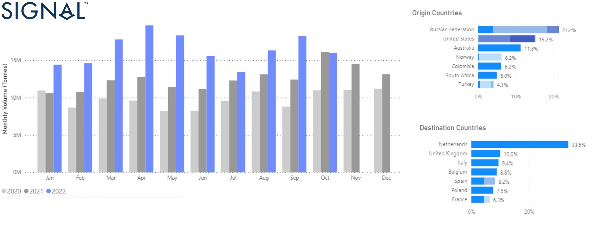
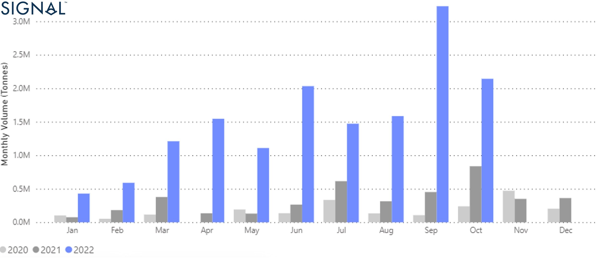
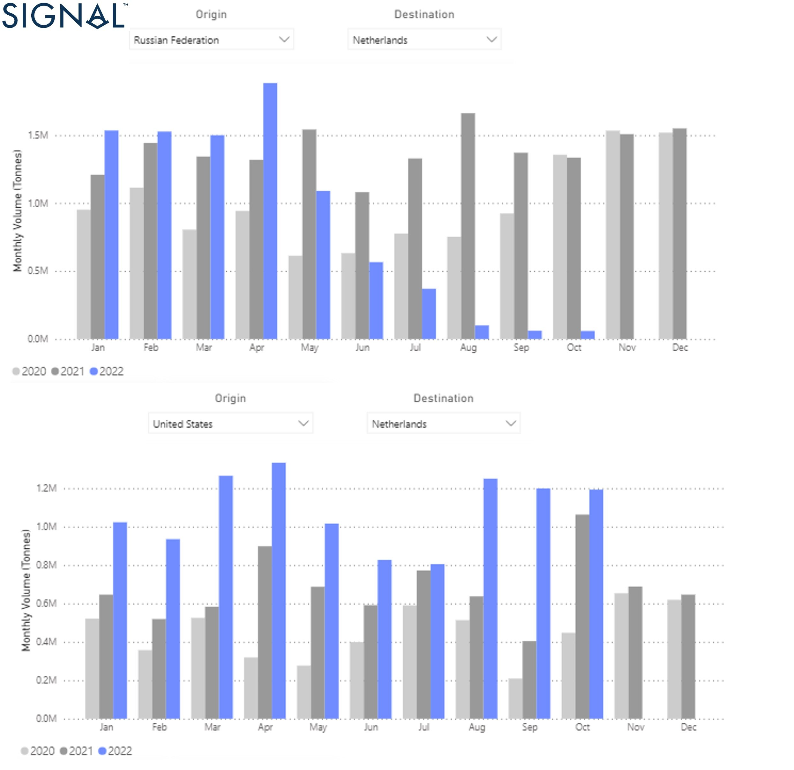
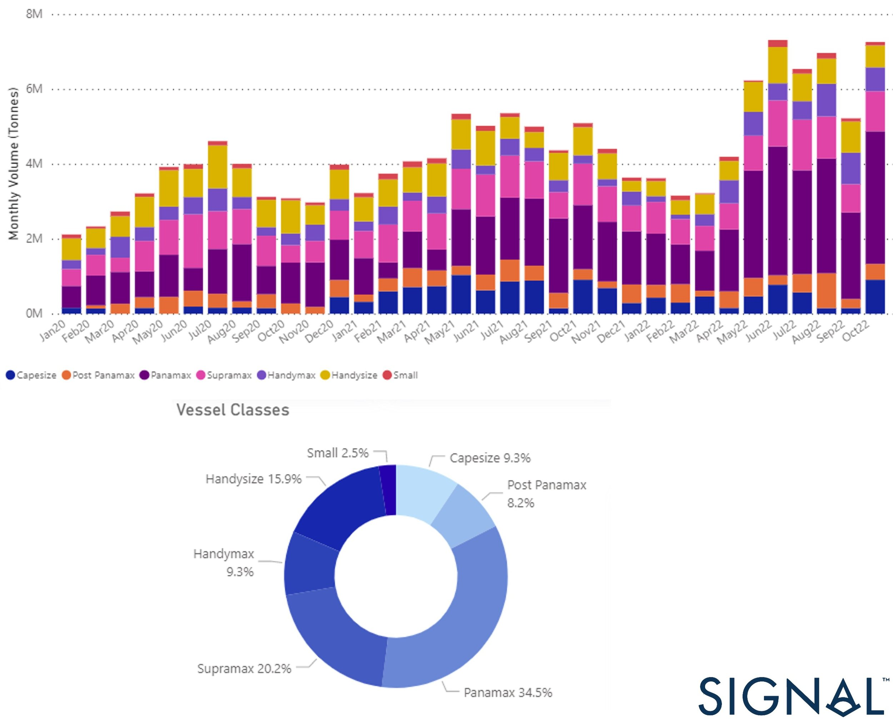
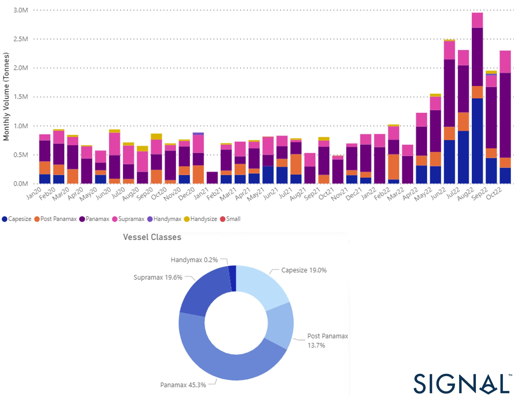
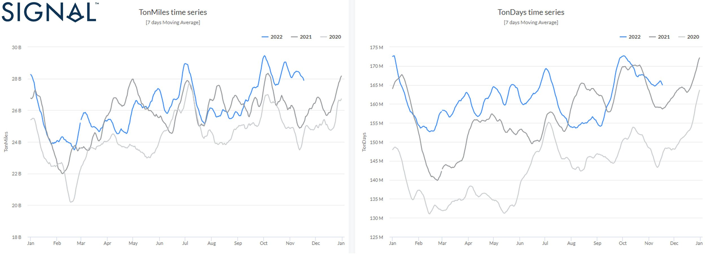

# Seaborne coal flows in 2022

**Date:** November 29, 2022  
**Publisher:** Breakwave Advisors | **Category:** Market Insights  
**Original URL:** [https://www.breakwaveadvisors.com/insights/2022/11/29/seaborne-coal-flows-in-2022](https://www.breakwaveadvisors.com/insights/2022/11/29/seaborne-coal-flows-in-2022)  

---

[

> **Figure 1: Buttonwdate**  
> **Interactive Data & Source:** [Gov](https://www.gov.uk/government/news/eu-us-uk-joint-statement-on-global-food-security-and-russia-sanctions-14-november-2022) | [Local Asset](file:///C:/Users/Dell/Github/Shipping/corpus/03-breakwave/insights/2022/assets/2022-11-29_seaborne-coal-flows-in-2022_img_buttonwdate_d45d644f7990.png)](https://www.breakwaveadvisors.com/agenda22)

This year is crucial for the energy mix in European countries, as the EU has imposed new sanctions on Russia. It is important to emphasize that the EU sanctions against Russia do not affect the agricultural and food sectors. On[**November 14**](https://www.gov.uk/government/news/eu-us-uk-joint-statement-on-global-food-security-and-russia-sanctions-14-november-2022), the British Foreign Secretary, the High Representative of the European Union, and the U.S. Secretary of State issued a statement on global food security and Russia sanctions.

The sanctioned products with significant effects on maritime trade and freight rates include crude oil, refined petroleum products, coal, and steel. Following the adoption of the[**sixth sanctions package**](https://www.consilium.europa.eu/en/policies/sanctions/restrictive-measures-against-russia-over-ukraine/sanctions-against-russia-explained/)in June 2022, the restrictions will apply to crude oil from December 5, 2022, and to other refined petroleum products from February 5, 2023. Currently, there is an exemption for importing crude oil via pipelines for EU member states that rely on Russian supplies due to their geographical location without other alternatives.

There is a six-month transition period for seaborne crude oil for existing contracts and spot transactions to allow global markets to adjust, and an eight-month transition period for refined petroleum products.[**After a transitional period of eight months**](https://ec.europa.eu/commission/presscorner/detail/en/QANDA_22_2823), member States importing Russian crude oil and petroleum products through pipelines cannot resell these products to other Member States or to third countries.

The[**coal**](https://www.rferl.org/a/russian-coal-exports-eu-ban-ukraine/31981840.html)was the first in the round of sanctions for the EU embargo on Russian coal, and the 120-day deadline for complying with the coal ban since it was adopted in April expired Aug. 10. There is a three-month transition period for existing contracts signed before the export ban was enacted. The European Commission estimates that reducing Europe's dependence on Russian coal could cost the Russian economy an annual loss of about $8 billion.

Meanwhile, European Union countries have already begun to reduce overall coal imports to meet climate goals and find clean alternatives. At the[**COP27**](https://ec.europa.eu/commission/presscorner/detail/en/MEX_22_6579)UN climate conference in Sharm el-Sheikh on November 4, the Commission called on all Parties to take urgent action to reduce greenhouse gas emissions and meet the commitments of the Paris Agreement and the Glasgow Climate Pact adopted last year at COP26. The transition to net-zero emissions will require innovative technologies such as carbon capture and storage to meet the EU's commitment to reduce CO2 emissions by at least 55% by 2030 and become the world's first carbon-neutral block by 2050, as envisioned by the[**European Green Deal**](https://ec.europa.eu/info/strategy/priorities-2019-2024/european-green-deal_en).

This month's analysis focuses on coal flows to Europe, the extent to which current trends reflect the impact of existing EU sanctions, and whether there is currently a detour of coal flows from other destinations toward major European importing countries.

Using[**Signal Ocean data**](https://app.signalocean.com/dry/reports/drybulkflows?fbclid=IwAR0aSdXWAhm7C5Zh53rqqfCJY5qjOvx-yI_b68Z0aZN3pRbMB3SaTLsbY2Y), we analyze recent trends in coal flows and the potential impact on demand growth as we confront ongoing geopolitical uncertainties and the challenges of the green transition to a net-zero future.

‍**‍**

## I. Coal Flows to Europe From All Over the World

An initial look at European coal imports (Figure 1) shows that total shipments have increased in the current year compared to the previous year, with the Russian Federation remaining the top source country and, the Netherlands the top destination country. Flows are expected to slow in the last quarter of the year, as the EU oil embargo on Russian coal has already curtailed supplies and other source countries are gradually replacing the volumes needed. October already ended with a lower monthly volume compared to the record high of August and September and the end of the first quarter of the year.

> **Figure 2: Image 1- Data Source: The Signal Ocean Platform**  
> *Image 1- Data Source: The Signal Ocean Platform, Coal Flows to Europe, 2020-2022https://app.signalocean.com/dry/reports/drybulkflows*  
> **Interactive Data & Source:** [Signal Ocean Platform](https://app.signalocean.com/dry/reports/drybulkflows?fbclid=IwAR0aSdXWAhm7C5Zh53rqqfCJY5qjOvx-yI_b68Z0aZN3pRbMB3SaTLsbY2Y) | [Local Asset](file:///C:/Users/Dell/Github/Shipping/corpus/03-breakwave/insights/2022/assets/2022-11-29_seaborne-coal-flows-in-2022_img_637cf900b7f5cf8f79440627-picture1_68cc077d0bee.jpg)

## ‍

## ‍Ii. Europe Ramping Up Coal Imports From South Africa

Today we are talking about replacing Russian coal flows to Europe, as we approach the middle of winter, and many European countries are expected to burn more coal due to the energy crisis. It is incredible that South African coal exports to Europe have jumped this year, reaching spectacular annual growth. September ended with record monthly shipments (image 2), the highest this year, but the last three quarters also saw the most increased volumes compared to similar months in the previous two years.

> **Figure 3: Image 2- Data Source: The Signal Ocean Platform**  
> *Image 2- Data Source: The Signal Ocean Platform, Coal Flows from South Africa to Europehttps://app.signalocean.com/dry/reports/drybulkflows*  
> **Interactive Data & Source:** [Signal Ocean Platform](https://app.signalocean.com/dry/reports/drybulkflows?fbclid=IwAR0aSdXWAhm7C5Zh53rqqfCJY5qjOvx-yI_b68Z0aZN3pRbMB3SaTLsbY2Y) | [Local Asset](file:///C:/Users/Dell/Github/Shipping/corpus/03-breakwave/insights/2022/assets/2022-11-29_seaborne-coal-flows-in-2022_img_637cf93e92f85451fcdda2b2-picture2_f27bde452558.jpg)

## ‍

## Iii. the Netherlands Emerged As the Top Destination for Us Coal Exports

We took a look at the Netherlands to examine how the main European coal importer from Russia is gradually switching to other primary sources to replace the Russian loss. As can be seen in image (3) below, the United States has been aggressively seeking to meet the energy needs of the Netherlands. After the end of the second quarter of this year, Russian coal imports to the Netherlands fell to almost zero in September and October, while the United States increased its exports to the highest level in two years

> **Figure 4: Image 3- Data Source: The Signal Ocean Platform**  
> *Image 3- Data Source: The Signal Ocean Platform, Coal Flows from Russia and the U.S. to NLhttps://app.signalocean.com/dry/reports/drybulkflows*  
> **Interactive Data & Source:** [Signal Ocean Platform](https://app.signalocean.com/dry/reports/drybulkflows?fbclid=IwAR0aSdXWAhm7C5Zh53rqqfCJY5qjOvx-yI_b68Z0aZN3pRbMB3SaTLsbY2Y) | [Local Asset](file:///C:/Users/Dell/Github/Shipping/corpus/03-breakwave/insights/2022/assets/2022-11-29_seaborne-coal-flows-in-2022_img_637cf966a916153100c845c9-picture3_8afd47b11627.jpg)

‍

## Iv. Russian Coal Gains Share in Asia: China and India

Russia appears to remain an important source of Chinese coal even after Australia's export ban, but India has also increased its Russian coal imports at favorable prices. The Asian market is expected to absorb the lion's share of Russian coal imports in the coming days as geopolitical tensions increase and the European Union is already in the process of reducing its dependence on coal and oil imports from Russia.

‍

As shown in image 4, Russian coal shipments to China have increased significantly since April, except for a downward trend in September. October ended similarly strong to June and July before the enforcement of the EU coal import ban on Russia. Panamax vessels lead shipments with a 35% share, while Supramax vessels have caught up with a 20% share.

> **Figure 5: Image 4- Data Source: The Signal Ocean Platform**  
> *Image 4- Data Source: The Signal Ocean Platform, Coal Flows from Russia to Chinahttps://app.signalocean.com/dry/reports/drybulkflows*  
> **Interactive Data & Source:** [Signal Ocean Platform](https://app.signalocean.com/dry/reports/drybulkflows?fbclid=IwAR0aSdXWAhm7C5Zh53rqqfCJY5qjOvx-yI_b68Z0aZN3pRbMB3SaTLsbY2Y) | [Local Asset](file:///C:/Users/Dell/Github/Shipping/corpus/03-breakwave/insights/2022/assets/2022-11-29_seaborne-coal-flows-in-2022_img_637cf9a01b835243b8b8963b-picture4_e7fbb759abe9.jpg)

In the case of the Indian coal market (image 5), we have seen a historical record of Russian coal imports in the summer season. With a trend of decrease in the fall, however, the pace remains historically high and India appears to be dependent on Russian coal. The share of Panamax vessels in Russian coal imports for the Indian market is even more significant than that of the Chinese, at 45%, while the percentage of Supramax vessels is 20%, as in the case of China.

> **Figure 6: Image 5- Data Source: The Signal Ocean Platform**  
> *Image 5- Data Source: The Signal Ocean Platform, Coal Flows from Russia to Indiahttps://app.signalocean.com/dry/reports/drybulkflows*  
> **Interactive Data & Source:** [Signal Ocean Platform](https://app.signalocean.com/dry/reports/drybulkflows?fbclid=IwAR0aSdXWAhm7C5Zh53rqqfCJY5qjOvx-yI_b68Z0aZN3pRbMB3SaTLsbY2Y) | [Local Asset](file:///C:/Users/Dell/Github/Shipping/corpus/03-breakwave/insights/2022/assets/2022-11-29_seaborne-coal-flows-in-2022_img_637cfa29d81b3879bce0095b-picture5_a0daa177f3aa.jpg)

‍**‍**

## V. Demand - Ton Days and Miles

Interestingly, the recent trend by China and India to buy Russian coal at a discount led to an increase in ton-days and miles for Capesize vessels in October which exceeded the levels of a similar period in 2021 and 2020. However, there was a downward correction in November, but values still have not fallen below the records of the previous two years. It appears that Russia's continued dominance in Asia for seaborne coal imports will support the increase in ton-days and miles for the larger vessel categories and trigger a new increase in Capesize freight rates.

‍

As shown in the image (6) below, the fourth quarter began with a significant increase in ton-days and miles for Capesize vessels, and it remains to be seen how this trend will develop in the final days of the year.

> **Figure 7: Image 6- Data Source: The Signal Ocean Platform**  
> *Image 6- Data Source: The Signal Ocean Platform, Capesize Ton Chartshttps://app.signalocean.com/dry/reports/toncharts*  
> **Interactive Data & Source:** [Signal Ocean Platform](https://app.signalocean.com/dry/reports/toncharts?fbclid=IwAR0aSdXWAhm7C5Zh53rqqfCJY5qjOvx-yI_b68Z0aZN3pRbMB3SaTLsbY2Y) | [Local Asset](file:///C:/Users/Dell/Github/Shipping/corpus/03-breakwave/insights/2022/assets/2022-11-29_seaborne-coal-flows-in-2022_img_637cfa57835d3745c63bab40-picture6281_a0965beb1046.jpg)

‍

## Looking Ahead

What we will see in the coming days depends largely on the new trends in coal imports that have emerged following the enforcement of the EU ban on Russian coal, and how this will shift existing trade routes to new, longer routes for European and Asian importers to meet their energy needs. Overall, the first three quarters of the year have already shown that European coal imports are being replaced by Russian coal while emerging Asian coal markets will most likely play a key role in driving up freight rates for the larger vessel categories for the rest of this year and next.

Data Source:[Signal Ocean Platform](https://www.thesignalgroup.com/signal-ocean-platform)
