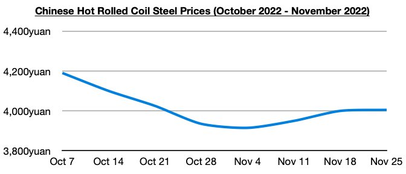
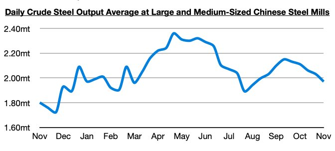
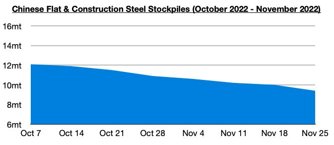

# Additional Improvement in Chinese Steel Market

**Date:** December 02, 2022  
**Publisher:** Breakwave Advisors | **Category:** Market Insights  
**Original URL:** [https://www.breakwaveadvisors.com/insights/2022/12/2/additional-improvement-in-chinese-steel-market](https://www.breakwaveadvisors.com/insights/2022/12/2/additional-improvement-in-chinese-steel-market)  

---

The average price of hot rolled coil in China ended last week at 4,005 yuan/ton ($558), which is 5 yuan more than a week ago. Steel prices have now increased for three straight weeks after previously declining for four straight weeks. Prices are still down year-on-year by 885 yuan however (-18%).

> **Figure 1: Chart 1 (65)**  
> [Local Asset](file:///C:/Users/Dell/Github/Shipping/corpus/03-breakwave/insights/2022/assets/2022-12-02_additional-improvement-in-chinese-steel-market_img_chart1286529_e31513e182da.jpg)

China's steel output has also recently rebounded, which combined with the ongoing rise in steel prices is encouraging. The most recently released data shows that daily crude steel output at large and medium-sized mills in China averaged 2 million tons during November 11 - 20. This is 1% more than was seen during the first ten days of the month and is up year-on-year by 14%. Overall, it remains encouraging that China’s steel output has stayed well above last year’s level. We remain of our view that China’s steel output likely bottomed in late July.

> **Figure 2: Chart 2 (56)**  
> [Local Asset](file:///C:/Users/Dell/Github/Shipping/corpus/03-breakwave/insights/2022/assets/2022-12-02_additional-improvement-in-chinese-steel-market_img_chart2285629_ee1050ff2710.jpg)

Also of note is that Chinese steel stockpiles have continued to decline. Stockpiles of flat and construction steel products at warehouses in major cities in China ended last week at approximately 9.4 million tons. This is 600,000 tons (-6%) less than a week ago and is down year-on-year by 2.4 million tons (-20%). Stockpiles have now fallen during twenty-one of the last twenty-two weeks. The stockpiles continue to follow normal seasonality.

> **Figure 3: Chart 3 (42)**  
> [Local Asset](file:///C:/Users/Dell/Github/Shipping/corpus/03-breakwave/insights/2022/assets/2022-12-02_additional-improvement-in-chinese-steel-market_img_chart3284229_901ea6420b0f.jpg)
