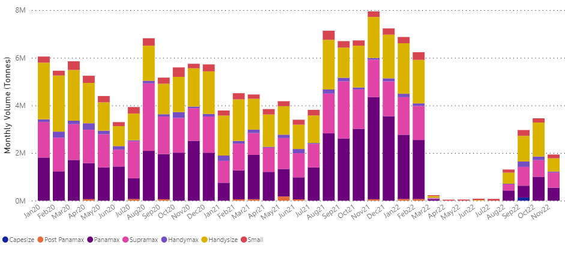
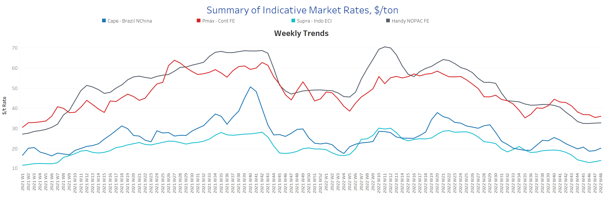
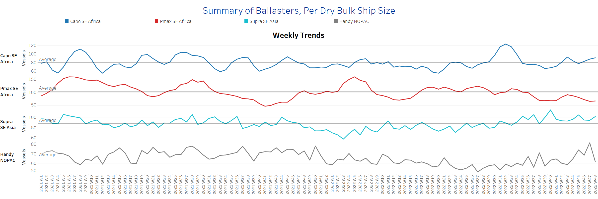
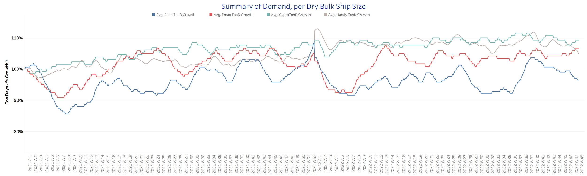
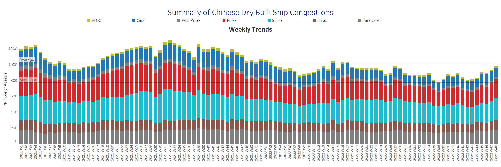

# Signal Dry Bulk Weekly Report

**Date:** December 02, 2022  
**Publisher:** Breakwave Advisors | **Category:** Market Insights  
**Original URL:** [https://www.breakwaveadvisors.com/insights/2022/12/2/signal-dry-bulk-weekly-report](https://www.breakwaveadvisors.com/insights/2022/12/2/signal-dry-bulk-weekly-report)  

---

Freight rates showed the first signs of recovery in late November after falling throughout the month. However, we are still observing an increase in the number of ballast vessels with signs of a downward trend in handysize vessels, while demand growth for Capesize vessels has continued to weaken in recent weeks.

In the iron ore market, prices recorded an increase to the highest level in two months after China took measures to strengthen its real estate sector. However, there are concerns about a downturn as there is a wave of protests across the country against the country's COVID -19 restrictions. China's largest commercial banks have agreed to provide $162 billion in new credit lines to private developers to help combat the liquidity crisis in the real estate sector. However, the second-largest economy has yet to overcome the macroeconomic challenges posed by COVID -19 ongoing cases.

In the grain market, we see that Ukrainian exports remain at a monthly level significantly weaker than in the first quarter of the year, while November ends with lower levels than in the previous two months. Using Signal Ocean data, the chart below shows a breakdown of monthly grain exports from Ukraine to all destinations by vessel size category, with Handysize and Panamax vessels appearing to draw more attention to volume.

## Chart of the Week Dry Bulk: Grain Flows From Ukraine

*Monthly November volume tonnes from Ukraine to all countries weaker than September-October*

> **Figure 1: Market Chart 1**  
> **Interactive Data & Source:** [Signal Ocean Platform](https://go.signalocean.com/e/983831/dry-dynamic-drybulkflows/2l7g3j/288942606?h=ukbIAP-7r8r8uPZOHScByqSKSsZh67oYXxiFSb3Ciyg) | [Local Asset](file:///C:/Users/Dell/Github/Shipping/corpus/03-breakwave/insights/2022/assets/2022-12-02_signal-dry-bulk-weekly-report_img_unnamed-2022-12-02t152241053_f642d7c03d8c.png)

Data Source: The Signal Ocean Platform, Grain Flows from Ukraine to all destinations

## Section 1/ Freight -Market Rates ($/T) Firmer

‘The Big Picture’ - Capesize and Panamax Bulkers and Smaller Ship Sizes

> **Figure 2: Market Chart 2**  
> **Interactive Data & Source:** [Signal Ocean Platform](https://www.thesignalgroup.com/signal-ocean-platform) | [Local Asset](file:///C:/Users/Dell/Github/Shipping/corpus/03-breakwave/insights/2022/assets/2022-12-02_signal-dry-bulk-weekly-report_img_unnamed-2022-12-02t152325297_ffe94b93b947.png)

We see an upward trend in freight rates for late November after a sustained decline throughout the month.

- **Capesize**vessel freight rates rose to $20/tonne, up almost $1/tonne from a week ago and nearly the same level as earlier in the month.

- **Panamax**vessel freight rates fromtheContinent to the Far East reached $36/tonne, down nearly $9/tonne from the week 40 peak.
- **Supramax**freight rates for the Indo-ECI route rose to $14/tonne, up $1/tonne from the previous week, and there appears to be a further upward trend for the next few days.

- **Handysize**freight rates from NOPAC to the Far East continued to hover below $32/tonne, with no signs of a pickup yet.

## Section 2/ Supply -Ballasters (# Vessels) Increasing

> **Figure 3: Supply Trend Lines for Key Load Areas**  
> **Interactive Data & Source:** [Signal Ocean Platform](https://www.thesignalgroup.com/signal-ocean-platform) | [Local Asset](file:///C:/Users/Dell/Github/Shipping/corpus/03-breakwave/insights/2022/assets/2022-12-02_signal-dry-bulk-weekly-report_img_unnamed-2022-12-02t152427448_d2d8bd1272de.png)

The Capesize, Panamax, and Supramax segments have seen an increase in the number of ballast ships, while Handysize has seen an unexpectedly significant decrease.

- **Capesize**SE Africa: The number of vessels now stands at 91, 14 more than in week 45 and 11 above the annual average.

- **Panamax**SE Africa: The number of vessels remains below the annual average, but with a slight increase to 67 vessels, 2 more than the previous week.
- **Supramax**SE Asia: The number of ships increased to 102, almost 7 more than the previous week.

- **Handysize**NOPAC: The number of vessels dropped to 62, almost 4 below the annual average. It remains to be seen if the downward trend will continue in December.

## Section 3/ Demand -TonDays Decreasing

> **Figure 4: TonDays Decreasing**  
> **Interactive Data & Source:** [Signal Ocean Platform](https://www.thesignalgroup.com/signal-ocean-platform) | [Local Asset](file:///C:/Users/Dell/Github/Shipping/corpus/03-breakwave/insights/2022/assets/2022-12-02_signal-dry-bulk-weekly-report_img_unnamed-2022-12-02t152508054_4550f7bbab6f.png)

Demand growth in the Capesize segment continues to decline significantly, although there have been signs of an upturn in the Panamax segment over the past two weeks.

- **Capesize**demand ton-days: The trend finally showed no signs of upward movement in November, and growth declined significantly at the end of the month.
- **Panamax**demand ton-days: There is a clear upward trend with signs of further strong growth in the first days of December.

- **Supramax**demand ton-days: The downward trend reversed before the end of November, with a slight upward movement.t.

- **Handysize**demand ton-days: The decline remains similar to the previous November days, with a stronger downward correction than the previous week.

## Section 4/ Port Congestion -No of Vesselsincreasing

> **Figure 5: Dry Bulk Ships Congested at Chinese Ports**  
> **Interactive Data & Source:** [Signal Ocean Platform](https://www.thesignalgroup.com/signal-ocean-platform) | [Local Asset](file:///C:/Users/Dell/Github/Shipping/corpus/03-breakwave/insights/2022/assets/2022-12-02_signal-dry-bulk-weekly-report_img_unnamed-2022-12-02t152557032_ebc6cabfc083.png)

In recent days, vessel congestion is similar to week 27, with a significant increase in the Panamax and Supramax segments, while Capesize shows a decreasing trend.

- **Capesize:**The number of vessels dropped to 123, 4 less than the previous week.

- **Panamax:**The number of vessels held increased to 239, 11 more than the previous week, with an upward trend of over 200 ships since the end of week 44.
- **Supramax:**The number of congested vessels increased to 280, 24 more than the previous week and one of the highest levels since the end of week 27.

- **Handysize**: The number of congested vessels was 171, 4 more than the previous week and 27% above the low of week 36.

Data Source:[Signal Ocean Platform](https://www.thesignalgroup.com/signal-ocean-platform)
