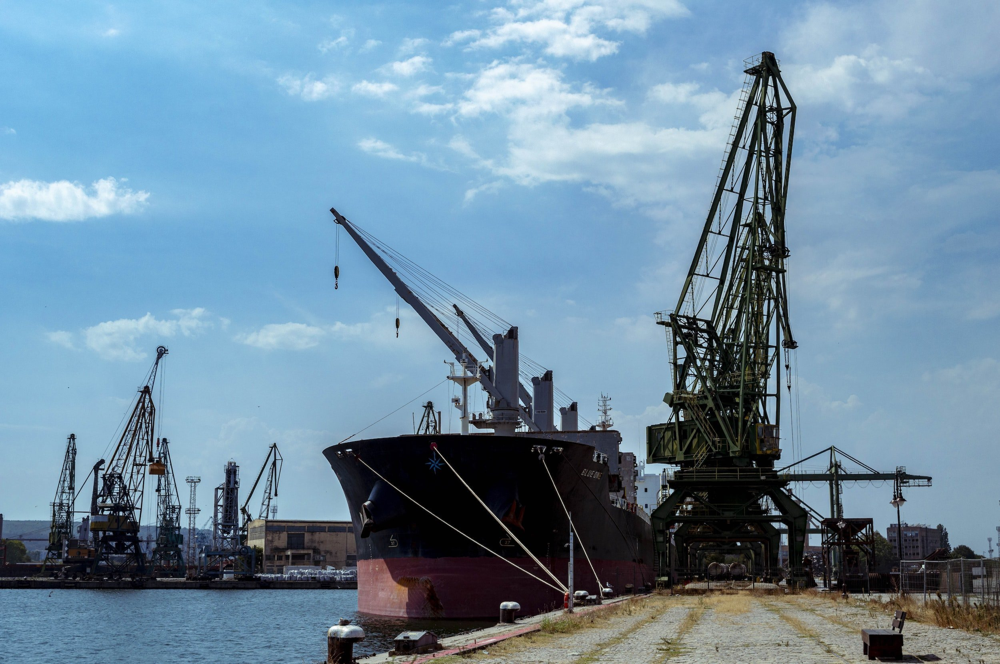
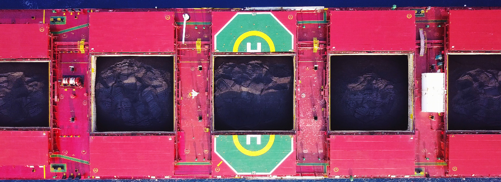
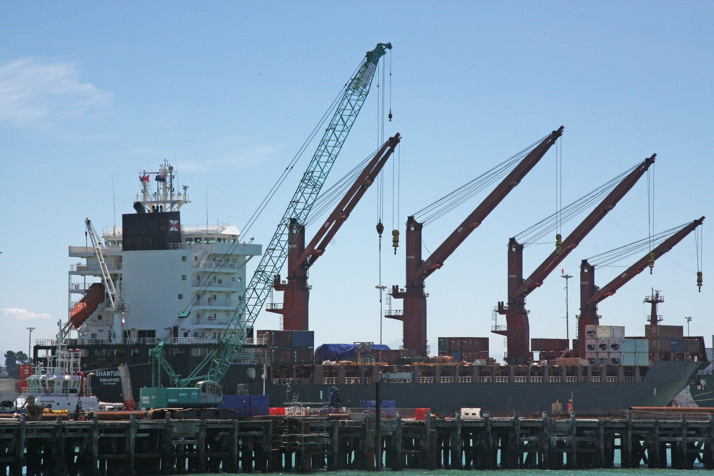
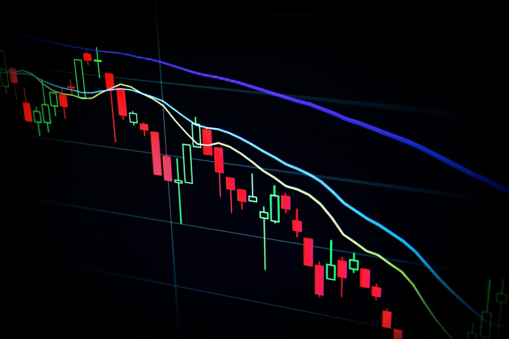

# Weekly Insights Review

**Date:** December 04, 2022  
**Publisher:** Breakwave Advisors | **Category:** Market Insights  
**Original URL:** [https://www.breakwaveadvisors.com/insights/2022/12/4/64a8dyem2ud9hr449mkl9rgk7y1y1t](https://www.breakwaveadvisors.com/insights/2022/12/4/64a8dyem2ud9hr449mkl9rgk7y1y1t)  

---

## Welcome to Our Weekly Insights Review

## Read Here Everything You Need to Know

## Braemar Weekly Dry Market Report

## Here We Go Again

The past several weeks has seen a range of economic support measures announced by the Chinese government.

[Read More](https://www.breakwaveadvisors.com/insights/2022/11/27/braemar-weekly-dry-market-report)

> **Figure 1: Unsplash Image 6omcvhppcuu**  
> **Interactive Data & Source:** [Breakwave Advisors Market Insights](https://www.breakwaveadvisors.com/insights/2022/11/28/doric-weekly-market-insight) | [Local Asset](file:///C:/Users/Dell/Github/Shipping/corpus/03-breakwave/insights/2022/assets/2022-12-04_64a8dyem2ud9hr449mkl9rgk7y1y1t_img_unsplash-image-6omcvhppcuu_801c02269141.jpg)

## Doric Weekly Market Insight

## Chinese Economic Data Are the Focal Point

In a sea full of reds, the forty-seventh trading week painted our screens with few brushstrokes of green at last!

> **Figure 2: Unsplash Image Rwas3vhjoj0**  
> **Interactive Data & Source:** [Breakwave Advisors Market Insights](https://www.breakwaveadvisors.com/insights/2022/11/29/seaborne-coal-flows-in-2022) | [Local Asset](file:///C:/Users/Dell/Github/Shipping/corpus/03-breakwave/insights/2022/assets/2022-12-04_64a8dyem2ud9hr449mkl9rgk7y1y1t_img_unsplash-image-rwas3vhjoj0_3304649789a5.jpg)

## Seaborne Coal Flows in 2022

## This Year Is Crucial

This year is crucial for the energy mix in European countries, as the EU has imposed new sanctions on Russia.

> **Figure 3: 1+(6)**  
> **Interactive Data & Source:** [Breakwave Advisors Market Insights](https://www.breakwaveadvisors.com/insights/2022/11/29/shipfix-global-market-update) | [Local Asset](file:///C:/Users/Dell/Github/Shipping/corpus/03-breakwave/insights/2022/assets/2022-12-04_64a8dyem2ud9hr449mkl9rgk7y1y1t_img_12b28629_b94f45bdad3a.png)

## Shipfix-Global Market Update

> **Figure 4: Unsplash Image Cz Fz9cm3qm**  
> **Interactive Data & Source:** [Breakwave Advisors Market Insights](https://www.breakwaveadvisors.com/insights/2022/11/29/shipfix-global-market-update) | [Local Asset](file:///C:/Users/Dell/Github/Shipping/corpus/03-breakwave/insights/2022/assets/2022-12-04_64a8dyem2ud9hr449mkl9rgk7y1y1t_img_unsplash-image-cz-fz9cm3qm_a97264c09bf8.jpg)

## Macro/geopolitics,commodity and Freight Markets

Rising Covid infection rates in China dominated the news flow last week, even before the reports of protests and unrest started to emerge.

## Signal Dry Bulk Weekly Report

> **Figure 5: Unsplash Image Vlqgc Lkhoy**  
> **Interactive Data & Source:** [Breakwave Advisors Market Insights](https://www.breakwaveadvisors.com/insights/2022/12/2/signal-dry-bulk-weekly-report) | [Local Asset](file:///C:/Users/Dell/Github/Shipping/corpus/03-breakwave/insights/2022/assets/2022-12-04_64a8dyem2ud9hr449mkl9rgk7y1y1t_img_unsplash-image-vlqgc-lkhoy_5817fd53377a.jpg)

## Snapshot of Spot Freight Rates, Supply-Demand Trends, Port Congestions

Freight rates showed the first signs of recovery in late November after falling throughout the month.

## Additional Improvement in Chinese Steel Market

## The Most Recently Released Data

The average price of hot rolled coil in China ended last week at 4,005 yuan/ton ($558), which is 5 yuan more than a week ago.

[Read More](https://www.breakwaveadvisors.com/insights/2022/12/2/additional-improvement-in-chinese-steel-market)

> **Figure 6: Unsplash Image Ib7jwp7m0ia**  
> **Interactive Data & Source:** [Breakwave Advisors Market Insights](https://www.breakwaveadvisors.com/insights/2022/12/3/mazars-comment-the-near-demise-of-bitcoin-is-a-warning-make-capitalism-great-again) | [Local Asset](file:///C:/Users/Dell/Github/Shipping/corpus/03-breakwave/insights/2022/assets/2022-12-04_64a8dyem2ud9hr449mkl9rgk7y1y1t_img_unsplash-image-ib7jwp7m0ia_e68cde5e9f45.jpg)

## Mazars Comment- The Near-Demise of Bitcoin Is a Warning: Make Capitalism Great Again

## There Seems to Be No Significant Financial Contagion

Some ideas are meant to die in infancy, but they can still make a powerful statement.

> **Figure 7: Unsplash Image Fixlqxahcfk**  
> [Local Asset](file:///C:/Users/Dell/Github/Shipping/corpus/03-breakwave/insights/2022/assets/2022-12-04_64a8dyem2ud9hr449mkl9rgk7y1y1t_img_unsplash-image-fixlqxahcfk_301984a0542d.jpg)
