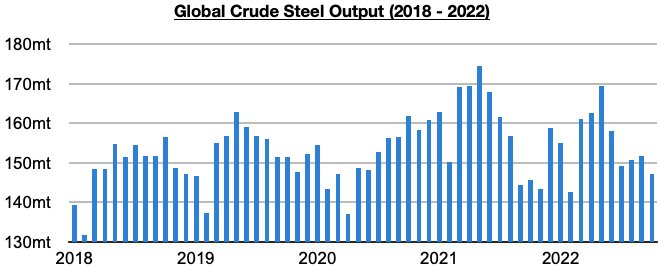
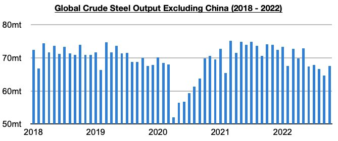
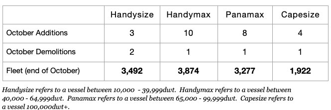

# Cargo Demand and Fleet Supply Issues Continue

**Date:** December 05, 2022  
**Publisher:** Breakwave Advisors | **Category:** Market Insights  
**Original URL:** [https://www.breakwaveadvisors.com/insights/2022/12/5/cargo-demand-and-fleet-supply-issues-continue](https://www.breakwaveadvisors.com/insights/2022/12/5/cargo-demand-and-fleet-supply-issues-continue)  

---

*By*[*Jeffrey Landsberg*](https://www.linkedin.com/in/jeffrey-landsberg-70ab957/)

Global crude steel production totaled 147.3 million tons last month. This is down month-on-month by 4.4 million tons (-3%) but is 1.6 million tons (1%) more than was reported last year for October 2021’s production. Global crude steel production has now increased on a year-on-year basis for two straight months after previously contracting on a year-on-year basis for twelve straight months. However, the growth remains almost entirely due to growth in China’s crude steel production. Crude steel production outside of China fell on a year-on-year basis again last month.

> **Figure 1: Chart 1 (66)**  
> [Local Asset](file:///C:/Users/Dell/Github/Shipping/corpus/03-breakwave/insights/2022/assets/2022-12-05_cargo-demand-and-fleet-supply-issues-continue_img_chart1286629_5cabbcee4c93.jpg)

Global crude steel production outside of China totaled 67.5 million tons last month. This is up month-on-month by 2.8 million tons (4%) but is 6.6 million tons (-9%) less than was reported last year for October 2021’s production. Concerning is that this has marked the eighth straight month with a year-on-year contraction. Going forward, we remain quite bearish for the world outside of China. Prior to these last eight months, crude steel production outside of China had grown on a year-on-year basis for twelve straight months.

> **Figure 2: Chart 2 (57)**  
> [Local Asset](file:///C:/Users/Dell/Github/Shipping/corpus/03-breakwave/insights/2022/assets/2022-12-05_cargo-demand-and-fleet-supply-issues-continue_img_chart2285729_93e6c144c666.jpg)

Still remaining concerning for the dry bulk market is that it is not only the global economy continuing to weaken. Newbuilding deliveries also continue to far outpace scrapping volume. 25 newbuildings were delivered in October, while only 5 vessels were scrapped. Overall, month after month of moderate fleet growth will remain a headwind for the dry bulk market, especially as issues remain on the cargo demand side.

> **Figure 3: Chart 3 (43)**  
> [Local Asset](file:///C:/Users/Dell/Github/Shipping/corpus/03-breakwave/insights/2022/assets/2022-12-05_cargo-demand-and-fleet-supply-issues-continue_img_chart3284329_0e7859d3a116.jpg)
