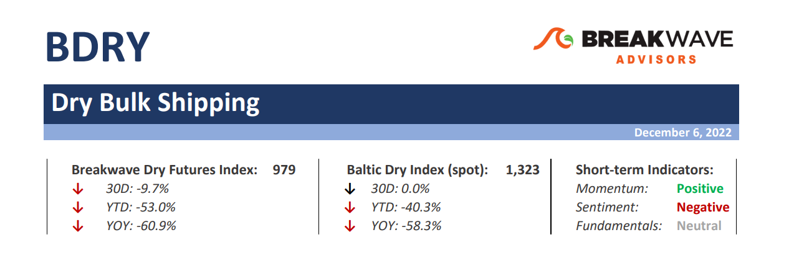
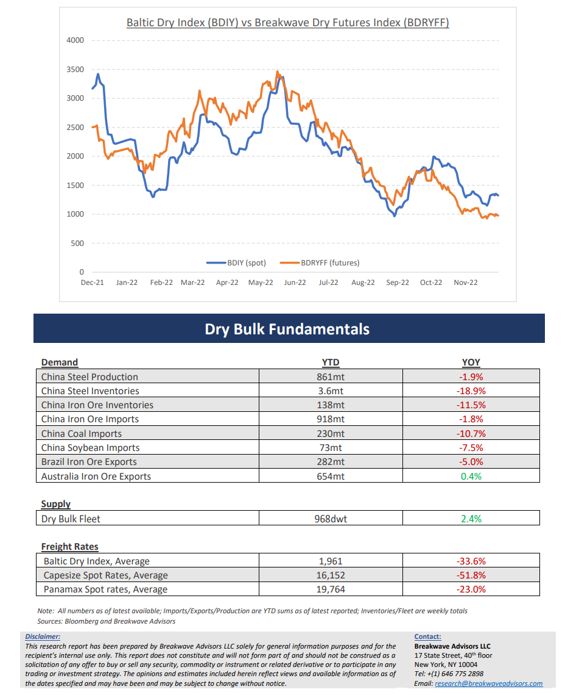

# Breakwave Bi-Weekly Dry Bulk Report - December 6, 2022

**Date:** December 06, 2022  
**Publisher:** Breakwave Advisors | **Category:** Market Insights  
**Original URL:** [https://www.breakwaveadvisors.com/insights/2022/12/6/breakwave-bi-weekly-dry-bulk-report-december-6-2022](https://www.breakwaveadvisors.com/insights/2022/12/6/breakwave-bi-weekly-dry-bulk-report-december-6-2022)  

---

> **Figure 1: Bdrytop**  
> [Local Asset](file:///C:/Users/Dell/Github/Shipping/corpus/03-breakwave/insights/2022/assets/2022-12-06_breakwave-bi-weekly-dry-bulk-report-december-6-2022_img_bdrytop_9bf5bdbc3e02.png)

**A quiet December for dry bulk freight? –**Spot dry bulk rates have stabilized in the~13,000 range for all asset classes in an uneventful two-week period despite significant news flow on the macro front. Brazilian iron ore cargoes have only trickled into the market and thus there has been no urgency from charterers to secure tonnage while the Pacific market has been relatively steady on the back of flattish export volumes. The near-term outlook also seems unexciting, thus the backwardation in the futures market. However, any potential tightness could have a considerable impact on rates given the relatively low absolute spot rate levels. How could such a tightness emerge, if it does? Firstly, bunker prices are high enough to discourage owners from sailing all the way to Brazil without a booked cargo given the low level of spot freight rates in that part of the world. As a result, any increase in Atlantic cargo flow for mid-January dates might face a relatively low vessel availability, thus causing the needed tightness in the market for rates to move up. If that were to happen, market participants might be faced with rising spot rates during a period when liquidity is thin and when most traders are on holiday. Although such a scenario is not by any means the base case, it has happened before and the resulting “squeeze” was significant. For now, the spot Capesize market seems very quiet and thus very little can be told about the near-term direction other than anticipation of where any potential tightness might appear.

**Is the much-awaited “pivot” in China’s strict Covid policy here? –**Following the widely-publicized demonstrations in several cities against the strict Covid-related policies in China, there has been some gradual changes and relaxations in policies relating to the pandemic. As a result, commodities have had quite a positive reaction so far, as a recovery in Chinese activity should lead to significant restocking of major commodities. On top of that, the considerable stimulus pumped into the economy over the last year should provide the much-needed boost in financing to restart China’s economic engine that has remained stagnated for more than a year now. Is this a real “pivot” in China’s policy or a mere publicity stunt to relax social tensions that have built internally? Only time will tell, but the daily news flow points to concrete steps towards reopening the economy and allowing economic activity to resume. Although such processes take time, we feel that, come next spring, economic growth in China will exceed the rate of the last several quarters, something that can only be positive for China’s steel complex.

**Dry bulk focus shifts back to fundamentals –**Following a period of high uncertainty and significant disruptions across the commodity spectrum, the gradual normalization of trade is shifting the market’s attention back to the traditional demand and supply dynamics that have shaped dry bulk profitability for decades. As effective fleet supply growth for the next few years looks marginal, demand will be the main determinant of spot freight rates with China returning back to the driver’s seat as the dominant force of bulk imports.

> **Figure 2: Bdrybottom**  
> [Local Asset](file:///C:/Users/Dell/Github/Shipping/corpus/03-breakwave/insights/2022/assets/2022-12-06_breakwave-bi-weekly-dry-bulk-report-december-6-2022_img_bdrybottom_c80e42325ef6.png)
