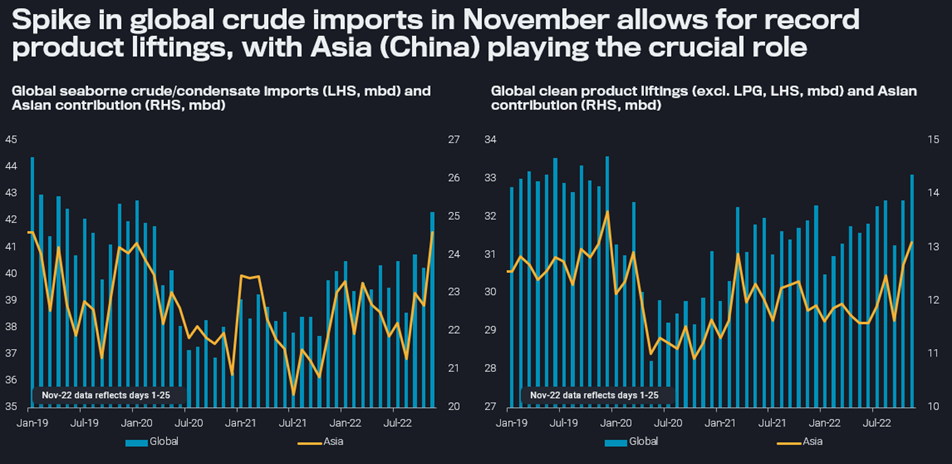

# Oil trade could have peaked in November

**Date:** December 06, 2022  
**Publisher:** Breakwave Advisors | **Category:** Market Insights  
**Original URL:** [https://www.breakwaveadvisors.com/insights/2022/12/6/oil-trade-could-have-peaked-in-november](https://www.breakwaveadvisors.com/insights/2022/12/6/oil-trade-could-have-peaked-in-november)  

---

November oil flow data paints a picture of very healthy refinery operations, with record crude imports and clean product liftings, lead by Asia. However, this spike looks unsustainable.

*By*[*David Wech*](https://www.linkedin.com/search/results/all/?heroEntityKey=urn%3Ali%3Afsd_profile%3AACoAACdbGu4B25CFPSM8gOGM562N0GXP-oL0T1Y&keywords=david%20wech&origin=RICH_QUERY_TYPEAHEAD_HISTORY&position=0&searchId=8f9d326e-f9c9-494c-9000-6e78beca0e29&sid=JA_)

lobal seaborne crude and condensate imports are set to undoubtedly mark the highest level in the Covid era in November. Based on preliminary data for days 1-25, crude imports could reach 42.3mbd, the highest since January 2020, and 2.4mbd higher than the average level over the last 12 months. Massive exports from the Americas, led by the US, Brazil and Guyana, in previous months, as well as high OPEC+ exports in October have provided the basis for this development. These massive flows, allowing also for onshore (Europe, China) and offshore (oil in transit) inventory builds, have contributed a large part in bringing down oil prices and structure, with slowing demand being the other main component.

Most of the additional crude has been arriving this month in Asia. In fact, seaborne crude/condensate imports into the region (excl. Oceania) could even reach an all-time high of 24.6mbd in November. The big draw of volumes from the Atlantic Basin, in sharp contrast to the summer period, is the main contributor to the dirty freight rally over recent months. And this flow may well continue, including – on top of healthy American supplies – additional Europe-facing Russian barrels that need to be rerouted.

> **Figure 1: 20221129**  
> **Interactive Data & Source:** [Analytics Vortexa](https://analytics.vortexa.com/?dateRange=2019-01-01T00%3A00%3A00.000Z__2022-11-25T23%3A59%3A59.999Z&filtersEnabled=%5B%22p%22%2C%22o%22%2C%22d%22%2C%22d_r%22%2C%22v%22%2C%22intra%22%2C%22sts_o%22%2C%22c_o%22%2C%22w%22%5D&geoBreakdownDestinationGlobal=region&geoBreakdownOriginGlobal=trading_subregion&metric=bpd&movementEvent=unloading_start&page=Flows&products=%5B%2254af755a090118dcf9b0724c9a4e9f14745c26165385ffa7f1445bc768f06f11%22%5D&tabId=c6f9e5c5-5194-4257-8a66-ff4ad1067951&timeSeriesProperty=destination_region) | [Local Asset](file:///C:/Users/Dell/Github/Shipping/corpus/03-breakwave/insights/2022/assets/2022-12-06_oil-trade-could-have-peaked-in-november_img_20221129_328d5d426435.png)

**Global seaborne**[**crude imports**](https://analytics.vortexa.com/?dateRange=2019-01-01T00%3A00%3A00.000Z__2022-11-25T23%3A59%3A59.999Z&filtersEnabled=%5B%22p%22%2C%22o%22%2C%22d%22%2C%22d_r%22%2C%22v%22%2C%22intra%22%2C%22sts_o%22%2C%22c_o%22%2C%22w%22%5D&geoBreakdownDestinationGlobal=region&geoBreakdownOriginGlobal=trading_subregion&metric=bpd&movementEvent=unloading_start&page=Flows&products=%5B%2254af755a090118dcf9b0724c9a4e9f14745c26165385ffa7f1445bc768f06f11%22%5D&tabId=c6f9e5c5-5194-4257-8a66-ff4ad1067951&timeSeriesProperty=destination_region)**and**[**clean product liftings**](https://analytics.vortexa.com/?dateRange=2019-01-01T00%3A00%3A00.000Z__2022-11-25T23%3A59%3A59.999Z&filtersEnabled=%5B%22p%22%2C%22o%22%2C%22d%22%2C%22d_r%22%2C%22v%22%2C%22intra%22%2C%22sts_o%22%2C%22c_o%22%2C%22w%22%5D&geoBreakdownDestinationGlobal=region&geoBreakdownOriginGlobal=trading_subregion&intraMovementFilter=0&metric=bpd&page=Flows&products=%5B%22b68cbb746f8b9098c50e2ba36bcad83001a53bd362e9031fb49085d02c36659c%22%5D&productsExcluded=%5B%22364ccbb996c944055b479810a8e74863267885dc1b01407cb0f00ab26dafe1e1%22%5D&tabId=c6f9e5c5-5194-4257-8a66-ff4ad1067951&timeSeriesProperty=origin_region)**, highlighting Asian contributions (mbd)**

Ample crude inflows have enabled refiners to hike product supplies. Clean product liftings (excl. LPG) have surged to the highest level observed so far in this decade, both on a global and Asian level. The letter development is driven by China where government incentives to export clean products are finally bearing fruits. And it will be of little surprise to the reader, that diesel plays the dominant role in the upside to clean product supplies.

However, in spite of these healthy product exports, diesel cracks and overall refining margins remain supportive, even after a noticeable correction of the last month. Accordingly, product liftings may remain lofty at least in December, in difference to crude supplies, which are curtailed by OPEC+ action. Preliminary data suggest, OPEC+ exports could be down easily by 1.5mbd month-on-month in November.

However, declining demand (additional Chinese lockdowns, economic slowdown), especially once we pass the peak winter season, along with potentially more expensive feedstocks (OPEC production cuts and the ripple effects of Russian sanctions), and the consequences of the Chinese product flood on the regional market, will have a strong potential to limit refining operations and, consequently, product flows over the upcoming months.
