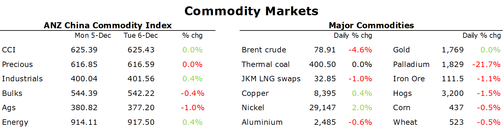

# European gas gains as a cold snap boosts demand

**Date:** December 07, 2022  
**Publisher:** Breakwave Advisors | **Category:** Market Insights  
**Original URL:** [https://www.breakwaveadvisors.com/insights/2022/12/7/european-gas-gains-as-a-cold-snap-boosts-demand](https://www.breakwaveadvisors.com/insights/2022/12/7/european-gas-gains-as-a-cold-snap-boosts-demand)  

---

*By*[*Daniel Hynes*](https://www.linkedin.com/in/dahynes/)

Investors took time to re-evaluate the macroeconomic backdrop following recent strong gains across the commodities complex. The spectre of tighter monetary policy weighed on sentiment.

> **Figure 1: 1670360992707**  
> **Interactive Data & Source:** [Linkedin](https://www.linkedin.com/newsletters/commodities-wrap-6692196755876012032/?fbclid=IwAR3kiXJqZdxmp9ZcRwBNI7FsBySI-XSC0pfPur1qzjt7OZp7PTE59Tsl1QI) | [Local Asset](file:///C:/Users/Dell/Github/Shipping/corpus/03-breakwave/insights/2022/assets/2022-12-07_european-gas-gains-as-a-cold-snap-boosts-demand_img_1670360992707_771be0c9830c.png)

**Crude oil**fell as concerns of weaker economic growth offset ongoing supply side issues. As European sanctions on Russian oil begin, the market has refocused on the economic backdrop amid tighter monetary policies from central banks. Recent strong economic data raised concerns that the Fed will continue to push interest rates higher, potentially pushing the US economy into recession. This comes amid dwindling liquidity in the market. After some strong moves over the course of the year, investors have pulled back from aggressive positions. This has magnified the shifts in sentiment. This comes amid signs of weakness in the physical market. Despite recent optimism over Chinese demand, State refiners have been cutting runs this month amid subdued demand. Saudi Arabia also lowered oil prices for its crude into Asia and Europe. The Energy Information Administration released its latest market outlook, with a contraction in US economic activity in Q2 2022 and Q1 2023 weighing on demand. It also raised its forecast for US supply to 12.34mb/d in 2023. As the G7 price gap is implemented, Russia warned it may set a price floor for its global oil sales. This may come via a fixed prices or stipulate maximum discounts to international benchmarks.

Frigid weather across Europe helped push**European gas**prices higher. The cold snap is putting pressure on inventories that have been successfully built up over the past few months. Recent withdrawals have seen storage facilities fall to 91% capacity. The outlook for the next two weeks is dominated by an Arctic blast, with temperatures in the UK and Nordics dropping below freezing, according to Maxar. This has created some doubt amongst traders, who had previously expected plentiful LNG supplies would get Europe through winter. Even so, the prospect of energy shortages remains high. A string of French politicians have been warning about potential power cuts amid issues with the country's nuclear power plants. A lack of interconnectivity across the continent could still see power shortages emerge.**North Asian LNG**prices edged lower as buyers refrained from adding to ample inventories.

**Base metals**were mixed as investors weighed up easing restrictions in China against tighter monetary policy by central banks. Sentiment has been buoyed by signs Beijing is shifting away from its zero-COVID strategy.**Zinc**gained after Nyrstar said its Auby smelter in France would remain closed indefinitely. High electricity prices in France have crippled the continent’s smelters. With the prospect of further shortages of electricity amid issues with nuclear power plants, Nyrstar saw little prospect of conditions improving. Aluminium eased lower amid signs of weak demand. A major global producer offered Japanese buyers a premium of USD95/t for the coming quarter, the lowest in more than two years. However, the market remains on edge amid reports that EU and US are weighing up new tariffs on Chinese steel and aluminium. The proposed plan is part of a bid to fight carbon emissions and global overcapacity.

**Iron ore**edged higher amid signs of rising demand. Inventories at major Chinese steel mills fell in the last 10 days of November from the second last 10 days, according to data from the China Iron & Steel Association. Stockpiles sank 12% to 15.3mt. Crude steel production at major mills expanded 1.3% to 2.03mt over the same period.

The recent rally above USD1800/oz, prompted selling in the**gold**market. Bullion-backed exchange trade funds cut their holdings by 13.7t on Monday.

Data source:[Commodities Wrap](https://www.linkedin.com/newsletters/commodities-wrap-6692196755876012032/?fbclid=IwAR3kiXJqZdxmp9ZcRwBNI7FsBySI-XSC0pfPur1qzjt7OZp7PTE59Tsl1QI)
