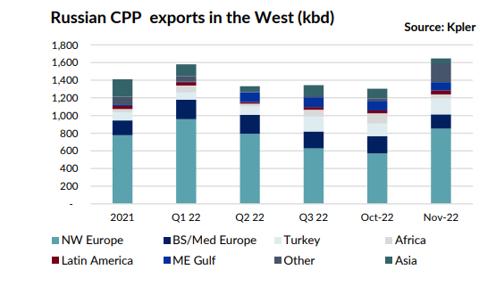

# Gibson's Tanker Market Report

**Date:** December 07, 2022  
**Publisher:** Breakwave Advisors | **Category:** Market Insights  
**Original URL:** [https://www.breakwaveadvisors.com/insights/2022/12/7/gibsons-tanker-market-report](https://www.breakwaveadvisors.com/insights/2022/12/7/gibsons-tanker-market-report)  

---

In just a couple of days from now, the EU ban on imports of Russian crude will come into effect. Still, huge uncertainty remains about the impact of sanctions and the price cap itself. The cap is designed to give additional bargaining power to buyers in third countries with minimal disruptions to crude flows. However, Russia has repeatedly stated (prior to the announced cap of $60/bbl) that it will not sell its crude under these conditions and is reportedly seeking to boost the recognition of Russian maritime cargo insurance. As such, the next few weeks will be critical, revealing how strong Russian determination not to sell its barrels under an arguably reasonable price cap level is, the appetite for Russian crude in third countries as well as the potential capacity of the tanker fleet willing to service price capped and/or non-price-capped exports of Russian barrels.

What will happen on the crude side, will offer an indication of what is likely to happen when the EU ban on imports of Russian clean and dirty products comes into effect on 5th of February. Yet, whilst there are many similarities between the crude and product markets, there are also some differences. Russian crude exports to the UK and EU countries in Northwest Europe (which in the past, accounted for the vast majority of Russian trade to Europe) have been in steady decline since spring, falling to just 120 kbd in November from 1.27 mbd in January/February 2022. In contrast, Russian clean exports to the UK/EU show a considerably slower rate of decline, with the trade averaging 0.77 mbd in October versus 1.2 mbd during the 1st two months of this year. Furthermore, exports actually increased to 1 mbd in November, which suggests that Russia could be maximizing product exports until the February deadline.

> **Figure 1: 1 (10)**  
> **Interactive Data & Source:** [Gibsons Co](https://www.gibsons.co.uk/market-reports) | [Local Asset](file:///C:/Users/Dell/Github/Shipping/corpus/03-breakwave/insights/2022/assets/2022-12-07_gibsons-tanker-market-report_img_1281029_d2143b3f6f50.png)

Furthermore, no major reshuffle in Russian CPP export flows has been seen so far to date. There have been some increases in shipments to the Middle East, West Africa and Latin America; however, these gains have been fairly limited, although trading of Russian products via storage terminals in Northwest Europe has also seen an increase.

Potentially, Russia could find it more difficult to find the same level of demand in third countries as it has found this year for its crude. After all, oil demand in likely markets where Russia can place its products is considerably lower than consumption in advanced western economies. If that’s the case, Russia could be forced to compensate by increasing crude exports and/or to reduce its refining runs.

Without doubt, however, the product tanker market is likely to see further increases in tonne miles. The CPP trade into Europe from further afield has already increased substantially in 2022, most notably from the Middle East, India and Far East, supported by Russian sanctions, the regional rebound in demand during the 1st half of the year from Covid related restrictions and the closure of refining capacity in 2020/21. When the time comes for Europe to fully wean itself off Russian products, the latest trends in global product flows can only accelerate.

Data source:[Gibson Shipbrokers](https://www.gibsons.co.uk/market-reports)
