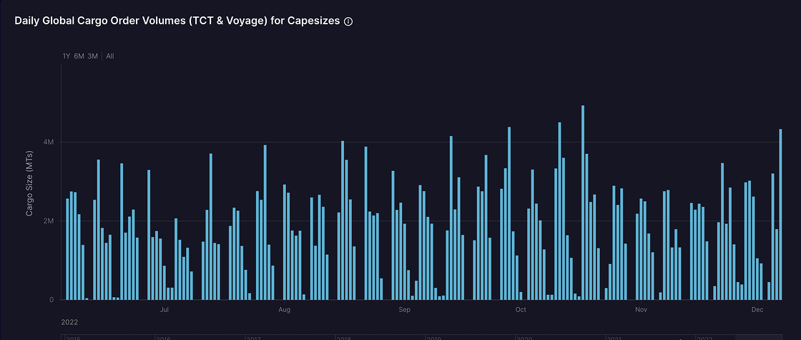

# Shipfix-Global Market Update

**Date:** December 08, 2022  
**Publisher:** Breakwave Advisors | **Category:** Market Insights  
**Original URL:** [https://www.breakwaveadvisors.com/insights/2022/12/8/shipfix-global-market-update](https://www.breakwaveadvisors.com/insights/2022/12/8/shipfix-global-market-update)  

---

*By*[*Ulf Bergman*](https://www.linkedin.com/in/ulf-bergman-81570425/)

## Macro/geopolitics

Reports are emerging that Chinese authorities are considering more measures to support the country’s ailing property sector. The yearlong efforts to deleverage the industry may come to an end with a shift away from the “housing is for living, not for speculation” policy. The travails facing the Chinese real estate sector have been weighing on consumer sentiments in the country and its demand for commodities. However, more credit and other support measures available for the sector could help reverse some of those adverse effects.

At the same time, officials are considering a GDP target of around five per cent for next year. The target may appear somewhat ambitious compared to this year’s growth, which is likely to be in the three to four per cent range. However, it may also signal an official shift away from Covid control to a greater focus on the well-being of the economy, which could boost the country’s demand for commodities and seaborne transportation.

## Commodity Markets

Brent crude oil extended losses into a fifth consecutive day on Wednesday. The futures declined by 2.7 per cent and ended the session at 77.17 dollars per barrel, the lowest closing price since the 24th of December last year. The mounting fears over a US recession and a more challenging demand outlook next year contributed to the drop.

Continued cold weather across Europe and rising demand contributed to increasing natural gas prices on the continent during yesterday’s session. The front-month futures gained 7.8 per cent and settled above 149 euros per megawatt-hour. Across the Atlantic, US natural gas prices bounced by nearly five per cent on forecasts of colder weather in the coming two weeks.

After gaining more than 35 per cent in the past month, the Newcastle coal futures took a breather yesterday. The contracts for delivery next month declined by 3.6 per cent and settled at 390 dollars per tonne. The futures for delivery in Nort-West Europe also fell, with the contracts for delivery in January settling at 262 dollars per tonne following a two per cent drop for the day.

The iron ore futures trading on the Singapore Exchange retreated by 1.8 per cent and ended the session at 106 dollars per tonne. Still, despite the decline yesterday, the contracts have gained nearly 40 per cent since the end of October on optimism that an easing of the Chinese Covid policies would boost demand for the steelmaking ingredient. Yesterday’s losses have also been reversed in today’s trading, with the January futures gaining around three per cent.

For the base metals, yesterday delivered a somewhat mixed trading session. The nickel futures trading at the London Metal Exchange provided the day’s standout performance, with a gain of 7.4 per cent for the session. In contrast, the aluminium contracts declined for a third consecutive session and settled 0.9 per cent lower. Copper and zinc recorded modest gains of 0.4 and 0.9 per cent, respectively.

After several days of losses, wheat and corn futures recovered some lost ground yesterday. The wheat contracts for delivery in March trading in Chicago advanced by 2.8 per cent yesterday, while the corn futures gained 0.6 per cent. The soybean futures also ended the day in the black, following gains of 1.2 per cent.

## Freight Markets

The headline Baltic Dry Index was propelled 2.5 per cent higher yesterday following robust gains in the largest tonnage segment. The sub-index for the Capesizes advanced by 6.2 per cent amid high cargo order volumes on Wednesday. The freight gauges for the other vessel segments were broadly unchanged yesterday.

The Baltic Exchange’s wet indices had a fairly quiet day, with the gauge for the dirty tankers continuing to slide amid a daily decline of 0.8 per cent. In contrast, the clean tankers recorded a modest gain of 0.3 per cent.

## The View From the Shipfix Desk

Yesterday’s strong performance for the Baltic Exchange’s Capesize index has been followed by a solid start to the day for the segment in the FFA market. The Capesizes have had a volatile period over the past few months, with daily gains and losses often in the double-digit territory. The index has gained nearly 450 per cent since the end of August but remains 67 per cent below the level seen a year ago. However, yesterday’s robust performance reflected a high level of cargo order volumes for the day amid increasing Chinese demand.

> **Figure 1: Market Chart 1**  
> **Interactive Data & Source:** [Shipfix](https://shipfix.com/) | [Local Asset](file:///C:/Users/Dell/Github/Shipping/corpus/03-breakwave/insights/2022/assets/2022-12-08_shipfix-global-market-update_img_unnamed-2022-12-08t140724844_468a5b9219b3.png)

Data Source:[Shipfix](https://shipfix.com/)
