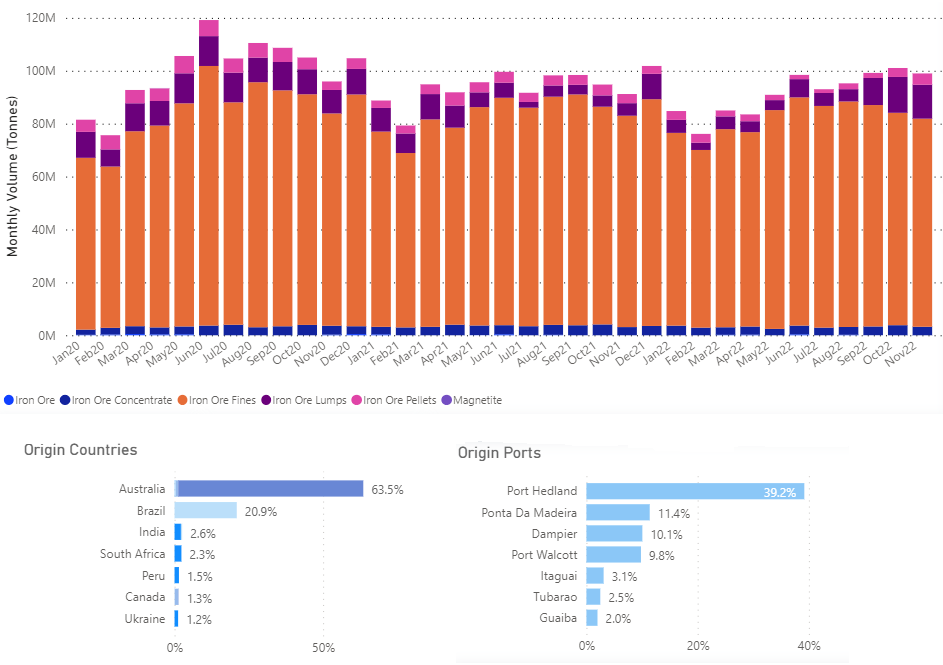
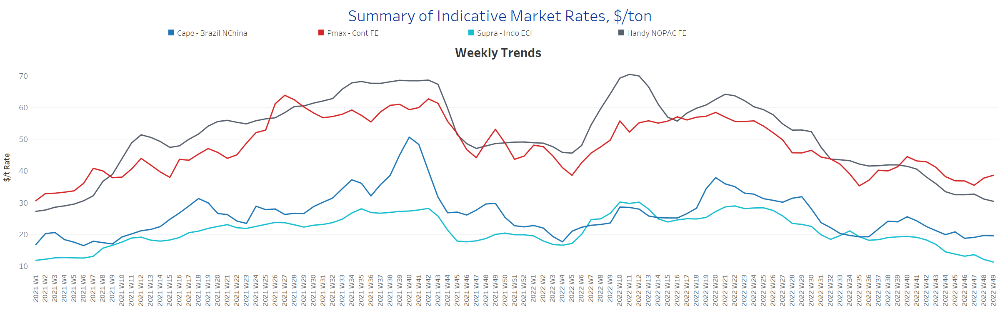
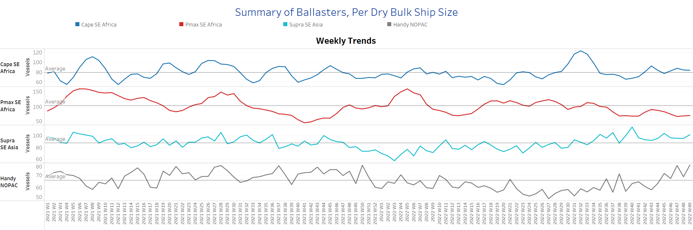
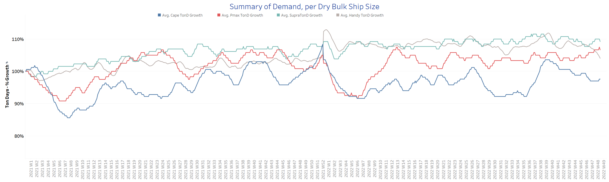
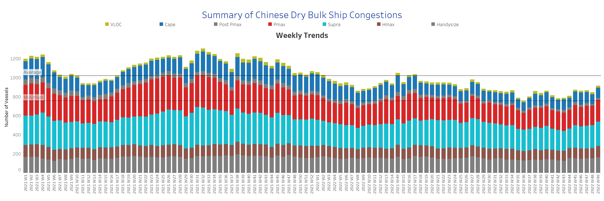

# Signal Dry Bulk Weekly Report

**Date:** December 08, 2022  
**Publisher:** Breakwave Advisors | **Category:** Market Insights  
**Original URL:** [https://www.breakwaveadvisors.com/insights/2022/12/8/signal-dry-bulk-weekly-report](https://www.breakwaveadvisors.com/insights/2022/12/8/signal-dry-bulk-weekly-report)  

---

The first week of December is fueling positive expectations for an upswing in freight rates in the major ship categories, while demand growth in the Panamax segment has been trending upward over the past three weeks. However, the increasing number of ships sailing with ballast may continue to put downward pressure on freight rates for the smaller Supramax and Handysize segments, where demand growth has yet to show clear signs of a near-term recovery.

In the iron market, imports to China supported the freight market from September, after declining in July and August (picture below), with more than 60% coming from Australia. Recent news of rising covid cases and Chinese policy actions have heightened concerns about the strength of Chinese iron ore demand for the year ending and the first quarter of 2023. However, we have seen an upturn in prices as the Chinese economy eventually eased curbs to stimulate its economy. Trading economics reported December iron ore cargoes with an iron ore content of 63.5% rose to $109.5 for delivery to Tianjin, the highest level since mid-August. Citi estimates iron ore prices could rise as high as $150 a tonne by June next year as China reopens.

## Chart of the Week Dry Bulk: Iron Ore Flows to China

> **Figure 1: Steady Strength of Chinese Iron Ore Imports, 64% Comes From Australia**  
> **Interactive Data & Source:** [Signal Ocean Platform](https://go.signalocean.com/e/983831/dry-dynamic-drybulkflows/2l97yj/290369316?h=osoExOwvAjtgX29Jl44is6mRlXpfPw4wKep3jgQaZaQ) | [Local Asset](file:///C:/Users/Dell/Github/Shipping/corpus/03-breakwave/insights/2022/assets/2022-12-08_signal-dry-bulk-weekly-report_img_unnamed-2022-12-08t135235347_29480762eb80.png)

Data Source: The Signal Ocean Platform, Iron Ore Flows from all destinations to China

## Section 1/ Freight -Market Rates ($/T) Firmer

‘The Big Picture’ - Capesize and Panamax Bulkers and Smaller Ship Sizes

> **Figure 2: Market Chart 2**  
> **Interactive Data & Source:** [Signal Ocean Platform](https://www.thesignalgroup.com/signal-ocean-platform) | [Local Asset](file:///C:/Users/Dell/Github/Shipping/corpus/03-breakwave/insights/2022/assets/2022-12-08_signal-dry-bulk-weekly-report_img_unnamed-2022-12-08t135645712_b4e18523040a.png)

The first week of December signalled a continued upswing in the large ship categories, while the slowing momentum in Handysize and Supramax is steepening from what it was in late November.

- **Capesize**vessel freight rates held steady at $19.6/ton, while the last peak was 4 weeks ago when rates were above $20/ton.

- **Panamax**vessel freight rates fromtheContinent to the Far East reached $38.6/tonne, nearly $4/tonne from the week 47 low.
- **Supramax**freight rates for the Indo-ECI route fell to $11/tonne, down nearly $2/tonne from the previous week, with a downward correction in the first week of December.

- **Handysize**freight rates for the NOPAC route to the Far East are now below $31/ton, and there are no signs of an upturn yet.

## Section 2/ Supply -Ballasters (# Vessels) Increasing

> **Figure 3: Supply Trend Lines for Key Load Areas**  
> **Interactive Data & Source:** [Signal Ocean Platform](https://www.thesignalgroup.com/signal-ocean-platform) | [Local Asset](file:///C:/Users/Dell/Github/Shipping/corpus/03-breakwave/insights/2022/assets/2022-12-08_signal-dry-bulk-weekly-report_img_unnamed-2022-12-08t135744583_16d4d74f1f6d.png)

There is an increasing trend in all vessel size categories except Capesize, while the number of ballast vessels in the Handysize and Supramax size categories is still above the annual average.

- **Capesize**SE Africa: The number of vessels is now 80, 8 less than the previous week and almost at the annual average.

- **Panamax**SE Africa: The number of vessels remains below the annual average, but with an increase to 71 vessels, 4 more than two weeks ago.
- **Supramax**SE Asia: The number of ships fluctuates between and above 95 in the last three weeks, almost 10 more than the annual average.

- **Handysize**NOPAC: The number of vessels signaled a sudden increase to 85, nearly 17 more than the previous week, defying previous estimates from late November for a possible decline in December.

## Section 3/ Demand -TonDays Decreasing

> **Figure 4: TonDays Decreasing**  
> **Interactive Data & Source:** [Signal Ocean Platform](https://www.thesignalgroup.com/signal-ocean-platform) | [Local Asset](file:///C:/Users/Dell/Github/Shipping/corpus/03-breakwave/insights/2022/assets/2022-12-08_signal-dry-bulk-weekly-report_img_unnamed-2022-12-08t135842332_e12e324ec8c4.png)

Demand growth in the Handysize segment continues to decline significantly, while we have seen a sustained upswing in the Panamax segment over the last three weeks.

- **Capesize**demand ton-days: The downward trend continues with a slight upturn in early December, although it remains to be seen how demand growth will develop in the final weeks of the year.
- **Panamax**demand ton-days: In the last three weeks, there is a continued upward trend, while there are no signs of slowing growth.

- **Supramax**demand ton-days: The downward trend seems to have reversed for early December. However, it remains to be seen if this will continue in the coming days as there are still signs of weakness.

- **Handysize**demand ton-days: The decline remains significant as in the late days of November, with a stronger downward correction since the end of week 46.

## Section 4/ Port Congestion -No of Vesselsincreasing

> **Figure 5: Dry Bulk Ships Congested at Chinese Ports**  
> **Interactive Data & Source:** [Signal Ocean Platform](https://www.thesignalgroup.com/signal-ocean-platform) | [Local Asset](file:///C:/Users/Dell/Github/Shipping/corpus/03-breakwave/insights/2022/assets/2022-12-08_signal-dry-bulk-weekly-report_img_unnamed-2022-12-08t135946259_87802c86720f.png)

In the first days of December, congestion is approaching the last peak of week 27, with a continuous increase in the Panamax, Supramax, and Handysize segments.

- **Capesize:**The number of vessels rose to 118, 2 more than the previous week.
- **Panamax:**The number of vessels accelerated to 247, 19 more than the previous week, with an upward trend of over 200 ships since the end of week 44.
- **Supramax:**The number of congested vessels rose to 267, 12 more than the previous week, surpassing the last peak of around 250 in week 40.
- **Handysize**: The number of congested vessels was 180, 13 more than the previous week and 30% above the low of week 43.

Data Source:[Signal Ocean Platform](https://www.thesignalgroup.com/signal-ocean-platform)
