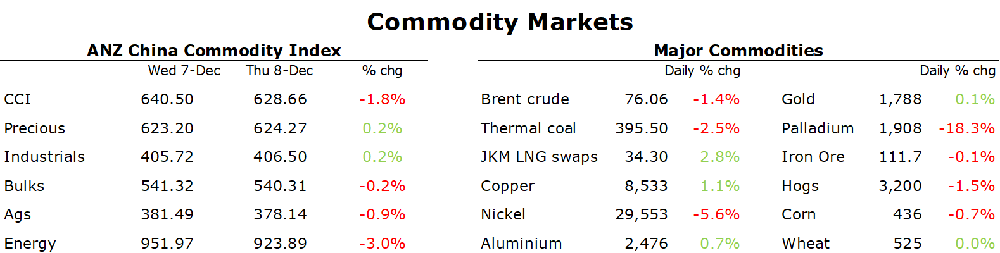

# China reopening boosts sentiment in industrial metal markets

**Date:** December 09, 2022  
**Publisher:** Breakwave Advisors | **Category:** Market Insights  
**Original URL:** [https://www.breakwaveadvisors.com/insights/2022/12/9/china-reopening-boosts-sentiment-in-industrial-metal-markets](https://www.breakwaveadvisors.com/insights/2022/12/9/china-reopening-boosts-sentiment-in-industrial-metal-markets)  

---

*By*[*Daniel Hynes*](https://www.linkedin.com/in/dahynes/)

A weaker USD and optimism over a China reopening supported sentiment across commodity markets. However, falls in gas and coal markets dragged the broader complex into the red.

> **Figure 1: Crude Oiljumped High Early in the Session After Reports North**  
> *Crude oiljumped high early in the session after reports North America’s keystone pipeline, which carries more than 600kb/d from Canada into the US, was halted due to a leak, with the operator declaringforce majeure. No timeframe was given for its restart. However, a lack of liquidity saw the rally peter out. The focus returned to the weakening economic backdrop, with central bank tightening creating plenty of uncertainty. Newly implemented European sanctions on Russian oil have had little impact on the oil market so far. A growing number of oil tankers have been halted near the Turkish Strait after an insurance wrangle prevented some from passing through the country’s waters. Russia also reiterated that it sees the price cap having limited impact on production. First Deputy Energy Minister Pavel Sorokin said most markets are available for our goods at adequate market-based principles. Meanwhile, the market is watching for signs the US will start refilling its strategic reserve. Earlier this year it said it would start buying when WTI crude is at or below USD67–72/bbl. However, Amos Hochstein, the US State Department’s senior energy security advisor, said that the Whitehouse is weighing up the impact of China’s reopening and the price cap on Russian oil, before moving to replenish the depleted reserves.*  
> [Local Asset](file:///C:/Users/Dell/Github/Shipping/corpus/03-breakwave/insights/2022/assets/2022-12-09_china-reopening-boosts-sentiment-in-industrial-metal-markets_img_1670533682874_965704bf11ae.png)

**.Copper**led the**base metals**higher as optimism over China’s economic outlook grows. The relaxation of COVID-19 rules has raised hopes of improving consumer demand. Earlier this week Beijing allowed home quarantine for mild cases, while people no longer have to show proof of a negative test before entering most public places. However, it’s been the package of support for the property sector which has really boosted sentiment. Some 17 property developers have announced financing plans since the government ended a fundraising ban, with 13 expected to get a combined CNY90bn. The money will ease a liquidity crunch and help companies finish homes. Signs of improving demand emerged this week after China’s commodity imports[**were stronger than expected in November**](../pdfs/2022-12-09_china-reopening-boosts-sentiment-in-industrial-metal-markets_china-commodity-trade-data-november-_1bb3ed9ffda4.pdf).

**Iron ore**also gained amid the positive developments in the property sector. This was aided by supply side issues. Vale doesn’t expect to get production back to the level it was at prior to the 2019 dam disaster. This year’s output will be around 310mt. It also lowered its 2023 guidance from 325mt to the same as this year.

**European gas**gave up some recent gains as strong imports of LNG offset concerns of stronger demand amid a cold snap across the continent. Flows from LNG terminals in northwest Europe reached all-time highs in December as cold weather pushed prices higher. Tankers held at sea for weeks in the past two months have also been discharging the fuel in increasing amounts, boosting supply. Nevertheless, the cold weather has boosted demand. Germany’s network regulator warned that homes and companies need to save more gas to avoid shortages. Traders are also closely watching activity in China, which is loosening COVID-19 restrictions, for any signs of stronger demand. This has boosted sentiment in the**North Asian LNG**market. Colder weather in parts of the region have also stoked hopes of further buying by Japan and South Korea.

**Gold**edged higher as the USD weakened. However, traders remained cautious ahead of key inflation data next week.

Data source:[Commodities Wrap](https://www.linkedin.com/newsletters/commodities-wrap-6692196755876012032/?fbclid=IwAR3kiXJqZdxmp9ZcRwBNI7FsBySI-XSC0pfPur1qzjt7OZp7PTE59Tsl1QI)
