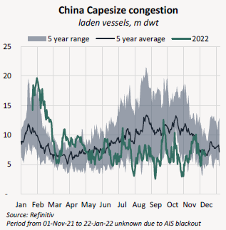
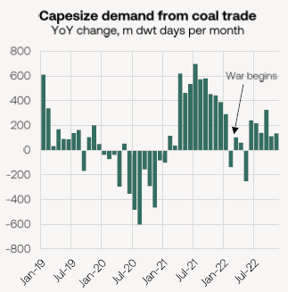
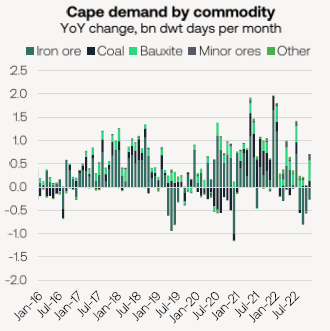
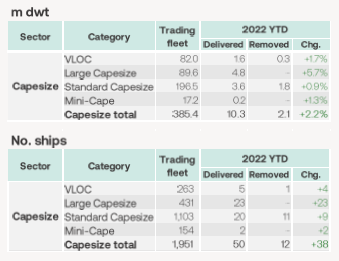

# Braemar Weekly Dry Market Report

**Date:** December 10, 2022  
**Publisher:** Breakwave Advisors | **Category:** Market Insights  
**Original URL:** [https://www.breakwaveadvisors.com/insights/2022/12/9/braemar-weekly-dry-market-report](https://www.breakwaveadvisors.com/insights/2022/12/9/braemar-weekly-dry-market-report)  

---

*By*[*Mark Nugent*](https://www.linkedin.com/in/mark-nugent-3724a3192/)

## The Big Picture: 2022 Review Pt. 1

### The Capes

We’ve seen a war, soaring inflation and an unpredictable China. But what has been a considerably volatile year for the Capesize market, is soon coming to an end.

## From the Beginning

Following a year in which the Baltic Capesize Index reached its highest level since 2009, 2022 has unfortunately not kept the party going. It was a lacklustre start to the year as the Chinese holidays approached and the historic levels of Chinese congestion embarked on a sharp decline, falling from 19.7m dwt to just 5.1m in little over a month.

> **Figure 1: Source: Refinitiv Period From 01-Nov-21 to 22-Jan-22 Unknown Due**  
> *Source: Refinitiv Period from 01-Nov-21 to 22-Jan-22 unknown due to AIS blackout*  
> [Local Asset](file:///C:/Users/Dell/Github/Shipping/corpus/03-breakwave/insights/2022/assets/2022-12-10_braemar-weekly-dry-market-report_img_image028929_99e5f3a1116f.png)

This coupled with the removal of the 14-day minimum ballast requirement in West Australia later in the year meant the Capesize market has been operating much more efficiently, weighing on freight rates. Though we got a brief spike in Chinese queues in September due to Typhoon Moifa this wasn’t close to the peaks of the start of the year. The C5 roundtrip has now shed approximately 7 days compared to what it was a year ago, despite the fleet operating at considerably slower speeds.

As the congestion in China eased, the world was met with the alarming news of a war starting in Ukraine. The EU immediately started implementing waves of economic and trade sanctions on Russia, which saw global seaborne coal flows (among others) drastically change. With the full EU import ban on Russian coal not taking effect until mid-August, most European energy producers were quick to stockpile Russian coal as gas prices in Europe soared. Though it was when power stations started looking elsewhere for coal that the Capes saw some benefits.

> **Figure 2: Market Chart 2**  
> [Local Asset](file:///C:/Users/Dell/Github/Shipping/corpus/03-breakwave/insights/2022/assets/2022-12-10_braemar-weekly-dry-market-report_img_image128929_d76468768e3e.png)

European power stations started importing coal from the US, Colombia, South Africa and Australia with the long voyages suiting the Capes. As a result, Capesize demand from European coal imports increased by 79.4% YoY across March-November.

With the war now in full flow and European coal demand soaring, Q2 was trending towards a return to the good times as locked down Australia and a rainy Brazil re-emerged following a disappointing Q1. With the issues of Q1 in the rear view mirror, Capesize iron ore shipments out of Australia and Brazil increased by 8.2% and 18.9% respectively in Q2. Now gaining momentum, the BCI increased by 19.4% in April closing at $18,460/day. In May, India surfaced as the X-factor that would drive the market to its peak of the year in May. An extreme heatwave saw the country’s coal imports from Indonesia hit their highest ever level, with 8.9m tonnes lifted on this trade by the Capes in May. As Indonesia started sweeping up Capes sailing from the Far East, resulting in a shrunken ballaster list back to the West. By May 23, the BCI reached its peak at $38,169/day, more than doubling MTD. As the sudden spike in demand dwindled, so did Capesize returns, reversing back $21,516/day by the end of the month.

> **Figure 3: Market Chart 3**  
> [Local Asset](file:///C:/Users/Dell/Github/Shipping/corpus/03-breakwave/insights/2022/assets/2022-12-10_braemar-weekly-dry-market-report_img_image228929_34cac5d79c2b.png)

Hitting new quarterly highs in both Q1 and Q2, West African bauxite has continued its rise in importance to the Cape market. Bauxite volumes surged 19.8% YoY in 1H22 to 42m tonnes. However, the inevitable weather-ridden Q3 took its toll and thus the West Africa option for ballasters was less fruitful and the Brazilian miners had more vessels to choose from. This was particularly impactful on Capesize returns as the VLOCs started grabbing a greater share of Brazilian iron ore shipments, reaching their highest daily volume of the year by October.

### The Macro

Though prices were already on the rise due to a widespread supply-demand imbalance in several dry bulk commodity markets in 2021, the war exacerbated global inflationary pressure. To combat rising prices, central banks have turned hawkish and global economic activity has started to slow. This naturally had affects on steel-intensive industries such as property and infrastructure which was then reflected in declining steel demand and thus production across all global producers, apart from India. So far this year, global steel production has declined 3.7% to 1.6bn tonnes according to the World Steel Association. October data did, however, provide some encouragement with most major producers showing a MoM improvement.

China on the other hand, has not had the burden of mounting inflation but has been in the midst of a year-long battle against Covid-19. The country’s zero-Covid policy has waned on its economy and therefore commodity demand, while the it’s property sector has yet to show any meaningful signs of a recovery. The developments of the past couple of weeks have been encouraging as restrictions across several major cities have been relaxed. China has announced a range of stimulus policies to support its property sector but the results have yet to show. As we discussed in a Big Picture in November, there is inherently a response lag with these policies and thus remain confident the results will start to show next year.

The macroeconomic environment and volatile freight returns this year has driven a cautious approach to newbuild contracting so far this year, as well as the looming environmental regulation set to take effect from the turn of the year. Newbuild prices have remained firm, however, despite the sharp downturn in the market as energy costs and steel plate prices, particularly in Japan, have yet to subside. As a result, just 30 Capes have been ordered so far this year. Slots are said to be almost full up for 2025, and some yards which can build both bulkers and tankers are now unsurprisingly seeing more interest for the latter, which could further extend delivery times. Cape deliveries have also been few and far between, set to match the 10-year lows of 2018 at 51 vessels. Meanwhile, just 12 vessels have been removed resulting in net Capesize fleet growth of 2.2%.

> **Figure 4: Market Chart 4**  
> [Local Asset](file:///C:/Users/Dell/Github/Shipping/corpus/03-breakwave/insights/2022/assets/2022-12-10_braemar-weekly-dry-market-report_img_image328829_803d6371b5c1.png)

Looking to next year, there remains several uncertainties with regards to new regulation, a Chinese recovery and a worsening economy in the West. And while the growth outlook for iron ore and coal is limited, we still see the potential for better days ahead.
