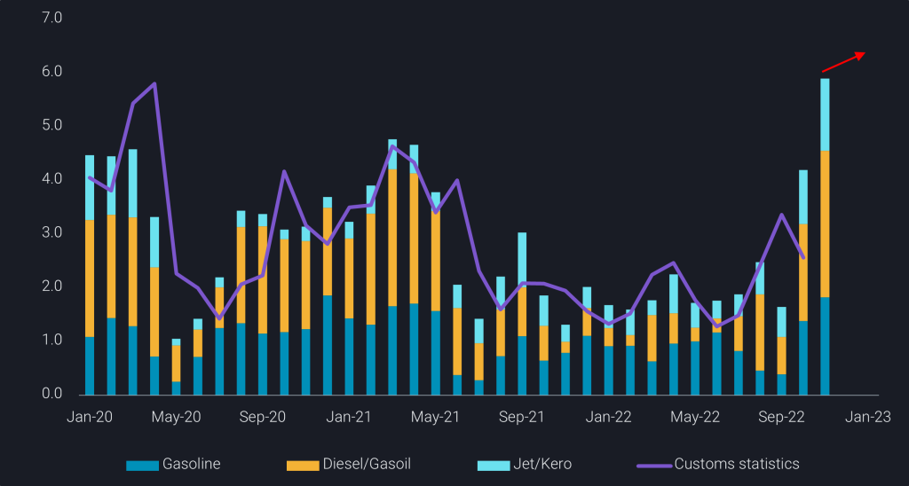
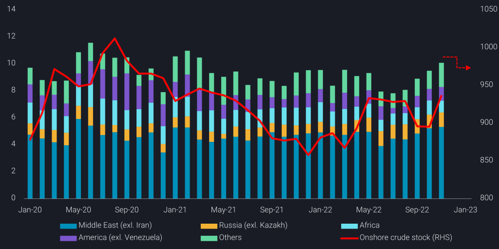

# China’s crude imports to slow down before a spring rebound

**Date:** December 13, 2022  
**Publisher:** Breakwave Advisors | **Category:** Market Insights  
**Original URL:** [https://www.breakwaveadvisors.com/insights/2022/12/13/chinas-crude-imports-to-slow-down-before-a-spring-rebound](https://www.breakwaveadvisors.com/insights/2022/12/13/chinas-crude-imports-to-slow-down-before-a-spring-rebound)  

---

*By*[*Emma Li*](https://www.linkedin.com/in/emma-li-73003443/)

After nine months of lacklustre performance, Chinese refiners have stepped on the accelerator and ramped up refining runs in Q4, incentivised by additional import and export quotas. As China works towards pivoting away from its stringent Covid policy, a recovery in domestic demand would support its crude imports, but anticipated cuts in export quotas next year back to 1H 2022 levels look likely to stall the momentum.

## Quota-Driven Crude Imports

China’s seaborne crude imports in November have breached the 10mbd mark, rising for four consecutive months and exhibiting a second straight month of year-on-year growth. The key impetus behind this came from the additional 13-14mt of product export quotas issued by the government to stimulate China’s ailing economy, a rare move that signaled a reversal in its oil export policy.

In response, Chinese refiners have boosted refining run rates and maximised diesel yields since September amidst seasonally strong domestic diesel demand as well as robust export margins. China’s November clean fuel exports sit at near 5.8mt, the highest since April 2020, while December exports are expected to breach 6mt, according to Vortexa’s data and refiners’ export plan respectively. This suggests that refiners need not only to maintain strong production in December but also continue to export at current rates till at least end of January to make use of the additional quotas.

> **Figure 1: China’s Clean Fuel Exports by Product (Mt)vs**  
> *China’s clean fuel exports by product (mt)vs. customs statistics*  
> **Interactive Data & Source:** [Analytics Vortexa](https://analytics.vortexa.com/?dateRange=2020-01-01T00%3A00%3A00.000Z__2022-11-30T23%3A59%3A59.999Z&filtersEnabled=%5B%22p%22%2C%22o%22%2C%22d%22%2C%22d_r%22%2C%22v%22%2C%22intra%22%2C%22sts_o%22%2C%22c_o%22%2C%22v_o%22%2C%22c%22%2C%22w%22%5D&from=%5B%22b5fafce6e20de2dc307fb7e0b89978ee91a49a7b6ec6f5461daf2633f3c56674%22%5D&metric=t&page=Flows&products=%5B%22d72edbab2b5e2e249d8c216909945922a02eb017dd200f90876fee6fa180c743%22%2C%22c76d43ed46524d628a16be1b63019719631a5c2dcbf54af5a94e90ebe2c37a4f%22%2C%22618411eeb2c3bb6fb5bee43f894aecc4be7cc8acc06d427c78aacd12abb2f41f%22%2C%22deda35eb9ca56b54e74f0ff370423f9a8c61cf6a3796fcb18eaeeb32a8c290bb%22%5D&tabId=0a0fa6d3-b422-46d0-b49c-e3784637df5f&timeSeriesHiddenSeries=%5B%22d7c97202bcb916580fb554245b1ed66965c0bb2ac71b55f34883d91bfdadcdda%22%2C%22seasonal_comparison_24%22%5D&timeSeriesProperty=product_group_product) | [Local Asset](file:///C:/Users/Dell/Github/Shipping/corpus/03-breakwave/insights/2022/assets/2022-12-13_chinas-crude-imports-to-slow-down-before-a-spring-rebound_img_picture1-4-1024x548_35d3f3817771.png)

Besides giving the state-run refiners the green light to boost clean fuel exports, Beijing also issued the first batch of 2023 crude import quotas to the independent refiners in early October, nearly three months earlier than in previous years, to encourage the refiners to boost production. This has resulted in a multi-year high of Iranian crude imports in November, as the independent sector has clung to these discounted grades this year, amidst depressing refining margins. The rise in crude inflows has also helped to rebuild[Shandong commercial crude inventories](https://analytics.vortexa.com/?dateRange=2020-01-01T00%3A00%3A00.000Z__2022-12-02T23%3A59%3A59.999Z&hiddenSeries=%5B%22a63890260e29d859390fd1a23c690181afd4bd152943a04c00cd6a5ecf3f7d1e%22%2C%22781cacc7033f877caa4b4106d096b74afe006a96391bf5a56a4f55b849359a42%22%2C%22b5fafce6e20de2dc307fb7e0b89978ee91a49a7b6ec6f5461daf2633f3c56674%22%5D&onshoreInventoriesLocations=%5B%22934c47f36c16a58d68ef5e007e62a23f5f036ee3f3d1f5f85a48c572b90ad8b2%22%2C%220fddbfd0d90bad306a92fcb483a19276f101a5f7f0783363f9f2a9d40c10558d%22%5D&page=OnShoreCrudeInventories&selectedRegion=%5B%220fddbfd0d90bad306a92fcb483a19276f101a5f7f0783363f9f2a9d40c10558d%22%5D&splitSelected=storage_type&tabId=0cd16ff6-30e9-4ff7-a5c6-915250d00cc2&tankCrude=%5B%22confirmed%22%2C%22probable%22%5D)last month, indicating a rather limited increase in crude throughput among Shandong independent refiners.

On the wider country level, implied crude consumption rates in October and November – calculated from Vortexa’s net crude imports, crude stock changes and NBS’ crude oil production – have also stagnated, as domestic and export margins soften. With a prospective cut in import and export quotas back to 1H 2022 levels on the horizon, refiners may need to cut back on their throughput in January, putting an end to China’s robust crude import momentum.

> **Figure 2: China Crude Imports by Origin Region (Mbd)vs**  
> *China crude imports by origin region (mbd)vs.Onshore crude stock*  
> **Interactive Data & Source:** [Analytics Vortexa](https://analytics.vortexa.com/?dateRange=2020-01-01T00%3A00%3A00.000Z__2022-12-05T23%3A59%3A59.999Z&filtersEnabled=%5B%22p%22%2C%22o%22%2C%22d%22%2C%22d_r%22%2C%22intra%22%2C%22sts_o%22%2C%22c_o%22%2C%22v%22%5D&metric=bpd&movementEvent=unloading_start&page=Flows&products=%5B%2254af755a090118dcf9b0724c9a4e9f14745c26165385ffa7f1445bc768f06f11%22%5D&tabId=79e451b4-c797-47b5-940c-9821caee6759&timeSeriesHiddenSeries=%5B%22seasonal_comparison_24%22%2C%22seasonal_comparison_12%22%5D&timeSeriesProperty=origin_region&to=%5B%22b5fafce6e20de2dc307fb7e0b89978ee91a49a7b6ec6f5461daf2633f3c56674%22%5D) | [Local Asset](file:///C:/Users/Dell/Github/Shipping/corpus/03-breakwave/insights/2022/assets/2022-12-13_chinas-crude-imports-to-slow-down-before-a-spring-rebound_img_picture2-2-1024x511_8fe028fba160.png)

## A Turning Point for Domestic Fuel Demand?

While China has announced that it will relax Covid restrictions in early November, cities only started easing curbs in early December, and steps to relief restrictions have varied across the country. As the dynamic zero-covid policy is still in place, although more targeted and less onerous now, a significant rise in domestic fuel consumption may not be imminent.

Cooling VLCC freight rates on all major China-bound routes, with a 40% decline in[MEG-to-China (TD3C) route](https://analytics.vortexa.com/?page=FreightPricing&preset=TD3C&ratesBreakdownProperty=cost&tabId=55b2af8a-973e-464e-a9bd-83466720fa8c)over the past two weeks, have pointed to a softening of crude purchasing activities.

Many experts expect China to only accelerate the lifting of restrictions after achieving a higher vaccination rate, especially among its vast elderly population. The process will take a few months even if a new round of mass vaccination starts now and people consent to the requirement.

This means that the long-awaited recovery in China’s oil demand is unlikely to materialise before March, when refiners typically start their seasonal turnarounds. Further downside risks to domestic refining margins have been partially offset by the delayed start-up of Shenghong’s 320kbd greenfield refining complex in east China and PetroChina’s 400kbd Guangdong refining/petrochemical complex in south China, with the latter only expected to commence on-spec production in Q1 next year.

## Future of Russian Crude Exports Largely Dependent on China

Chinese crude imports from the Atlantic Basin and the Middle East will also be a function of its imports from Russia. Expectations range from a slowdown in China’s Russian crude buying to a “China takes it all” approach. For now we can see that there are far less Urals on the way to China than over recent months, and the logistical side of future Russia-China flows is yet to be solved. Surely individual players are planning for imports outside the price cap, while others are at least demanding deeper discounts than so far.

Ultimately the decision on this issue will fall on the government level and China may well be the party that defines whether the price cap mechanism is (globally) implemented or not. There are mixed signals as far as we can tell. China may not be in a hurry, as its strong position can be exploited either way.

Data Source:[Vortexa](https://www.vortexa.com//oil-gas-data-traders-analysts-data-scientists?gclid=Cj0KCQjw8_qRBhCXARIsAE2AtRZKOvMnbilZ_6_91d7huSFFy71pWLrnPwGwOHVzXsmsG-1a1mZnQw8aAt89EALw_wcB&hsa_acc=1782073842&hsa_ad=548425387665&hsa_cam=14746637662&hsa_grp=125038601902&hsa_kw=&hsa_mt=&hsa_net=adwords&hsa_src=g&hsa_tgt=dsa-1431852288425&hsa_ver=3&utm_campaign=%5BCD%5D%20-%20DSA%20-%20EMEA&utm_medium=cpc&utm_medium=ppc&utm_source=google&utm_source=adwords&utm_term=)
