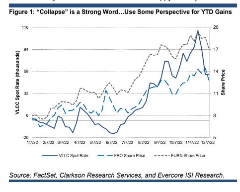

# Chappell's Shipping Show: As We Wrap Up 2022, It's Important to Keep Perspective

**Date:** December 14, 2022  
**Publisher:** Breakwave Advisors | **Category:** Market Insights  
**Original URL:** [https://www.breakwaveadvisors.com/insights/2022/12/14/chappells-shipping-show-as-we-wrap-up-2022-its-important-to-keep-perspective](https://www.breakwaveadvisors.com/insights/2022/12/14/chappells-shipping-show-as-we-wrap-up-2022-its-important-to-keep-perspective)  

---

*By*[*Jonathan Chappell*](https://www.linkedin.com/search/results/all/?heroEntityKey=urn%3Ali%3Afsd_profile%3AACoAAAAN4-YB90xiG3gFP26pnw5b9SX6vhvSpGw&keywords=jonathan%20chappell&origin=RICH_QUERY_SUGGESTION&position=0&searchId=3facb8d2-c59d-4862-9ac4-42bb398f1fb5&sid=%2CC%3A)*and*[*Sean Morgan*](https://www.linkedin.com/in/sean-morgan-cfa-52924420/)

In our last report of 2022, we address the elephant in the room following a tremendous year for tanker rates and equities (the 8 under our coverage are up 77-339%). With U.S. Strategic Petroleum Reserve releases slowing, OPEC+ production cuts beginning, the global economy teetering, and the sanctions and price cap on Russian crude implemented as of last Monday, VLCC spot rates have come off the boil of late (see Figure 1).

The recent, and rapid, decline has again spurred talk of “the cycle is already over” or “the impact of the global trade map shift is completed,” and even though rates in most other segments have held near multi-year highs (especially for product tankers), once fear (“it’s over”) and greed (“time to take profits”) take over, the narrative is tough to fight. However, the decline requires perspective. First, VLCC rates are indeed down 48.5% from the peak in early November, but rates are still up 18x from the start of 2022 and were running negative for many weeks in 2022. Second, only VLCCs have really hooked down to any meaningful extent, for all the reasons we laid out above. Third, taking Europe’s challenges with Russian fossil fuels out of the picture for a moment, the orderbook of new tonnage is still at 30-year lows, inventories are still below 5-year averages, and even amid widespread recession fears, consensus forecasts call for oil demand growth over the coming year(s). Finally, we CANNOT remove the redrawing of the global oil/product trade map from the equation because of its vast, and long-lasting, impact on ton-mile demand and fleet utilization.

As it relates to the stocks, the group is down 5-17% from year-to-date highs (with product tanker equities holding in substantially better), and who are we to admonish locking in gains in an otherwise difficult year for investing. However, blips, pullbacks and volatility will always occur, and abandoning a thesis because of short-term sentiment shifts is an easy path to selling too early, especially as EPS and dividends have yet to really reflect this budding cyclical uplift. Risk-adjust as you see fit, but don’t confuse volatility with “the end.” The only thing we see ending is this calendar year...and thank God for that. Happy Holidays!

> **Figure 1: 1 (2)**  
> [Local Asset](file:///C:/Users/Dell/Github/Shipping/corpus/03-breakwave/insights/2022/assets/2022-12-14_chappells-shipping-show-as-we-wrap-up-2022-its-important-to-keep-perspective_img_128229_79f6fb5c78a2.png)
