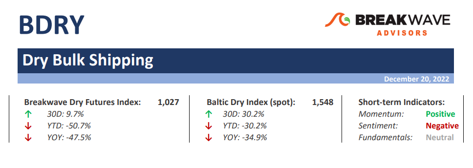
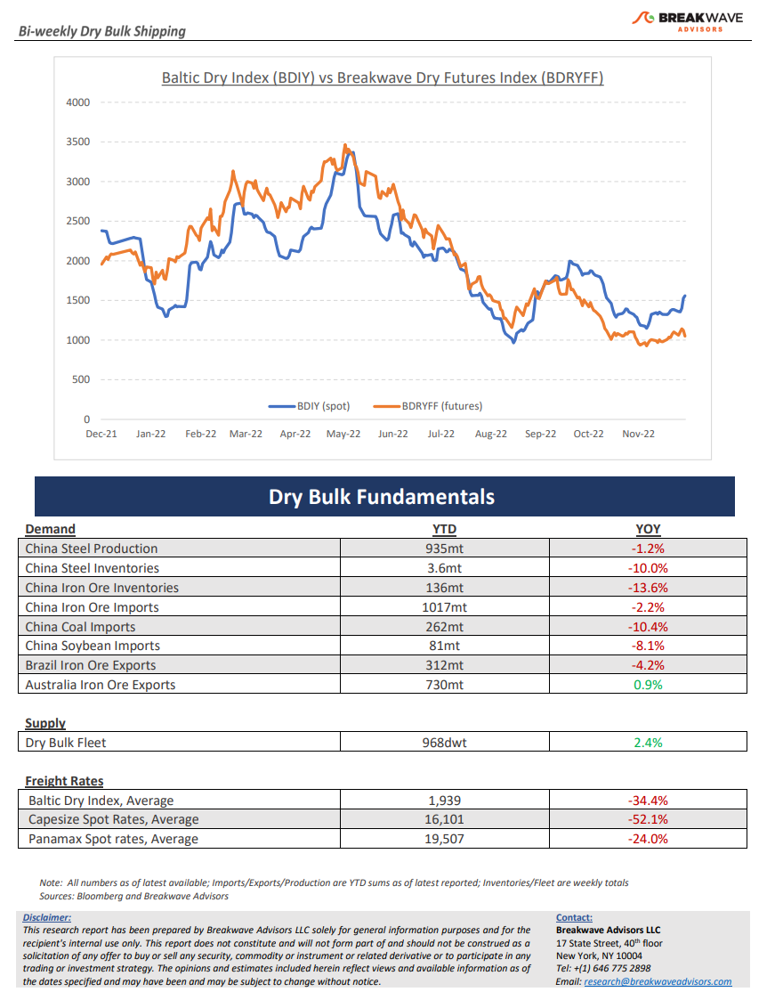

# Breakwave Bi-Weekly Dry Bulk Report - December 20, 2022

**Date:** December 20, 2022  
**Publisher:** Breakwave Advisors | **Category:** Market Insights  
**Original URL:** [https://www.breakwaveadvisors.com/insights/2022/12/20/breakwave-bi-weekly-dry-bulk-report-december-20-2022](https://www.breakwaveadvisors.com/insights/2022/12/20/breakwave-bi-weekly-dry-bulk-report-december-20-2022)  

---

> **Figure 1: Drytop**  
> [Local Asset](file:///C:/Users/Dell/Github/Shipping/corpus/03-breakwave/insights/2022/assets/2022-12-20_breakwave-bi-weekly-dry-bulk-report-december-20-2022_img_drytop_34c7bd35c035.png)

**Santa rally for spot, doom and gloom for futures**– All it took was some (anticipated?) delays and inclement weather in the North Atlantic for spot Capesize rates to recover, albeit at a much later stage than historically has been the case. December, which has been the weakest link of the fourth quarter for many months now, seems to be heading for a relatively strong close with both the monthly average and the spot level at multi-month highs. Yet, the bearishness of market participants remain amble, with the forward curve lingering at particularly depressing levels despite the spot market revival. In the freight futures market, where the inability to effectively arbitrage spot versus futures exists, discounts don’t matter…until pricing forces it. The next several months’ futures are trading firmly in the single digit range and any attempt to price a more aggressive path for the spot market is forcefully destroyed by the hedging books of commodity traders. With just a handful of days left in the year and with Capesize futures prices for January some 9,000 below spot, the outlook for Capesize owners seems already determined with little doubt left. Or isn’t it? As we have said numerous times, short term fluctuations and seasonality calls tend to take a life of their own as the surprise factor comes into play. We also have no strong opinion about the near-term direction of spot rates, but we wonder what would happen if traders woke up with a strong hangover on New Year’s Day and are faced with a high-double digit Index and the usual strong first week of the year for fixing activity looming? We hope the NYE party was worth the headache... Happy New Year and a prosperous, healthy 2023!

**China’s Covid pivot is here, but the real work is still ahead**– Following a series of announcements in the past two weeks, it now seems clear that China is moving forward with significant relaxations in its policies when it comes to Covid. As a result, sentiment across investments and sectors that are levered to China have also seen a revival, albeit a brief one. Now, more concrete steps are needed to bring back some type of demand that only real economic activity can create. Is such a turnaround about to take place? In our view, all eyes should be on the upcoming real estate statistic releases that will provide some clues on whether activity is picking up but also what type the magnitude such a recovery might be. Land sales, new developments and loan growth remain key elements in identifying a change in trends. The Chinese New Year is early this year (January 22nd), and thus we do not anticipate much ahead of the holidays. However, following the holiday break, we expect some increased raw material restocking and higher demand for steel to drive stronger iron ore imports and thus increased shipping demand.

**Dry bulk focus shifts back to fundamentals**– Following a period of high uncertainty and significant disruptions across the commodity spectrum, the gradual normalization of trade is shifting the market’s attention back to the traditional demand and supply dynamics that have shaped dry bulk profitability for decades. As effective fleet supply growth for the next few years looks marginal, demand will be the main determinant of spot freight rates with China returning back to the driver’s seat as the dominant force of bulk imports.

> **Figure 2: Drybottom**  
> [Local Asset](file:///C:/Users/Dell/Github/Shipping/corpus/03-breakwave/insights/2022/assets/2022-12-20_breakwave-bi-weekly-dry-bulk-report-december-20-2022_img_drybottom_caf2182591df.png)
