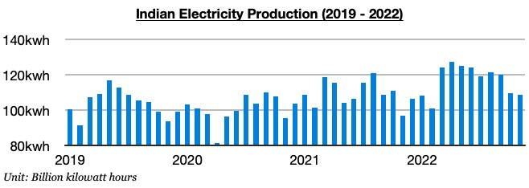
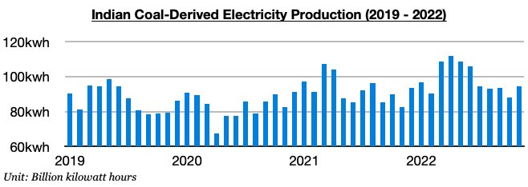
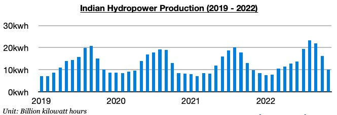

# Strong Growth In India's Electricity Output

**Date:** December 20, 2022  
**Publisher:** Breakwave Advisors | **Category:** Market Insights  
**Original URL:** [https://www.breakwaveadvisors.com/insights/2022/12/20/strong-growth-in-indias-electricity-output](https://www.breakwaveadvisors.com/insights/2022/12/20/strong-growth-in-indias-electricity-output)  

---

*By*[*Jeffrey Landsberg*](https://www.linkedin.com/in/jeffrey-landsberg-70ab957/)

As we discussed in our most recent Weekly Dry Bulk Report, India produced approximately 108.5 billion kilowatt hours of electricity last month. This is down month-on-month by 1.1 billion kilowatt hours (-1%) but is up year-on-year by 11.8 billion kilowatt hours (12%). Overall, India's electricity production has now increased on a year-on-year basis during eight of the last nine months. The 12% year-on-year growth seen last month has marked the largest year-on-year growth seen since June.

> **Figure 1: Chart 1 (67)**  
> [Local Asset](file:///C:/Users/Dell/Github/Shipping/corpus/03-breakwave/insights/2022/assets/2022-12-20_strong-growth-in-indias-electricity-output_img_chart1286729_6663a6840044.jpg)

India’s coal-derived electricity generation totaled approximately 94.4 billion kilowatt hours last month. This has marked a month-on-month increase of 6.3 billion kilowatt hours (7%) and is up year-on-year by 12 billion kilowatt hours (15%). Coal derived-electricity generation has also now increased on a year-on-year basis during eight of the last nine months, with last month’s growth also marking the largest seen since June.

> **Figure 2: Chart 2 (58)**  
> [Local Asset](file:///C:/Users/Dell/Github/Shipping/corpus/03-breakwave/insights/2022/assets/2022-12-20_strong-growth-in-indias-electricity-output_img_chart2285829_bbd14bd06425.jpg)

India’s hydropower output totaled approximately 10.1 billion kilowatt hours last month. This has marked a month-on-month decline of 6.2 billion kilowatt hours (-38%) but is up year-on-year by 300 million kilowatt hours (3%). It is normal for hydropower output to continue to fall during this time of year. Output, though, has now grown on a year-on-year basis during eleven of the last thirteen months.

> **Figure 3: Chart 3 (44)**  
> [Local Asset](file:///C:/Users/Dell/Github/Shipping/corpus/03-breakwave/insights/2022/assets/2022-12-20_strong-growth-in-indias-electricity-output_img_chart3284429_c14450c941f6.jpg)
