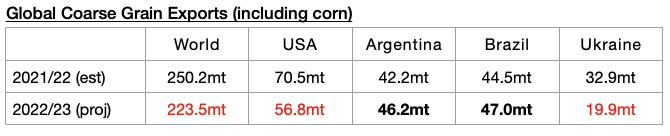
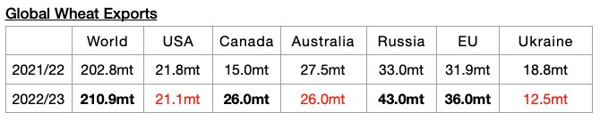
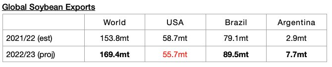
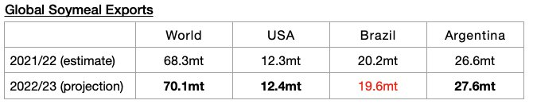

# Global Grain Trade Contraction

**Date:** December 23, 2022  
**Publisher:** Breakwave Advisors | **Category:** Market Insights  
**Original URL:** [https://www.breakwaveadvisors.com/insights/2022/12/23/global-grain-trade-contraction](https://www.breakwaveadvisors.com/insights/2022/12/23/global-grain-trade-contraction)  

---

*By*[*Jeffrey Landsberg*](https://www.linkedin.com/in/jeffrey-landsberg-70ab957/)

Global grain trade has been a problem for the dry bulk market this year as it has been in a contraction. The United States Department of Agriculture (USDA) has released their latest grain export forecast for the current 2022/23 season and continues to predict a global contraction as 488.1 million tons of exports are expected. This is 1.5 million more than was forecast a month ago but would mark a year-on-year decline of 21.9 million tons (-4%). Global soybean exports (soybeans are not technically classified as a grain) are only expected to increase year-on-year by 15.1 million tons (*discussed in more detail below*).

The USDA is now forecasting that global coarse grain exports in 2022/23 will total 225.1 million tons, which is 1.6 million tons (-1%) less than was forecast a month ago and would mark a year-on-year decline of 26.7 million tons (-11%).

> **Figure 1: Chart 1 (68)**  
> [Local Asset](file:///C:/Users/Dell/Github/Shipping/corpus/03-breakwave/insights/2022/assets/2022-12-23_global-grain-trade-contraction_img_chart1286829_124e685df9a1.jpg)

Global wheat exports are expected to total 210.9 million tons. This is 2.2 million tons (1%) more than was forecast a month ago and would mark a year-on-year increase of 8.1 million tons (4%).

> **Figure 2: Chart 2 (59)**  
> [Local Asset](file:///C:/Users/Dell/Github/Shipping/corpus/03-breakwave/insights/2022/assets/2022-12-23_global-grain-trade-contraction_img_chart2285929_8ac05d44998d.jpg)

Global soybean exports are expected to total 169.1 million tons. This is 300,000 tons more than was forecast a month ago and would mark a year-on-year increase of 15.6 million tons (10%).

> **Figure 3: Chart 3 (45)**  
> [Local Asset](file:///C:/Users/Dell/Github/Shipping/corpus/03-breakwave/insights/2022/assets/2022-12-23_global-grain-trade-contraction_img_chart3284529_5fb38bcb5641.jpg)

Global soymeal exports are expected to total 70.1million tons. This is 100,000 tons more than was forecast a month ago and would mark a year-on-year increase of 1.8 million tons (3%).

> **Figure 4: Chart 4 (20)**  
> [Local Asset](file:///C:/Users/Dell/Github/Shipping/corpus/03-breakwave/insights/2022/assets/2022-12-23_global-grain-trade-contraction_img_chart4282029_3b40922b1ec7.jpg)
