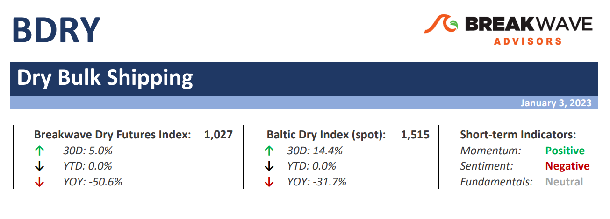
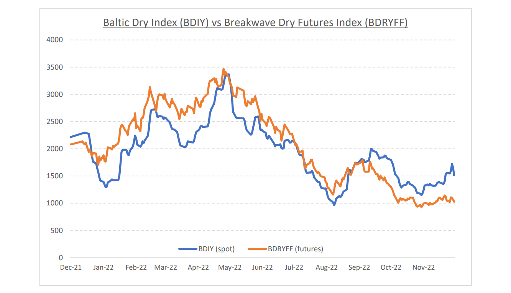
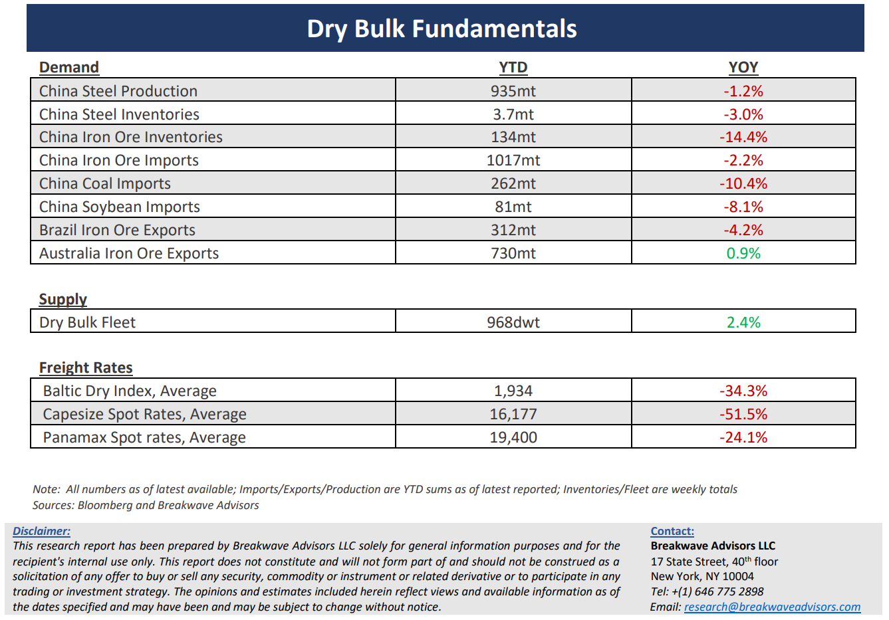

# Breakwave Bi-Weekly Dry Bulk Report - January 3, 2023

**Date:** January 03, 2023  
**Publisher:** Breakwave Advisors | **Category:** Market Insights  
**Original URL:** [https://www.breakwaveadvisors.com/insights/2023/1/2/breakwave-bi-weekly-dry-bulk-report-january-3-2023](https://www.breakwaveadvisors.com/insights/2023/1/2/breakwave-bi-weekly-dry-bulk-report-january-3-2023)  

---

> **Figure 1: Dbreporttop**  
> **Interactive Data & Source:** [Breakwave Advisors Market Insights](https://www.breakwaveadvisors.com/publications) | [Local Asset](file:///C:/Users/Dell/Github/Shipping/corpus/03-breakwave/insights/2023/assets/2023-01-03_breakwave-bi-weekly-dry-bulk-report-january-3-2023_img_dbreporttop_7a66ecf63ccc.png)

•**Quiet holiday break drives spot Capesize rates lower**– As the Christmas holiday break comes to an end and traders return to their desks, the Capesize rate market is once again faced with a significant divergence between spot and futures. On the one hand, although the spot market has weakened quite a bit during the holidays, it remains above the futures market. This is not a surprise: the first quarter has traditionally been the softest quarter of the year with inclement weather in both the Pacific and Atlantic basins usually affecting loading operations, and as a result, shipping demand. We see no reason why this time will be different and, as a result, we also anticipate spot rates to weaken and probably converge on the futures curve over the next few weeks. Yet, time and again, expectations and reality in dry bulk have differed. A case in point is last year, when the Capesize futures market for the first quarter was priced deep in the 20,000 range only to see actual spot rates drifting and averaging below 15,000 (which was still an impressive performance). For those who believe consensus once again will be wrong and with first quarter futures currently at ~9,000, the risk/reward this time around is tilted towards a higher average. However, we believe the greatest opportunity lies further out in the futures curve, as we expect the macro picture as it relates to China to materially improve in the coming months as the country reopens and restocking demand takes over, while at the same, increasing steel mill profitability could lead to increasing demand for imported iron ore.

•**China’s unwinding of strict virus controls leads to a surge in cases, but the process of reopening is underway**– As anticipated, China has now gone into a full reopening mode, following years of strict antivirus policies that have led to depressed economic activity, significantly affecting shipping and commodity demand. Now, the irreversible decision to fully reopen the economy at any cost is leading to a surge in virus cases, similar to the one the western world experienced in 2021. Following a brief period of high transmission and surging cases, we expect the Springtime to bring higher demand as society adapts to life with the virus and economic activity benefits from the significant stimulus in the pipeline. Commodities, and as a result, shipping will be great beneficiaries of such a scenario, something that in our view is not currently priced in the futures markets. The last two years have been some of the worse in terms of economic activity in China, with PMI recently reaching similar to the GFC recession. The economic cycle in China is past its trough, and it is a matter of time before the all-important credit cycle boosts demand for materials in an economy that remains highly reliant on industrial activity, real estate and infrastructure spending.

•**Dry bulk focus shifts back to fundamentals**– Following a period of high uncertainty and significant disruptions across the commodity spectrum, the gradual normalization of trade is shifting the market’s attention back to the traditional demand and supply dynamics that have shaped dry bulk profitability for decades. As effective fleet supply growth for the next few years looks marginal, demand will be the main determinant of spot freight rates with China returning back to the driver’s seat as the dominant force of bulk imports and thus shipping demand.

[Subcribe - Bi-Weekly Dry Bulk Report](https://www.breakwaveadvisors.com/publications)

> **Figure 2: Dbreportchart**  
> [Local Asset](file:///C:/Users/Dell/Github/Shipping/corpus/03-breakwave/insights/2023/assets/2023-01-03_breakwave-bi-weekly-dry-bulk-report-january-3-2023_img_dbreportchart_faa813a3980d.png)

> **Figure 3: Dbreportbottom**  
> [Local Asset](file:///C:/Users/Dell/Github/Shipping/corpus/03-breakwave/insights/2023/assets/2023-01-03_breakwave-bi-weekly-dry-bulk-report-january-3-2023_img_dbreportbottom_3c0f7ba35da9.png)
