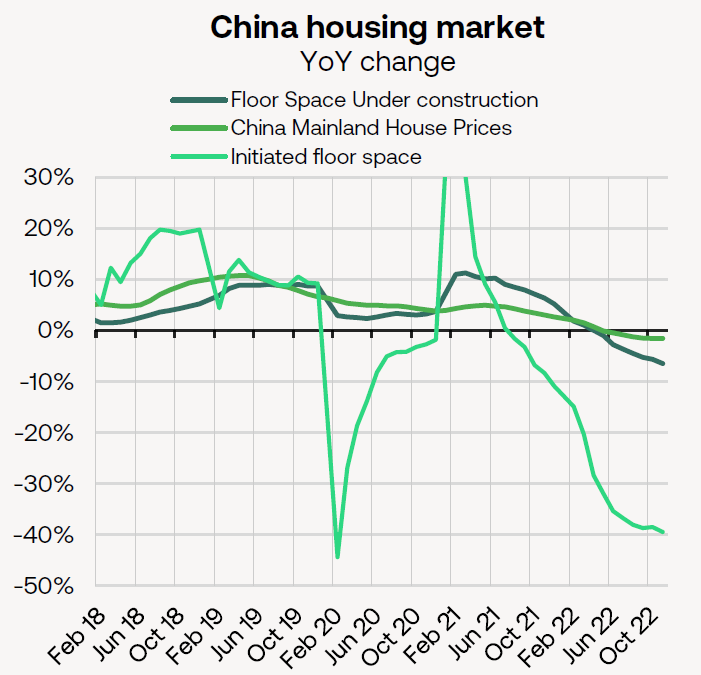
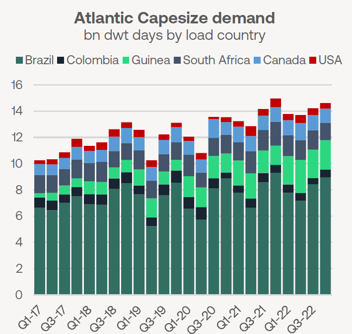

# The Big Picture: 2023: On our radar

**Date:** January 09, 2023  
**Publisher:** Breakwave Advisors | **Category:** Market Insights  
**Original URL:** [https://www.breakwaveadvisors.com/insights/2023/1/9/the-big-picture-2023-on-our-radar](https://www.breakwaveadvisors.com/insights/2023/1/9/the-big-picture-2023-on-our-radar)  

---

## Things to Look Out For

*As we start the new year, we look into some of the factors that may play a role in determining freight rates for the year ahead.*

*By*[*Mark Nugent*](https://www.linkedin.com/in/mark-nugent-3724a3192/)

## Iron Ore and Steel

With news of further support policies for the Chinese property market being implemented, the iron ore price in China has rebounded to $123.2/t on the Dalian Commodity Exchange, an increase of 39.7% from the lows at the start of November. While the move prices in a healthy improvement in demand from the Covid-stricken depths of 2H22, we do not expect Chinese steel production to surpass its previous peak. The mass construction spree of recent years has left the country with ample supply of housing, which is one of the largest consumers of China’s steel output, and thus initiated floor space is continuing to decline.

Last year China reiterated its goals to continue to make energy efficiency improvements in its industrial sector, including steel and other construction metals. By sticking to this policy, we would expect to see larger volumes imported this year from the Atlantic suppliers, which hold greater reserves of high-grade iron ore .

As is the case with most years, iron ore flows will be affected by seasonal weather patterns, particularly in Brazil as it typically experiences heavy rainfall. In Australia, it is now cyclone season and the Australian Bureau of Meteorology expects a likelihood of two coastal impacts from cyclones this season, suggesting disruptions are set to take place in this region also in the near future.

## China Re-Opening

Many welcomed the sight of China lifting Covid-19 restrictions in early December as FFA prices moved to the upside. Though China is now quickly reopening, strong economic activity will not return overnight, particularly as the country deals with the subsequent surge in cases. Opening up has come in tandem with a series of stimulus announcements to aid its economy which, as we have stated before, will take time to make their intended impact.

> **Figure 1: Market Chart 1**  
> [Local Asset](file:///C:/Users/Dell/Github/Shipping/corpus/03-breakwave/insights/2023/assets/2023-01-09_the-big-picture-2023-on-our-radar_img_image0281029_f7eb42b0e437.png)

Inevitably there will be a slowdown in activity across the Chinese New Year period as there traditionally is, followed by an adjustment period of exiting zero-Covid. As a result, we look to the second half of the year for an improvement in both China’s economy and overall bulk commodity demand.

## Coal Headwinds

The largest story breaking in the new year has been a reported partial lifting of China’s unofficial ban of Australian coal which has been in place since 2020. It is also solely open for a handful of state-owned utilities, implying trade will not return to pre-ban levels. Australia has also found several new customers, namely in Europe since the war started, which are likely to have filled miners’ orderbooks. Further we expect Chinese domestic producers to sustain the levels of production of last year and continue to drive substitution of seaborne volumes, implying less need for expensive Australian coal. In its most recent release in November, China produced 391.3m tonnes of coal, the second highest level on record. With Covid-19 restrictions being constantly removed, China’s domestic coal supply chain logistics should normalise from those in 2H22 indicating a lower need for quickly sourced seaborne product. While the reopening in China will increase the country’s energy demand, we expect the strong domestic output and less logistical disruptions to keep seaborne demand subdued.

Elsewhere, following a brief slowdown for several months, EU countries started importing large quantities of coal again in Q4. In December, EU countries imported 8.9m tonnes of thermal coal, the second highest level since the war broke out. With the Russia-Ukraine war dragging on and pipeline gas flows only declining, we can expect the renewed European coal demand to continue into this year.

## West Africa’s Growing Importance

The continued strength in Guinean bauxite trade in 2022 was one of the few trades that hit new heights last year. Bulk carriers loaded over 100m tonnes of bauxite in Guinea for the first time in 2022, increasing by 15.2% YoY. This can be owed to robust aluminium production in China despite the many headwinds primary industry faced in the country throughout the year. Naturally, as the volumes have increased, so has the impact this trade has had on the dry market. Ballasters heading west have increasingly sought after West Africa options as volumes from Brazil appeared less consistent, which has been important in keeping the market balanced, namely on the Capesizes. Of course, we expect to see the typical slowdown in Q3 this year but the volumes during this period have continued to improve on the previous year despite the poor weather, and at 21.4m tonnes, this was better than any quarterly volume achieved pre-2020.

> **Figure 2: Market Chart 2**  
> [Local Asset](file:///C:/Users/Dell/Github/Shipping/corpus/03-breakwave/insights/2023/assets/2023-01-09_the-big-picture-2023-on-our-radar_img_image1281029_f8147ddb304c.png)
