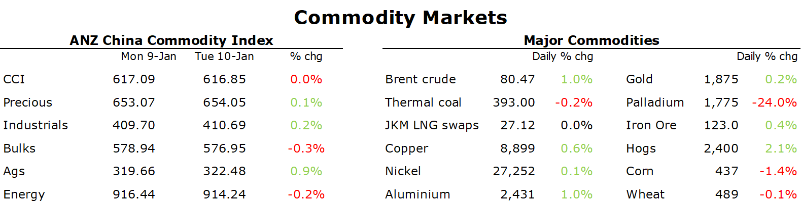

# Crude oil gains amid signs of stronger Chinese demand

**Date:** January 11, 2023  
**Publisher:** Breakwave Advisors | **Category:** Market Insights  
**Original URL:** [https://www.breakwaveadvisors.com/insights/2023/1/11/crude-oil-gains-amid-signs-of-stronger-chinese-demand](https://www.breakwaveadvisors.com/insights/2023/1/11/crude-oil-gains-amid-signs-of-stronger-chinese-demand)  

---

*By*[*Daniel Hynes*](https://www.linkedin.com/in/dahynes/)

Commodity markets were mixed as optimism over China’s reopening was offset by concerns of further monetary tightening by central banks. A weaker USD ultimately helped push the sector higher.

> **Figure 1: 1673385732433**  
> **Interactive Data & Source:** [Linkedin](https://www.linkedin.com/newsletters/commodities-wrap-6692196755876012032/?fbclid=IwAR3kiXJqZdxmp9ZcRwBNI7FsBySI-XSC0pfPur1qzjt7OZp7PTE59Tsl1QI) | [Local Asset](file:///C:/Users/Dell/Github/Shipping/corpus/03-breakwave/insights/2023/assets/2023-01-11_crude-oil-gains-amid-signs-of-stronger-chinese-demand_img_1673385732433_b5fff2cf1e75.png)

**Crude oil**prices were under pressure early in the session after two Fed official said the bank will likely need to raise rates above 5% to combat inflation. However, the selloff was short lived, with the market still buoyed by signs of stronger demand from China. Monday’s news that China had issued a fresh batch of import quotas suggests the world’s largest importer is ramping up to meet higher demand. It also appears to be importing a wider variety of Russian crude. Buyers snapped up three cargoes, including the lesser-known Arco grade. In its latest monthly report, EIA raised its forecast for demand growth in 2023 to 1.05mb/d. However, it also expects US output to rise to meet this demand, with US shale oil providing the bulk of the gains.

**European natural gas**gave back some of yesterday’s gains as focused returned to weak demand amid mild weather across the continent. An association of storage operators in Germany said that the country will be able to get through this winter with enough gas even if an extreme cold spell hits the region. In such an event, inventories would bottom out at 20% capacity in March. However, in bad news for European imports, the recent fall in natural gas prices has induced buyers back into the**North Asian LNG**spot market. In the past few weeks, India and Thailand have both purchase cargo after a long absence. Argentina is also considering snapping up supply.

**European carbon**gave back some gains following Monday’s rally. EUAs eased lower amid suggestions the market had 'overshot' in the previous session. This came amid mixed energy markets as the outlook for demand is clouded by unseasonal warmer weather.**Australia’s nascent carbon market**could find much need support after the government released its detailed design proposal for the Safeguard Mechanism emissions compliance framework. To reach its 2030 target, it will impose declining emissions limits on large industrial polluters under the Safeguard Mechanism, which covers around 215 of Australia’s largest emitting facilities across metals, mining, oil and gas and manufacturing sectors.

**Copper**led the**base metals**higher as risk sentiment improved over China’s reopening. An early session selloff was also reversed after Powell avoided giving clues on the outlook for interest rates. Sentiment was supported by reports of further financial support for China’s economy. The PBoC and the banking regulator urged the country’s lenders to provide powerful financial support for the economy. The meeting was said to focus on supporting important property developers and reducing their risks.

Further weakness in the USD helped push**gold**prices higher. Bond yields were also lower as market expectations of a slowdown in interest rate hikes grow.

Data source:[Commodities Wrap](https://www.linkedin.com/newsletters/commodities-wrap-6692196755876012032/?fbclid=IwAR3kiXJqZdxmp9ZcRwBNI7FsBySI-XSC0pfPur1qzjt7OZp7PTE59Tsl1QI)
