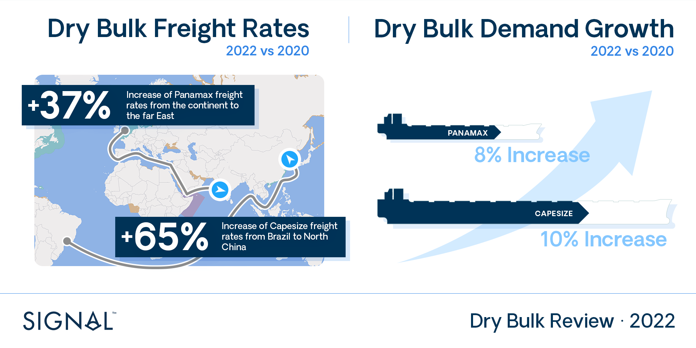
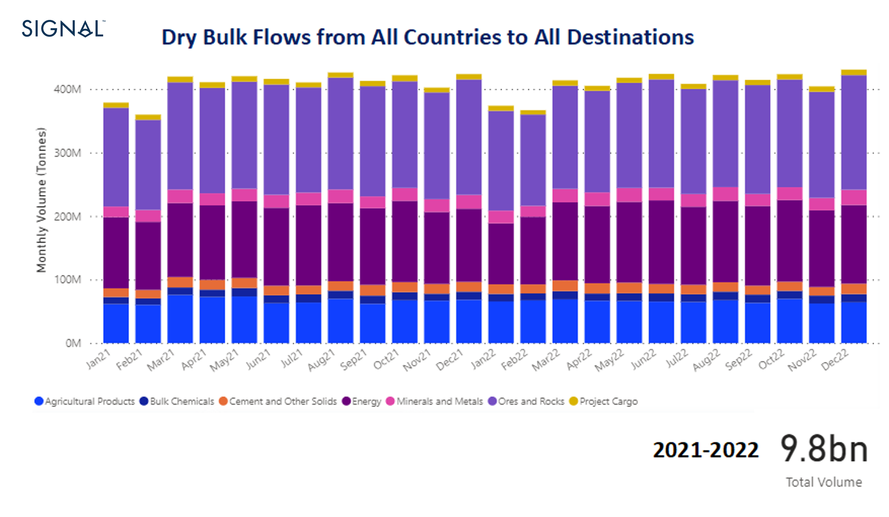
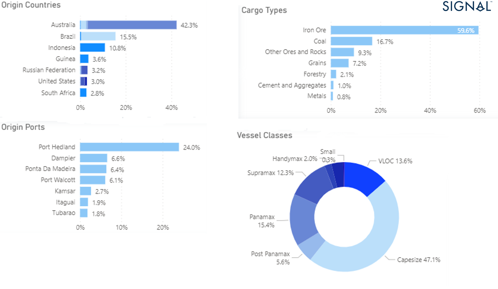
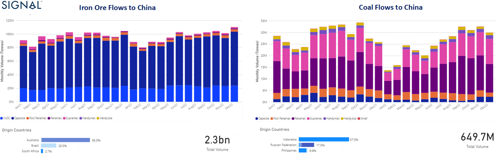
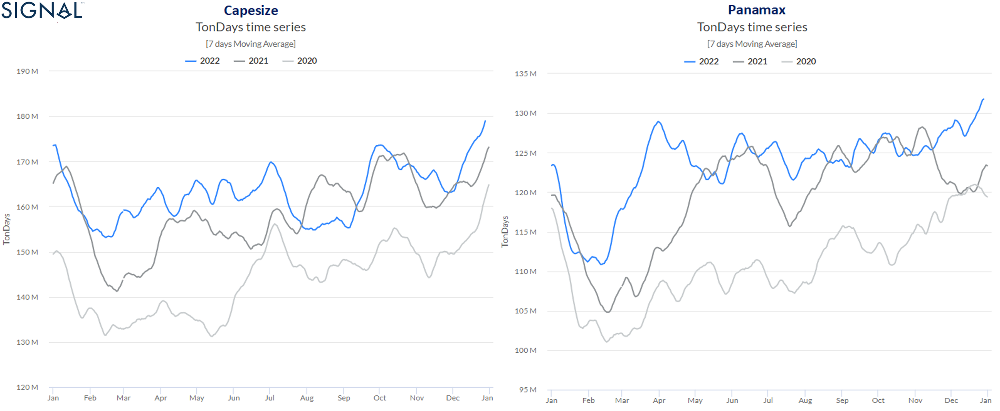
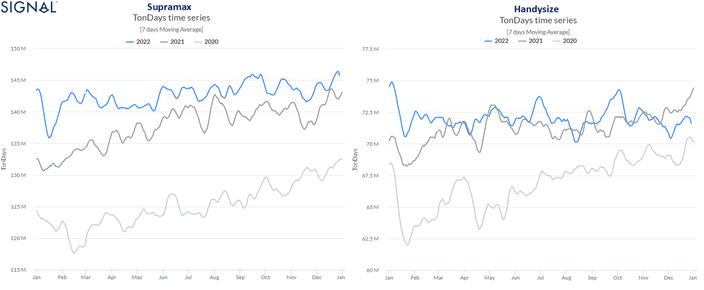
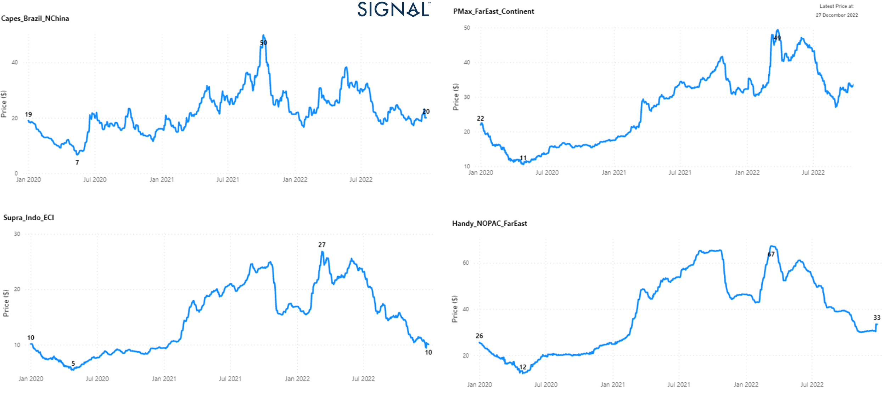
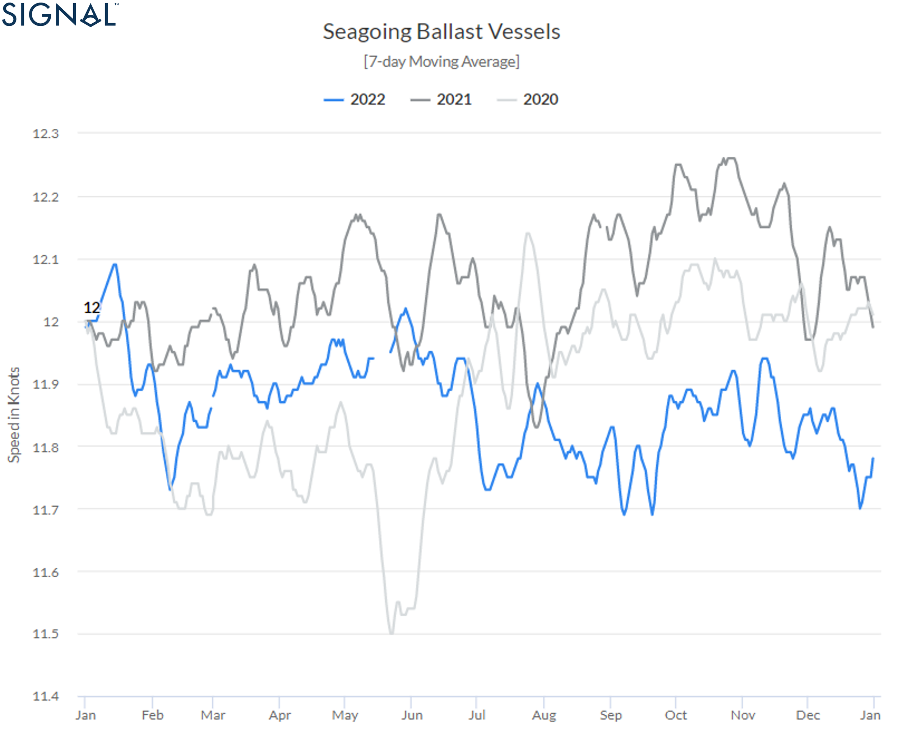

# Signal Dry Bulk Annual Review 2022

**Date:** January 11, 2023  
**Publisher:** Breakwave Advisors | **Category:** Market Insights  
**Original URL:** [https://www.breakwaveadvisors.com/insights/2023/1/11/dry-bulk-annual-review-2022](https://www.breakwaveadvisors.com/insights/2023/1/11/dry-bulk-annual-review-2022)  

---

### A Review of Dry Bulk Freight Fundamentals

> **Figure 1: 63bd795b361ff11b41431e2c B**  
> **Interactive Data & Source:** [Un](https://www.un.org/en/black-sea-grain-initiative) | [Local Asset](file:///C:/Users/Dell/Github/Shipping/corpus/03-breakwave/insights/2023/assets/2023-01-11_dry-bulk-annual-review-2022_img_63bd795b361ff11b41431e2c-b_2bb1883aa7b1.png)

The year ended with critical changes in grain flows due to geopolitical tensions between Russia and Ukraine. In parallel, the Chinese real estate crisis seriously impacted Capesize vessels, while the energy crisis drove up coal flows and Panamax freight rates.

[**‍**](https://www.un.org/en/black-sea-grain-initiative)Amid the macroeconomic and geopolitical challenges, it is interesting to see that the volume of bulk cargo flows has remained stable over the past two years. Cargo flow volumes were helped by the[**Black Sea Grain Corridor Initiative**](https://www.un.org/en/black-sea-grain-initiative)in the third quarter, but freight rates in the Supramax and Handysize segments remained weaker.

[**‍**](https://www.un.org/en/black-sea-grain-initiative)A serious concern for bulk demand growth in the coming year is[**Chinese economic growth**](assets/2023-01-11_dry-bulk-annual-review-2022_index_671e8865f732.html), as 2022 ended with GDP growth of at least 4.4%, but well above economists' expectations.[**Economists had generally expected**](assets/2023-01-11_dry-bulk-annual-review-2022_index_017c1ec239f2.html)growth to fall to a rate between 2.7% and 3.3% in 2022. The Chinese government had maintained a much higher annual growth target of around 5.5%.

[**‍**](https://www.un.org/en/black-sea-grain-initiative)In our annual review[**using Signal Ocean data**](https://app.signalocean.com/tanker/reports), we examine freight market trends on reference routes and current patterns of bulk flows compared to the previous two years. 2021 surprised many with exceptionally high levels for Capesize and Panamax vessels, while 2022 saw a downward cycle for smaller vessel sizes.

For the first quarter of 2023, it is becoming apparent that the explosion of Chinese Covid cases will pose a new threat to the global economy and seaborne iron ore demand, while the current trend in seagoing ballast speed for dry bulkers has already fallen to its lowest level since 2020.

The following sections present the evolution of trends in dry bulk flows, demand, freight rates, vessel speeds, and supply.

‍

### I. Dry Bulk Flows - China

The volume of dry bulk flows from all countries to all destinations was stable similar to last year, with the exception of January and February, while December ended with a slightly higher volume than November.**Image**1 shows that the overall trend for this year and last year for bulk shipments supports the recovery in freight rates despite ongoing macroeconomic challenges. Total volume over the past two years is estimated at about 9.8 billion tonnes, with China accounting for 40% of flows (**image**2) and Australia as the origin country accounting for 29%.

> **Figure 2: Image 1 - Data Source: The Signal Ocean Platform**  
> *Image 1 - Data Source: The Signal Ocean Platform, Dry Bulk Flows 2021-2022, from All to All Destinationshttps://app.signalocean.com/dry/dynamic/drybulkflows*  
> **Interactive Data & Source:** [Signal Ocean Platform](https://app.signalocean.com/dry/dynamic/drybulkflows) | [Local Asset](file:///C:/Users/Dell/Github/Shipping/corpus/03-breakwave/insights/2023/assets/2023-01-11_dry-bulk-annual-review-2022_img_63bbeb8155c57e15eb1b13fe-image1drybu_592e0c6fbd24.png)

**Image**2 shows the breakdown of the volume of bulk cargo flows over the past two years by origin and destination countries, ship size category, and cargo types. Iron ore fines and thermal coal accounted for 27% and 21%, respectively, while Capesize and Supramax vessels had the largest volume shares, accounting for 30% and 21%, respectively as measured in metric tons.

> **Figure 3: Image 2 - Data Source: The Signal Ocean Platform**  
> *Image 2 - Data Source: The Signal Ocean Platform, Dry Bulk Flows 2021-2022, Breakdown (Origin - Destination Countries, Vessel Classes, Cargo Grades)https://app.signalocean.com/dry/dynamic/drybulkflows*  
> **Interactive Data & Source:** [Signal Ocean Platform](https://app.signalocean.com/dry/dynamic/drybulkflows) | [Local Asset](file:///C:/Users/Dell/Github/Shipping/corpus/03-breakwave/insights/2023/assets/2023-01-11_dry-bulk-annual-review-2022_img_63bbeb8155c57e15eb1b13fe-image1drybu_592e0c6fbd24.png)

> **Figure 4: Image 3 - Data Source: The Signal Ocean Platform**  
> *Image 3 - Data Source: The Signal Ocean Platform, Dry Bulk Flows 2021-2022, from from All to Chinahttps://app.signalocean.com/dry/dynamic/drybulkflows*  
> **Interactive Data & Source:** [Signal Ocean Platform](https://app.signalocean.com/dry/dynamic/drybulkflows) | [Local Asset](file:///C:/Users/Dell/Github/Shipping/corpus/03-breakwave/insights/2023/assets/2023-01-11_dry-bulk-annual-review-2022_img_63bbeb8155c57e15eb1b13fe-image1drybu_592e0c6fbd24.png)

Looking at China as the main destination for bulk flows and demand growth,**image**3 shows that the volume of flows has increased, especially in the fourth quarter of this year. In the last two years, the total volume of commodity flows was 3.9 billion tonnes, with iron ore accounting for 60% of the volume and Australia remaining the top source country for Chinese bulk imports with a 42% share (**image**4).

> **Figure 5: Image 3 - Data Source: The Signal Ocean Platform**  
> *Image 3 - Data Source: The Signal Ocean Platform, Dry Bulk Flows 2021-2022, from from All to Chinahttps://app.signalocean.com/dry/dynamic/drybulkflows*  
> **Interactive Data & Source:** [Signal Ocean Platform](https://app.signalocean.com/dry/dynamic/drybulkflows) | [Local Asset](file:///C:/Users/Dell/Github/Shipping/corpus/03-breakwave/insights/2023/assets/2023-01-11_dry-bulk-annual-review-2022_img_63bbeb8155c57e15eb1b13fe-image1drybu_592e0c6fbd24.png)

> **Figure 6: Image 4- Data Source: The Signal Ocean Platform**  
> *Image 4- Data Source: The Signal Ocean Platform, Dry Bulk Flows 2021-2022 to China, Breakdown(Origin Countries, Vessel Classes, Cargo Grades)https://app.signalocean.com/dry/dynamic/drybulkflows*  
> **Interactive Data & Source:** [Signal Ocean Platform](https://app.signalocean.com/dry/dynamic/drybulkflows) | [Local Asset](file:///C:/Users/Dell/Github/Shipping/corpus/03-breakwave/insights/2023/assets/2023-01-11_dry-bulk-annual-review-2022_img_63bc1ddaae8e7e2459cc594f-image4flows_e4f9a739e81e.png)

**Image**5 shows the total volume of iron ore and coal flows to China over the past two years, as well as the top three source countries. It is interesting to note that the fourth quarter of 2022 saw an exceptional increase in coal flows to China compared to the previous two quarters, with Indonesia leading the origin countries with a 57% share. For iron ore, December saw a higher import pace than November, matching the volume of December 2021. Overall, the year ended with a promising outlook for Chinese iron ore and coal demand, although slower momentum was feared given the outbreak of Covid cases.

> **Figure 7: Image 5- Data Source: The Signal Ocean Platform**  
> *Image 5- Data Source: The Signal Ocean Platform, Dry Bulk Flows 2021-2022 to China, Iron Ore & Coalhttps://app.signalocean.com/dry/dynamic/drybulkflows*  
> **Interactive Data & Source:** [Signal Ocean Platform](https://app.signalocean.com/dry/dynamic/drybulkflows) | [Local Asset](file:///C:/Users/Dell/Github/Shipping/corpus/03-breakwave/insights/2023/assets/2023-01-11_dry-bulk-annual-review-2022_img_63bc1e052f1b692076f1487f-image5irono_7630ac52c58a.png)

### Ii. Demand Growth - Tonne Charts

The higher volume of iron ore and coal dry bulk flows to China is reflected in the growth of dry bulk demand tonne-days, where the fourth quarter of the year ended with increasing momentum in the Capesize and Panamax segments. Overall, the tonne-days trend for the larger vessel categories was higher than in 2021 and 2020, and December suggests similar strength for the first days of 2023, (**image**6).

> **Figure 8: Image 6 - Data Source: The Signal Ocean Platform**  
> *Image 6 - Data Source: The Signal Ocean Platform, Demand, Capesize - Panamaxhttps://app.signalocean.com/dry/reports/toncharts*  
> **Interactive Data & Source:** [Signal Ocean Platform](https://app.signalocean.com/dry/reports/toncharts) | [Local Asset](file:///C:/Users/Dell/Github/Shipping/corpus/03-breakwave/insights/2023/assets/2023-01-11_dry-bulk-annual-review-2022_img_63bc1e5c0a9d2fbb4c63e198-image6deman_e28931a504f1.png)

Looking at the smaller ship segments (**image**7), growth in tonne-days was also higher in the Supramax segment than in the previous two years, while slower momentum was observed in the Handysize size in the fourth quarter. The slowdown in Handysize demand growth in tonne-days at a lower level than in previous years in the fourth quarter leads to a downward revision of freight rates for the first months of the New Year, as geopolitical tensions are still causing difficulties in grain exports from Ukraine to the main Asian markets.

> **Figure 9: Image 7 - Data Source: The Signal Ocean Platform**  
> *Image 7 - Data Source: The Signal Ocean Platform, Demand, Supramax - Handysizehttps://app.signalocean.com/dry/reports/toncharts*  
> **Interactive Data & Source:** [Signal Ocean Platform](https://app.signalocean.com/dry/reports/toncharts) | [Local Asset](file:///C:/Users/Dell/Github/Shipping/corpus/03-breakwave/insights/2023/assets/2023-01-11_dry-bulk-annual-review-2022_img_63bc1e8b0f5db04879554367-image7deman_2a6e0e2d2ac3.png)

### Iii. Freight Market - $/Tonne

Overall, 2022 was a year of strong growth in freight rates for the larger vessel categories, although rates for Capesize vessels grew at a slower pace after the exceptionally high levels of 2021 (**image**8). Although the freight market for the larger vessel categories was above 2020 levels, rates for the Supramax and Handysize vessel classes were very weak, while the Panamax segment appears to be the winner in 2022. In the last days of the year ending, Panamax freight rates showed a strong performance and Asian coal demand paved the way for stronger demand and higher freight rates in the upcoming first quarter of the New Year.

> **Figure 10: Image 8 - Data Source: The Signal Ocean Platform**  
> *Image 8 - Data Source: The Signal Ocean Platform, Market Prices, 2020-2022https://app.signalocean.com/dry/dynamic/market-prices*  
> **Interactive Data & Source:** [Signal Ocean Dynamic Market Prices](https://app.signalocean.com/dry/dynamic/market-prices) | [Local Asset](file:///C:/Users/Dell/Github/Shipping/corpus/03-breakwave/insights/2023/assets/2023-01-11_dry-bulk-annual-review-2022_img_63bc1ed510db0d68e7b7d311-image8dryra_5cc7b9b5604a.png)

### Iv. Vessel Speeds

The geopolitical crisis prompted shipowners to reduce the ballast speed of ships at sea, and 2022 ended with a record low ballast speed for bulk carriers. It is estimated that last year's levels are the lowest compared to 2021 and 2020 (**image**9), as the larger vessel categories continue to have lower ballast speeds at sea (**image**10). The fourth quarter suggests a similar slowdown in ballast speeds as freight rates enter a downward cycle at the start of the new year.

> **Figure 11: Image 9 - Data Source: The Signal Ocean Platform**  
> *Image 9 - Data Source: The Signal Ocean Platform, Vessel Speeds, Ballast, Dry Bulk Vessel, All sizeshttps://app.signalocean.com/dry/reports/vesselSpeeds*  
> **Interactive Data & Source:** [Signal Ocean Platform](https://app.signalocean.com/dry/reports/vesselSpeeds?_gl=1*1euqdnf*_ga*NzU3MjczOTk0LjE2MzM0MzAzNjg.*_ga_2W2L38HL2W*MTY3MzQzMzUxNS4yMC4wLjE2NzM0MzM1MTUuNjAuMC4w&_ga=2.194721896.477147957.1673433516-757273994.1633430368) | [Local Asset](file:///C:/Users/Dell/Github/Shipping/corpus/03-breakwave/insights/2023/assets/2023-01-11_dry-bulk-annual-review-2022_img_63bc1f227fd5073bfc1db28d-image9balla_6ef85cdd9354.png)

‍

> **Figure 12: Image 10 - Data Source: The Signal Ocean Platform**  
> *Image 10 - Data Source: The Signal Ocean Platform, Vessel Speeds, Ballast, Dry Bulk Vessels (Capesize Vs Panamax)https://app.signalocean.com/tanker/reports/vesselSpeeds*  
> **Interactive Data & Source:** [Signal Ocean Platform](https://app.signalocean.com/tanker/reports/vesselSpeeds) | [Local Asset](file:///C:/Users/Dell/Github/Shipping/corpus/03-breakwave/insights/2023/assets/2023-01-11_dry-bulk-annual-review-2022_img_63bbeb8155c57e15eb1b13fe-image1drybu_592e0c6fbd24.png)

### V. Vessel Supply - Ballasters’ View

Finally, looking at the weekly trends of ballast vessels in the main vessel categories (**image**11), we see that the number of vessels in ballast increases in the New Year in the Capesize and Panamax segments, but remains below the average trend. In the Handysize segment, the number of ballasted vessels remains above the average trend, and there is also an increase in the Supramax segment.

Overall, the weekly trends for ballast vessels show an upward trend, suggesting a continuation of the weakening trend in freight rates for the first few days of the new year. It remains to be seen how the January days will play out for vessel employment given the economic uncertainty in China and the challenges to the smooth flow of grain shipments.

> **Figure 13: Image 11 - Data Source: The Signal Ocean Platform**  
> *Image 11 - Data Source: The Signal Ocean Platform, Weekly Supply Trend, Ballasters’ View*  
> **Interactive Data & Source:** [Signal Ocean Platform](https://www.thesignalgroup.com/signal-ocean-platform) | [Local Asset](file:///C:/Users/Dell/Github/Shipping/corpus/03-breakwave/insights/2023/assets/2023-01-11_dry-bulk-annual-review-2022_img_63bbeb8155c57e15eb1b13fe-image1drybu_592e0c6fbd24.png)

### Overall Outlook - Looking Ahead

The New Year brings uncertainty for bulk freight rates as China has a significant impact on Capesize freight rate trends. However, the energy crisis appears to be continuing to boost coal flows significantly and improve sentiment for Panamax rates between the Continent and the Far East. It is questionable, however, whether the growth in Asian coal demand will be sufficient for the increase in bulk carrier employment rates and an upward cycle in freight rates. It remains to be seen whether the Chinese economy will be able to overcome the rinderpest outbreak and successfully manage the looming threat of a new round of economic downturn with negative effects on the global economy.

‍

Data Source:[Signal Ocean Platform](https://www.thesignalgroup.com/signal-ocean-platform)
