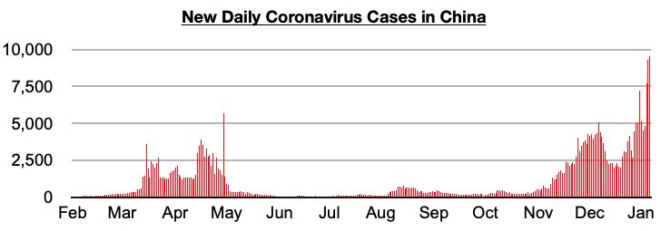

# Chinese Consumers Buying Less, Still Just Paying More

**Date:** January 13, 2023  
**Publisher:** Breakwave Advisors | **Category:** Market Insights  
**Original URL:** [https://www.breakwaveadvisors.com/insights/2023/1/12/chinese-consumers-buying-less-still-just-paying-more](https://www.breakwaveadvisors.com/insights/2023/1/12/chinese-consumers-buying-less-still-just-paying-more)  

---

*By*[*Jeffrey Landsberg*](https://www.linkedin.com/in/jeffrey-landsberg-70ab957/)

As we have been stressing in our Weekly China Reports, inflation exceeding retail sales growth in both September and October in China was a troubling and almost unprecedented event. Throughout this century, the only two other times prior to September that retail sales grew by less than inflation for two straight months was first during China’s initial coronavirus outbreak that began in earnest in January 2020, and then later during March through May 2022 when cases were surging again. September and October 2022 were not months that saw a surge in new coronavirus cases or restrictions — but these were months where there was sudden economic distress.

> **Figure 1: Chart 1 (69)**  
> [Local Asset](file:///C:/Users/Dell/Github/Shipping/corpus/03-breakwave/insights/2023/assets/2023-01-13_chinese-consumers-buying-less-still-just-paying-more_img_chart1286929_ca4ae9fec2aa.jpg)

More recent data has also shown that inflation again exceeded retail sales growth in November. Retail sales contracted year-on-year by 5.9% in November, while inflation grew year-on-year by 1.6%. December’s data, when it is published, is also all but guaranteed to show a fourth straight month of inflation exceeding retail sales growth, and this month is extremely likely to mark a fifth straight month as coronavirus cases have continued to surge. Consumers in China are still not actually buying more goods compared to a year ago. They are only paying more.
