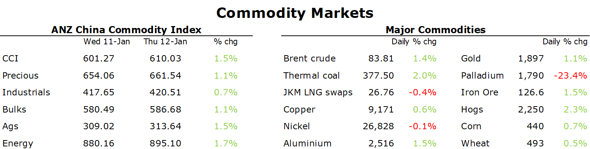

# Gold rallies amid expectations of slower rate hikes from Fed

**Date:** January 13, 2023  
**Publisher:** Breakwave Advisors | **Category:** Market Insights  
**Original URL:** [https://www.breakwaveadvisors.com/insights/2023/1/13/gold-rallies-amid-expectations-of-slower-rate-hikes-from-fed](https://www.breakwaveadvisors.com/insights/2023/1/13/gold-rallies-amid-expectations-of-slower-rate-hikes-from-fed)  

---

*By*[*Daniel Hynes*](https://www.linkedin.com/in/dahynes/)

Slowing US inflation saw risk appetite rise sharply across the complex. This increased confidence of demand strengthening as China’s reopens its economy.

> **Figure 1: 1673558287433**  
> **Interactive Data & Source:** [Linkedin](https://www.linkedin.com/newsletters/commodities-wrap-6692196755876012032/?fbclid=IwAR3kiXJqZdxmp9ZcRwBNI7FsBySI-XSC0pfPur1qzjt7OZp7PTE59Tsl1QI) | [Local Asset](file:///C:/Users/Dell/Github/Shipping/corpus/03-breakwave/insights/2023/assets/2023-01-13_gold-rallies-amid-expectations-of-slower-rate-hikes-from-fed_img_1673558287433_d75f104bbc52.png)

**Gold**rallied after inflation slowed in the US. This was bolstered by a less aggressive Fed. Philly Fed’s Patrick Harker said he favours hikes of 25bp going forward. A weaker USD as a result of a less hawkish Fed saw investor appetite for the precious metal rise. This was supported by lower yields on Treasuries. The rally in gold lifted the rest of the sector. Silver outperformed gold, and platinum and palladium gained.

Strong risk appetite across markets helped push**crude oil**higher. This was aided by increasing confidence in China’s recovery. China’s road traffic levels are continuing to rebound from record low levels following the easing of COVID-19 restrictions. A congestion index comprising the 15 cities with the most vehicles registrations has risen by 31.3% vs a week earlier. This comes as Chinese buyers become more active in the physical market. Unipec is said to have snapped up about 3-4mbbl of US crude for March and April in recent days. Chinese authorities also issued a fresh batch of import quotas last week as they look to support increased demand.

The prospect of colder weather pushed**European natural gas**higher. A cold front is expected to move through the British isles, western Scandinavia and the Iberian peninsula over the weekend, according to forecast Maxar Technologies. Milder temperatures have tempered demand, with storage facilities above seasonal levels. However, traders are conscious that competition for LNG is likely to rise amid China’s reopening. Dutch front month futures rose near 3% to settle at EUR67.20/MWh.**North Asian LNG**spot prices were steady despite increasing interest from Chinese buyers. A cold wave is expected to bring rain and snow to China’s central and eastern provinces later this week. However, this is being offset by reduced activity in Japan. Ample stockpiles have seen buyers remain on the sidelines. Sentiment was also hampered by reports that the Freeport LNG terminal drew power from the grid for the first time since it was shut down in June last year.

**European carbon**recorded healthy gains amid strong underlying demand in the run-up to compliance season. Liquidity was also better, amid a growing focus on short-dated trading.**Australian carbon**crude units pushed to AUD35.50/t amid growing confidence that changes to the Safeguard Mechanism will likely boost demand for credits.

**Base metals**rallied across the board amid the improved risk sentiment. Markets have been buoyed by the prospect of a jump in industrial activity in China. However, a slowdown in rate hikes by the Fed could also see economic growth across developed markets hold up better than previously expected.

Data source:[Commodities Wrap](https://www.linkedin.com/newsletters/commodities-wrap-6692196755876012032/?fbclid=IwAR3kiXJqZdxmp9ZcRwBNI7FsBySI-XSC0pfPur1qzjt7OZp7PTE59Tsl1QI)
