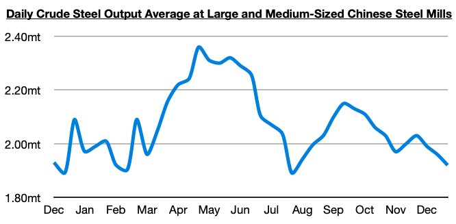
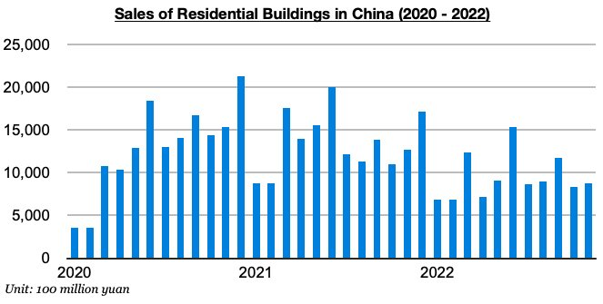

# Issues Remain For Dry Bulk Market

**Date:** January 17, 2023  
**Publisher:** Breakwave Advisors | **Category:** Market Insights  
**Original URL:** [https://www.breakwaveadvisors.com/insights/2023/1/17/issues-remain-for-dry-bulk-market](https://www.breakwaveadvisors.com/insights/2023/1/17/issues-remain-for-dry-bulk-market)  

---

*By*[*Jeffrey Landsberg*](https://www.linkedin.com/in/jeffrey-landsberg-70ab957/)

One key theme we have been stressing in recent work is that passenger travel in China via road, subways, and air are increasing (along with other consumer activity), but some industrial markets in China continue to face significant pressure. Coal burn at power plants recently fell to the lowest level seen since early December and has been down year-on-year by 6%. Steel production has also continued to fall, and ended the final days of December at the lowest level seen since late July and down year-on-year by 8%. The most recently released data shows that daily crude steel output at large and medium-sized mills in China averaged 1.92 million tons during December 21 - 30. This is 2% less than was seen during the previous ten days and is down year-on-year by 8%.

> **Figure 1: In Our View**  
> *In our view, reopening will remain the much easier of the two issues this year. China’s government has no choice but to do anything it can to stimulate the housing market again, but we continue to worry that China simply already has more homes than demand for homes. The government is now expected to further relax restrictions on property developers by dialing back the "three red lines" policy (which restricts the amount of new borrowing property developers can raise by placing caps on debt ratios), but can it really stimulate actualdemandfor homes? We remain very concerned that housing supply will continue to far outweigh housing demand. Sales of residential buildings in China have contracted on a year-on-year basis for seventeenth straight months and recently by the largest amount since May.*  
> [Local Asset](file:///C:/Users/Dell/Github/Shipping/corpus/03-breakwave/insights/2023/assets/2023-01-17_issues-remain-for-dry-bulk-market_img_chart1286729_2a12633b554f.jpg)

China continues to experience industrial weakness and of course great problems in its housing market. At the same time, much of the global economy remains very weak, early-to-mid 2022’s heavy port congestion remains a thing of the past, and new vessels are still being delivered. While the dry bulk fleet is only set to grow by a relatively small amount this year (we expect 350 to 400 deliveries, which would work out to 2.8% - 3.2% growth independent of scrapping), even low growth is a problem when a market is already contending with issues. Overall, we do not expect that this will be an easy year. A lot will continue to rest on how quickly China reopens and how well the housing market is able to recover.

> **Figure 2: Chart 2 (58)**  
> [Local Asset](file:///C:/Users/Dell/Github/Shipping/corpus/03-breakwave/insights/2023/assets/2023-01-17_issues-remain-for-dry-bulk-market_img_chart2285829_e3ae3dda0784.jpg)
