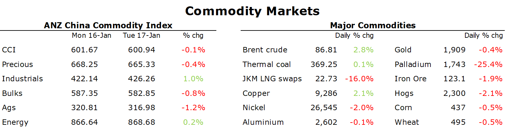

# Crude oil gains as OPEC casts an optimistic tone on demand

**Date:** January 18, 2023  
**Publisher:** Breakwave Advisors | **Category:** Market Insights  
**Original URL:** [https://www.breakwaveadvisors.com/insights/2023/1/18/crude-oil-gains-as-opec-casts-an-optimistic-tone-on-demand](https://www.breakwaveadvisors.com/insights/2023/1/18/crude-oil-gains-as-opec-casts-an-optimistic-tone-on-demand)  

---

*By*[*Daniel Hynes*](https://www.linkedin.com/in/dahynes/)

Sentiment was broadly positive as optimism regarding China’s reopening returned. A slightly weaker USD also added support.

> **Figure 1: 1673989250356**  
> **Interactive Data & Source:** [Linkedin](https://www.linkedin.com/newsletters/commodities-wrap-6692196755876012032/?fbclid=IwAR3kiXJqZdxmp9ZcRwBNI7FsBySI-XSC0pfPur1qzjt7OZp7PTE59Tsl1QI) | [Local Asset](file:///C:/Users/Dell/Github/Shipping/corpus/03-breakwave/insights/2023/assets/2023-01-18_crude-oil-gains-as-opec-casts-an-optimistic-tone-on-demand_img_1673989250356_83d3a9383fc2.png)

**Crude oil**edged higher as OPEC set a more optimistic tone on demand. Secretary General Haitham Al Ghais said he’s optimistic about the outlook for the global economy. The oil producer group said that a potential slowdown in advanced economies is countered by accelerating growth in Asia. This comes ahead of a meeting with its partners in the production sharing agreement on 1 Feb. They will be presented with a complex picture. Potential supply losses from Russia and the reopening of China could see the market tighten quickly. Crude oil has also found some support from a weaker USD and growing expectations that central banks are nearing their end to aggressive rate hikes. Reports suggest the ECB is considering a slower pace of rake hikes than Christine Lagarde indicated in December.

**European gas**rebounded strongly as Asian demand was back in focus. A cold snap gripping Europe this week is likely to drive demand higher. This could see it compete with Asian buyers who are rapidly returning to the LNG market to take advantage of lower prices. Dutch front month futures eventually ended the session up 8.3% to EUR60/MWh. Bargain hunting also helped push**North Asian LNG**spot prices higher. Buyers from India and Thailand were lured back into the market following a 45% decline in prices. The Korea-Japan Maker subsequently rallied more than 12% to settle at USD22.73/MMBtu. Larger buyers, such as China and Japan, continue to sit on the sidelines amid healthy levels of inventories.

**European carbon**rebounded strongly following the gains across the energy complex. Speculative buying was prevalent after the market tested its recent low in early trading. This helped erase nearly all of Monday’s losses. The World Economic Forum heard that companies are becoming increasingly hesitant in purchasing carbon credits because of complex standards, varying definitions of quality or a lack of market transparency. This has seen the retirement of carbon credits, where companies claim offsets against their own emissions, fall last year in the world’s largest carbon market.

Better than expected economic data from China helped boost sentiment in the**base metal**sector. While GDP of 3% was the second slowest pace since the 1970s, December data came in better than expected. Much of the upside surprise came from manufacturing, with industrial production rising 1.6% in Q4. The fall in retail sales (-1.8% y/y) was also limited. This saw copper surge to its highest level since June 2022. The gains were supported by a weaker USD. Nevertheless, the market remains cautious of ongoing headwinds. The Lunar New Year is likely to see demand remain subdued. Premiums for copper cathode in China low while stockpiles are rising.

**Gold**fell for a second day amid lower Treasury yields but remained above the key USD1900/oz level

Data source:[Commodities Wrap](https://www.linkedin.com/newsletters/commodities-wrap-6692196755876012032/?fbclid=IwAR3kiXJqZdxmp9ZcRwBNI7FsBySI-XSC0pfPur1qzjt7OZp7PTE59Tsl1QI)
