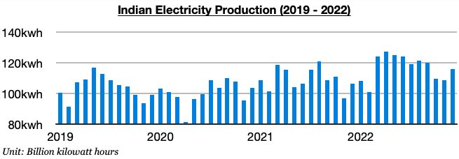
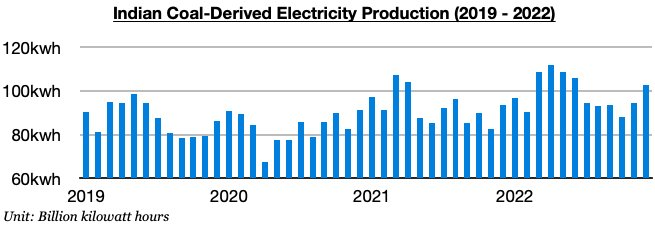
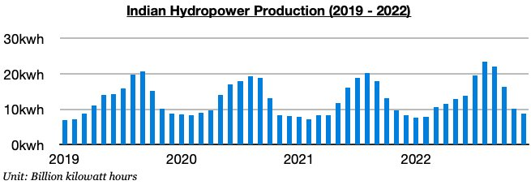

# Strong Growth In India's Electricity Production

**Date:** January 20, 2023  
**Publisher:** Breakwave Advisors | **Category:** Market Insights  
**Original URL:** [https://www.breakwaveadvisors.com/insights/2023/1/19/strong-growth-in-indias-electricity-production-o3NPe](https://www.breakwaveadvisors.com/insights/2023/1/19/strong-growth-in-indias-electricity-production-o3NPe)  

---

*By*[*Jeffrey Landsberg*](https://www.linkedin.com/in/jeffrey-landsberg-70ab957/)

India produced approximately 115.7 billion kilowatt hours of electricity last month, which is up month-on-month by 7.2 billion kilowatt hours (7%) and up year-on-year by 9.4 billion kilowatt hours (9%). India’s electricity production ended last year increasing on a year-on-year basis during nine of the last ten months. It began the year contracting on a year-on-year basis in both January and February.

> **Figure 1: Chart 1 (68)**  
> [Local Asset](file:///C:/Users/Dell/Github/Shipping/corpus/03-breakwave/insights/2023/assets/2023-01-20_strong-growth-in-indias-electricity-production-o3npe_img_chart1286829_99a30e8f3573.jpg)

India’s coal-derived electricity generation totaled approximately 102.5 billion kilowatt hours last month. This has marked a month-on-month increase of 8.1 billion kilowatt hours (9%) and is up year-on-year by 9.1 billion kilowatt hours (10%). Coal derived-electricity generation has also now increased on a year-on-year basis during nine of the last ten months. January and February also experienced year-on-year contractions.

> **Figure 2: Chart 2 (59)**  
> [Local Asset](file:///C:/Users/Dell/Github/Shipping/corpus/03-breakwave/insights/2023/assets/2023-01-20_strong-growth-in-indias-electricity-production-o3npe_img_chart2285929_d1615390e371.jpg)

India’s hydropower output totaled only 8.8 billion kilowatt hours last month. This has marked a month-on-month decline of 1.3 billion kilowatt hours (-13%) but is up year-on-year by 400 million kilowatt hours (5%). It is normal for hydropower output to continue to fall during this time of year. Output, though, has now grown on a year-on-year basis during twelve of the last fourteen months.

> **Figure 3: Chart 3 (44)**  
> [Local Asset](file:///C:/Users/Dell/Github/Shipping/corpus/03-breakwave/insights/2023/assets/2023-01-20_strong-growth-in-indias-electricity-production-o3npe_img_chart3284429_fa52fc26cf13.jpg)
