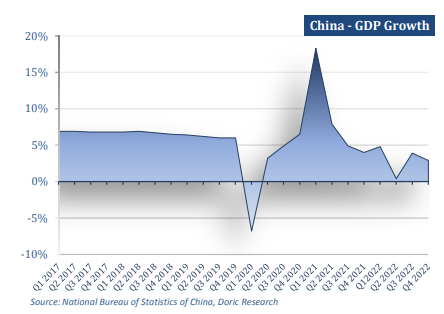
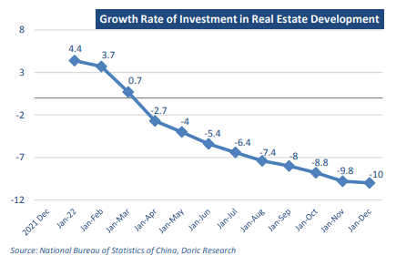
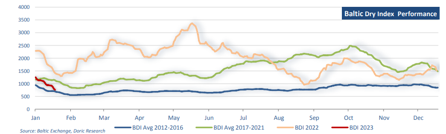

# Doric Weekly Market Insight

**Date:** January 23, 2023  
**Publisher:** Breakwave Advisors | **Category:** Market Insights  
**Original URL:** [https://www.breakwaveadvisors.com/insights/2023/1/23/doric-weekly-market-insight](https://www.breakwaveadvisors.com/insights/2023/1/23/doric-weekly-market-insight)  

---

*By*[*Michalis Voutsinas*](https://www.linkedin.com/in/michalis-voutsinas-587544163/)

The third week of the trading year kicked off with a slew of data, including China's fourth-quarter economic performance. In the last quarter of the previous year, GDP was flat compared with the third quarter and rose 2.9 percent year-on-year, higher than analyst expectations of a marginal 1.6 percent increase. As far as the trailing four quarters go, China’s economy grew by just 3 percent during 2022, underscoring the hefty costs of the Beijing’s longstanding zero-Covid policy. Missing China's official growth target of 5.5 percent, the aforementioned expansion was the slowest since 1976, setting aside of course the unprecedented 2020.

> **Figure 1: 1 (2)**  
> **Interactive Data & Source:** [Doric](https://www.doric.gr/) | [Local Asset](file:///C:/Users/Dell/Github/Shipping/corpus/03-breakwave/insights/2023/assets/2023-01-23_doric-weekly-market-insight_img_128229_2275041398fb.png)

Kang Yi, head of China’s National Bureau of Statistics, stressed that "The national economy continued to develop despite downward pressure, economic output reached a higher level, employment levels and prices were generally stable, people's lives had been continuously improved, new achievements were secured in high-quality development, while overall economic and social development was stable and healthy." Compared with major economies across the world, the three-percent growth rate was relatively fast, he said, attributing the economy's rebound from stronger-than-expected shocks to the timely support of pro-growth policies.

In other figures released by the National Bureau of Statistics this week, various metrics surpassed expectations in December. In particular, retail sales fell by 1.8 percent last month compared with a year earlier, up from a dive of 5.9 per cent in November. Industrial production, a gauge of activity in the manufacturing, mining and utilities sectors, grew by 1.3 percent in December. The urban surveyed jobless rate stood at 5.5 percent in December, down from 5.7 percent in November. On the other hand, the real estate sector kept sending negative signals. In fact, real estate development investment was 13,289.5 billion yuan in 2022, a significant decrease of 10 percent over the previous year.

Among them, the residential investment balanced at 10,064.6 billion yuan, down 9.5 percent. In sync, the sales area of commercial housing lay at 1,358.37 million square meters, a decrease of 24.3 percent over the previous year, of which the residential sales area decreased by 26.8 percent. The sales of commercial housing stood at 13,330.8 billion yuan, down 26.7 percent, of which residential sales decreased by 28.3 percent.

> **Figure 2: 1 (3)**  
> **Interactive Data & Source:** [Doric](https://www.doric.gr/) | [Local Asset](file:///C:/Users/Dell/Github/Shipping/corpus/03-breakwave/insights/2023/assets/2023-01-23_doric-weekly-market-insight_img_128329_d90ee50e6ff9.png)

The world’s second largest economy, after battling strong global economic and geopolitical headwinds, a debt crisis in the crucial property sector, and severe self-imposed constraints related to zero-Covid policy, managed to stay afloat. In that sense, this was a rather positive GDP report, and lays a solid ground for the economy to recover in the upcoming quarters. The country recently lifted its pandemic restrictions, enabling Chinese citizens to move around freely again. China’s reopening and exit from its strict zero-Covid policy is expected to be the most positive catalyst for global markets. Chinese Vice-Premier Liu He stressed in Davos that the country is returning back to normality faster than expected, projecting a rosy picture for this year despite recording the second-lowest annual growth figures in more than 40 years. He added that since China ended its zero-Covid policy last month, the time it had taken to reach a peak in the number of infections had been relatively quick, “which somehow is beyond our expectations”.

In sharp contrast, expectations for the first quarter of the spot market are anything but sanguine. Trading activity is currently facing a double whammy of swelling Covid infections and the holiday season in China, causing a slow de-stocking at the utilities. Additionally, a lukewarm start of the economic year for the rest of the world added further pressure to the Baltic indices, concluding today at multi-month minima. Looking forward, growing consumption due to pent-up demand in China and increased market confidence are largely expected to put BDI back on track. The forward curves of the sector seem to be in agreement with the aforementioned, albeit a bit cautiously time being.

> **Figure 3: 1 (4)**  
> **Interactive Data & Source:** [Doric](https://www.doric.gr/) | [Local Asset](file:///C:/Users/Dell/Github/Shipping/corpus/03-breakwave/insights/2023/assets/2023-01-23_doric-weekly-market-insight_img_128429_febb150fcbb6.png)

Data source:[Doric](https://www.doric.gr/)
