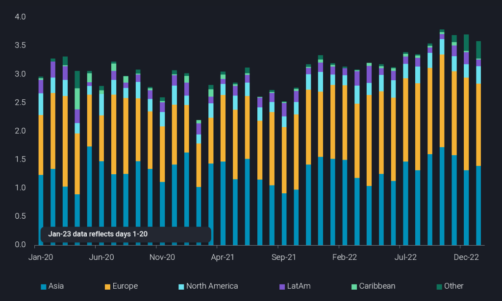
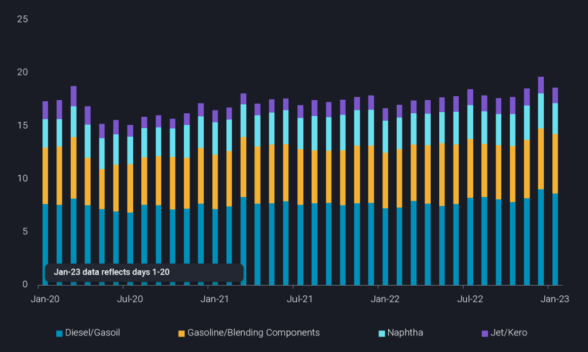
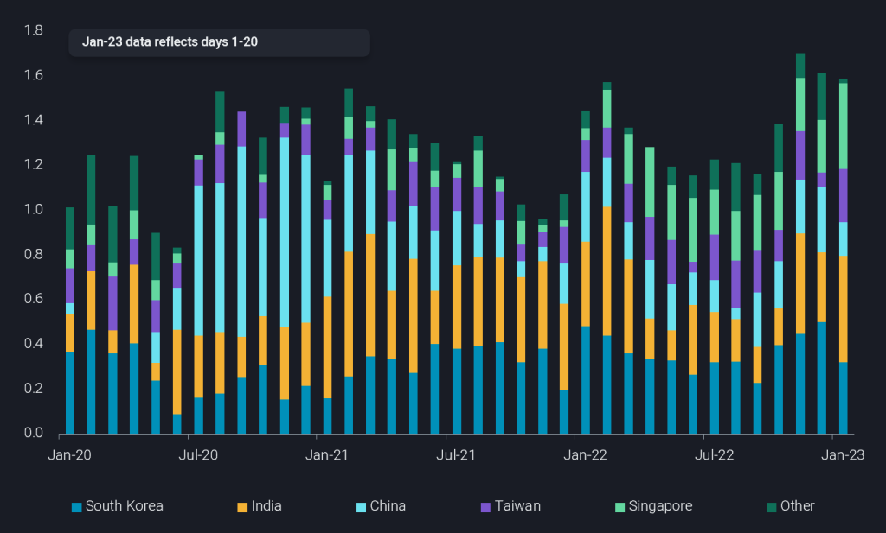

# Favorable tailwinds developing for US seaborne crude exports

**Date:** January 25, 2023  
**Publisher:** Breakwave Advisors | **Category:** Market Insights  
**Original URL:** [https://www.breakwaveadvisors.com/insights/2023/1/25/favorable-tailwinds-developing-for-us-seaborne-crude-exports](https://www.breakwaveadvisors.com/insights/2023/1/25/favorable-tailwinds-developing-for-us-seaborne-crude-exports)  

---

## Us Crude Exports Expected to Remain Strong As Indications of Demand From Refiners in Asia Surface Along with Existing Demand From Europe

*By*[*Rohit Rathod*](https://www.linkedin.com/search/results/all/?fetchDeterministicClustersOnly=false&heroEntityKey=urn%3Ali%3Afsd_profile%3AACoAABZG0fMBtd2Qvnc2RvofUNjm-E-A7SU7VrU&keywords=rohit%20rathod&origin=RICH_QUERY_SUGGESTION&position=0&searchId=e2df8771-4b48-4cfd-acb5-4e4a4f21117a&sid=EtS)

US seaborne crude/condensate exports seem to have slowed down in January 2023 compared to the record highs seen in 4Q 2022, but developments in Asia suggesting strong refinery demand along with Europe’s continued need to replace Russian barrels provide strong tailwinds for US crude exports. As for the decrease in January US crude exports, a strong December for global refined product exports and subsequent well supplied product markets, we believe were the reason behind this temporary dip.

## Europe Remains the Top Destination for Us Crude

> **Figure 1: Favorable Tailwinds for Us Exports 1 1024x615**  
> **Interactive Data & Source:** [Analytics Vortexa](https://analytics.vortexa.com/?dateRange=2020-01-01T00%3A00%3A00.000Z__2023-01-20T23%3A59%3A59.999Z&filtersEnabled=%5B%22p%22%2C%22o%22%2C%22d%22%2C%22d_r%22%2C%22v%22%2C%22intra%22%2C%22sts_o%22%2C%22c_o%22%2C%22v_f%22%5D&from=%5B%222d92cc08f22524dba59f6a7e340f132a9da0ce9573cca968eb8e3752ef17a963%22%5D&geoBreakdownOriginGlobal=region&metric=bpd&page=Flows&products=%5B%2254af755a090118dcf9b0724c9a4e9f14745c26165385ffa7f1445bc768f06f11%22%5D&tabId=fed0c5bb-bbe0-4f82-96d5-1e348abc8ef9&timeSeriesHiddenSeries=%5B%22seasonal_comparison_24%22%2C%22seasonal_comparison_12%22%5D&timeSeriesProperty=destination_region&v=2) | [Local Asset](file:///C:/Users/Dell/Github/Shipping/corpus/03-breakwave/insights/2023/assets/2023-01-25_favorable-tailwinds-developing-for-us-seaborne-crude-exports_img_favorable-tailwinds-for-us-exports-1_467760ae06cd.png)

US seaborne crude exports in December 2022 reached 3.7mbd which were lower than the record high of 3.8mbd set in October. Come January 2023, we see a slight decrease in those numbers but still strong exports – 3.6mbd in January (days 1-20). Europe has been the top destination for US crude exports since the late 2021 and the share increased further after the Russia-Ukraine conflict as the European refiners looked to the Americas to replace Russian barrels. September 2022 was when Asia regained the top spot in terms of US crude exports on the back of strong diesel margins but come December and the implementation of EU insurance ban and price cap on Russian crude, Europe again became the top destination for US crude exports and continued to remain so in January (days 1-20). So far exports to Europe stand at 1.4mbd in January (days 1-20) and are likely to remain strong as the double whammy of open arbitrages as well as low freight rates to Europe continues.

## High Refined Product Exports in December Have Kept the World Well Supplied

> **Figure 2: Favorable Tailwinds for Us Exports 2 1024x615 (1)**  
> **Interactive Data & Source:** [Analytics Vortexa](https://analytics.vortexa.com/?dateRange=2020-01-01T00%3A00%3A00.000Z__2023-01-20T23%3A59%3A59.999Z&filtersEnabled=%5B%22p%22%2C%22o%22%2C%22d%22%2C%22d_r%22%2C%22v%22%2C%22intra%22%2C%22sts_o%22%2C%22c_o%22%2C%22v_f%22%5D&geoBreakdownOriginGlobal=region&metric=bpd&page=Flows&products=%5B%22b68cbb746f8b9098c50e2ba36bcad83001a53bd362e9031fb49085d02c36659c%22%5D&productsExcluded=%5B%22a75fcc09bfc7d16496de3336551bc52b5891838bb7c22356d2cb65451587d1e5%22%2C%22364ccbb996c944055b479810a8e74863267885dc1b01407cb0f00ab26dafe1e1%22%2C%22cbb5acffa542aad31d26712a8cdfd9884301aa7658ac95c40f86ddb31bc29d9b%22%5D&tabId=fed0c5bb-bbe0-4f82-96d5-1e348abc8ef9&timeSeriesHiddenSeries=%5B%22seasonal_comparison_24%22%2C%22seasonal_comparison_12%22%5D&timeSeriesProperty=product_group_product&v=2) | [Local Asset](file:///C:/Users/Dell/Github/Shipping/corpus/03-breakwave/insights/2023/assets/2023-01-25_favorable-tailwinds-developing-for-us-seaborne-crude-exports_img_favorable-tailwinds-for-us-exports-2_d7789201fb70.png)

December was also a month for record high refined product exports from a global perspective with December exports reaching 19.6mbd. This likely influenced refinery demand as markets remained well supplied leading to the dip in US crude exports seen in January. Having said so, we believe a higher than usual spring refinery maintenance season in the US (strong diesel margins led to many refiners pushing their planned maintenances from 2022 into 2023) as well as the February ban on Russian products will lead to increased refinery demand from East of Suez refiners, as the world and especially Europe will need to remain well supplied with refined products, especially with diesel.

## Asian Imports Likely to Pick Up on Increased Chinese Demand

> **Figure 3: Favorable Tailwinds for Us Exports 3 1024x617**  
> **Interactive Data & Source:** [Analytics Vortexa](https://analytics.vortexa.com/?dateRange=2020-01-01T00%3A00%3A00.000Z__2023-01-20T23%3A59%3A59.999Z&filtersEnabled=%5B%22p%22%2C%22o%22%2C%22d%22%2C%22d_r%22%2C%22v%22%2C%22intra%22%2C%22sts_o%22%2C%22c_o%22%2C%22v_f%22%5D&from=%5B%222d92cc08f22524dba59f6a7e340f132a9da0ce9573cca968eb8e3752ef17a963%22%5D&geoBreakdownOriginGlobal=region&metric=bpd&movementEvent=unloading_start&page=Flows&products=%5B%2254af755a090118dcf9b0724c9a4e9f14745c26165385ffa7f1445bc768f06f11%22%5D&tabId=fed0c5bb-bbe0-4f82-96d5-1e348abc8ef9&timeSeriesHiddenSeries=%5B%22seasonal_comparison_24%22%2C%22seasonal_comparison_12%22%5D&timeSeriesProperty=destination_country&to=%5B%22e6955a2c59dc90833986fe0894cf6718dddaa7816bb51bc955cdd3eb4470e554%22%5D&v=2) | [Local Asset](file:///C:/Users/Dell/Github/Shipping/corpus/03-breakwave/insights/2023/assets/2023-01-25_favorable-tailwinds-developing-for-us-seaborne-crude-exports_img_favorable-tailwinds-for-us-exports-3_5a8ab0805487.png)

Asian imports of US crude although strong have remained below[European imports](https://analytics.vortexa.com/?dateRange=2020-01-01T00%3A00%3A00.000Z__2023-01-20T23%3A59%3A59.999Z&filtersEnabled=%5B%22p%22%2C%22o%22%2C%22d%22%2C%22d_r%22%2C%22v%22%2C%22intra%22%2C%22sts_o%22%2C%22c_o%22%2C%22v_f%22%5D&from=%5B%222d92cc08f22524dba59f6a7e340f132a9da0ce9573cca968eb8e3752ef17a963%22%5D&geoBreakdownOriginGlobal=region&metric=bpd&movementEvent=unloading_start&page=Flows&products=%5B%2254af755a090118dcf9b0724c9a4e9f14745c26165385ffa7f1445bc768f06f11%22%5D&tabId=fed0c5bb-bbe0-4f82-96d5-1e348abc8ef9&timeSeriesHiddenSeries=%5B%22seasonal_comparison_24%22%2C%22seasonal_comparison_12%22%5D&timeSeriesProperty=destination_country&to=%5B%22f39d455f5d38907394d6da3a91da4e391f9a34bd6a17e826d6042761067e88f4%22%5D&v=2)but fixtures data for February and March loadings as well as market sources suggest strong crude procurement from China likely leading to higher imports from the Americas, especially the US.[Imports into India](https://analytics.vortexa.com/?dateRange=2020-01-01T00%3A00%3A00.000Z__2023-01-20T23%3A59%3A59.999Z&filtersEnabled=%5B%22p%22%2C%22o%22%2C%22d%22%2C%22d_r%22%2C%22v%22%2C%22intra%22%2C%22sts_o%22%2C%22c_o%22%2C%22v_f%22%5D&from=%5B%222d92cc08f22524dba59f6a7e340f132a9da0ce9573cca968eb8e3752ef17a963%22%5D&geoBreakdownOriginGlobal=region&metric=bpd&movementEvent=unloading_start&page=Flows&products=%5B%2254af755a090118dcf9b0724c9a4e9f14745c26165385ffa7f1445bc768f06f11%22%5D&tabId=fed0c5bb-bbe0-4f82-96d5-1e348abc8ef9&timeSeriesHiddenSeries=%5B%22seasonal_comparison_24%22%2C%22seasonal_comparison_12%22%5D&timeSeriesProperty=destination_country&to=%5B%2270425373a1836d6d0390dc6fef838a468717fba7776d66065a5043488f9f041b%22%5D&v=2)have also seen an uptick in January (days 1-20) reaching 480kbd, a m-o-m increase of 170kbd. Favorable shipping economics have kept US crude imports lucrative for Asian refiners in February trade cycle and will likely continue in March trading cycle as well. As discussed earlier, the need to keep the world well supplied with refined products, and with a higher spring refinery maintenance season in the US, it will likely lead to increased refinery demand from East of Suez refiners and subsequently strong crude exports from the US.

Data Source:[Vortexa](https://www.vortexa.com//oil-gas-data-traders-analysts-data-scientists?gclid=Cj0KCQjw8_qRBhCXARIsAE2AtRZKOvMnbilZ_6_91d7huSFFy71pWLrnPwGwOHVzXsmsG-1a1mZnQw8aAt89EALw_wcB&hsa_acc=1782073842&hsa_ad=548425387665&hsa_cam=14746637662&hsa_grp=125038601902&hsa_kw=&hsa_mt=&hsa_net=adwords&hsa_src=g&hsa_tgt=dsa-1431852288425&hsa_ver=3&utm_campaign=%5BCD%5D%20-%20DSA%20-%20EMEA&utm_medium=cpc&utm_medium=ppc&utm_source=google&utm_source=adwords&utm_term=)
