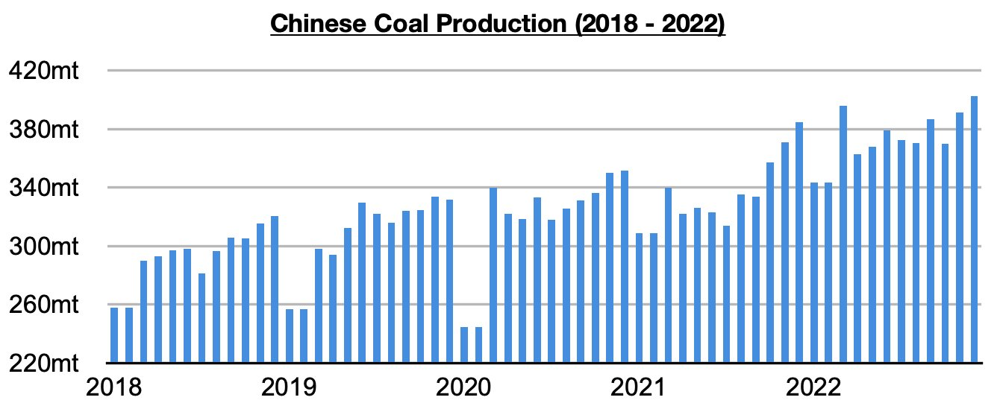
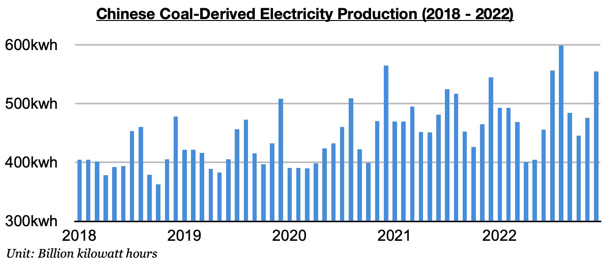

# Headwinds For Chinese Coal Import Prospects

**Date:** January 26, 2023  
**Publisher:** Breakwave Advisors | **Category:** Market Insights  
**Original URL:** [https://www.breakwaveadvisors.com/insights/2023/1/26/headwinds-for-chinese-coal-import-prospects](https://www.breakwaveadvisors.com/insights/2023/1/26/headwinds-for-chinese-coal-import-prospects)  

---

*By*[*Jeffrey Landsberg*](https://www.linkedin.com/in/jeffrey-landsberg-70ab957/)

China produced a record 402.7 million tons of coal last month. As we have been stressing in our Weekly Dry Bulk Reports and Weekly China Reports, the government last year was no longer primarily focused on improving mine safety and instead shifted its focus to ensuring robust coal production. Overall, this has led to a significant change. Most recently, last month's record production was up month-on-month by 11.4 million tons (3%) and up year-on-year by 18 million tons (5%). The previous record was 395.8 million tons produced in March.

> **Figure 1: Chart 1 (68)**  
> [Local Asset](file:///C:/Users/Dell/Github/Shipping/corpus/03-breakwave/insights/2023/assets/2023-01-26_headwinds-for-chinese-coal-import-prospects_img_chart1286829_9ab10c1b0953.jpg)

As we also discussed in our note, China's total electricity production came in at a very firm 757.9 billion kilowatt hours which was up year-on-year by the same 5% as coal production. However, coal derived electricity generation grew year-on-year by only 2%. Coal-derived electricity generation totaled 554.9 billion kilowatt hours, which is up month-on-month by 79.5 billion kilowatt hours (17%) and up year-on-year by 10.6 billion kilowatt hours (2%).

> **Figure 2: Chart 2 (59)**  
> [Local Asset](file:///C:/Users/Dell/Github/Shipping/corpus/03-breakwave/insights/2023/assets/2023-01-26_headwinds-for-chinese-coal-import-prospects_img_chart2285929_b769ad1768fd.jpg)

China's coal-derived electricity generation has now increased on a year-on-year basis during each of the last six months -- but the year-on-year growth last month was again exceeded by growth in coal production. This remains a headwind for China’s coal import prospects. Also remaining an issue is that hydropower production returned to finding year-on-year growth last month. Other renewable sources of electricity generation in China continue to grow on a year-on-year basis as well.
